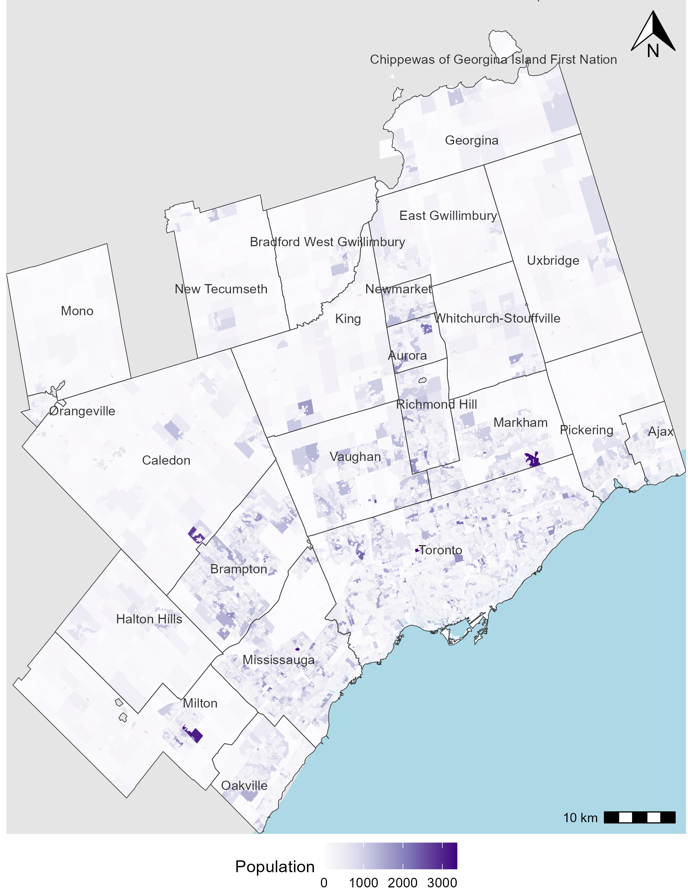
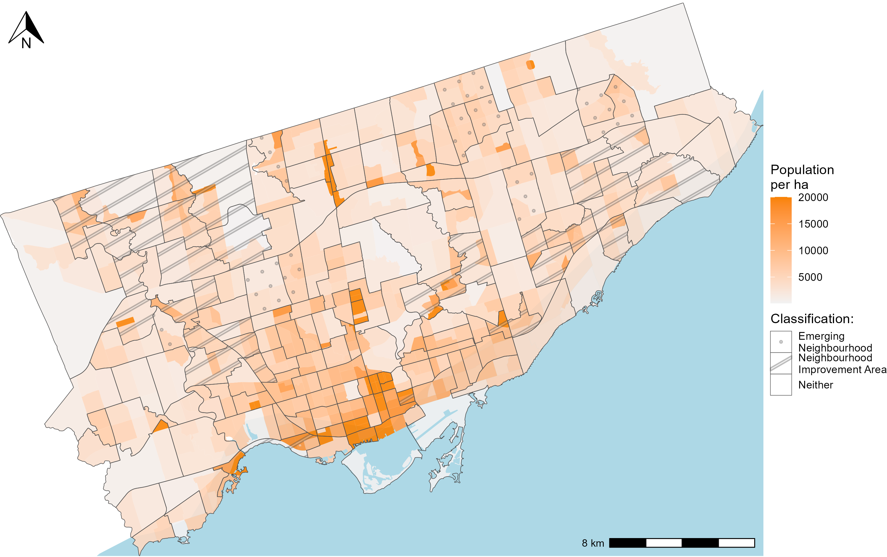
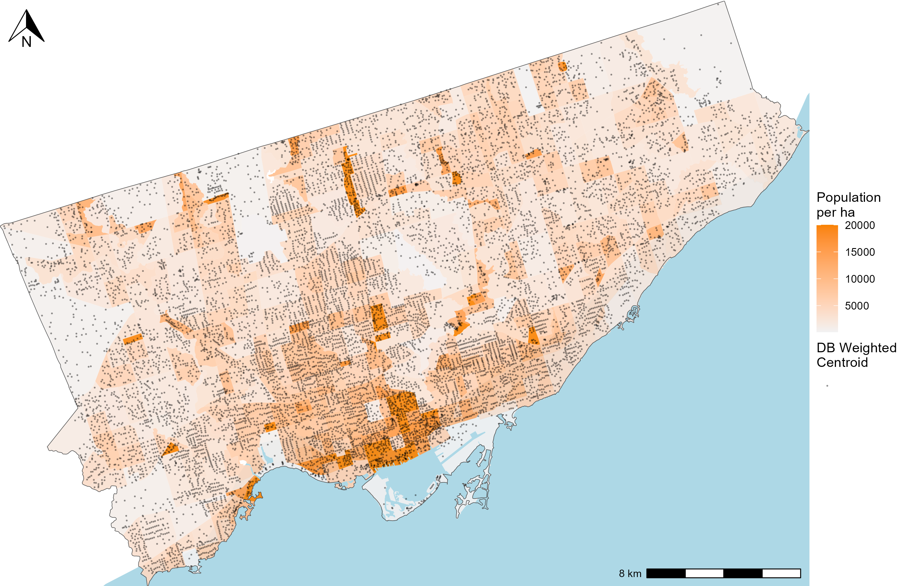
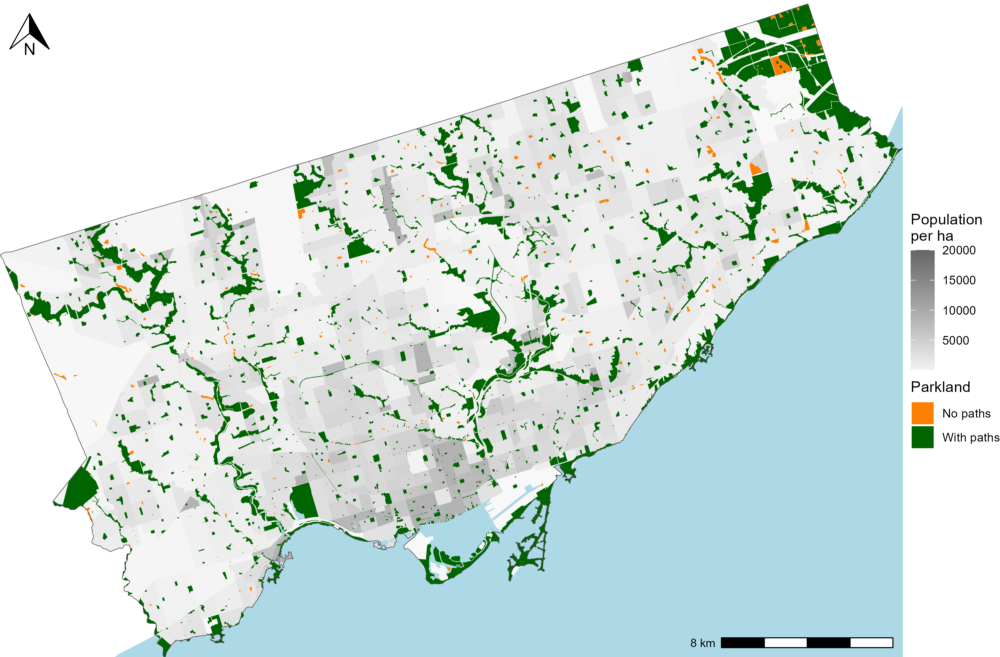
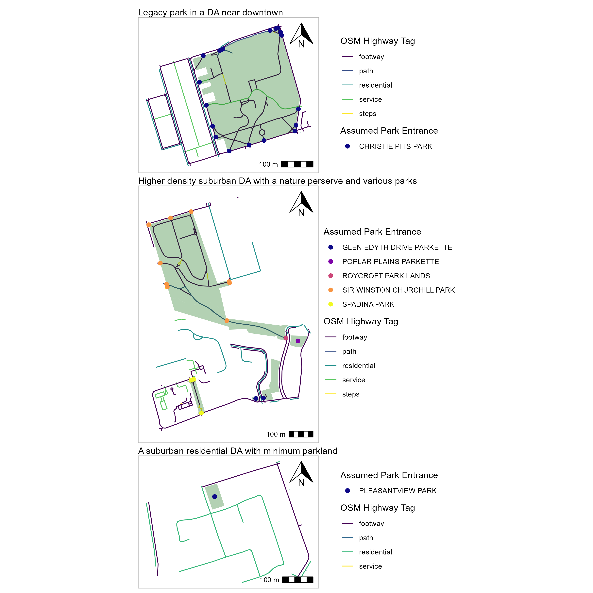
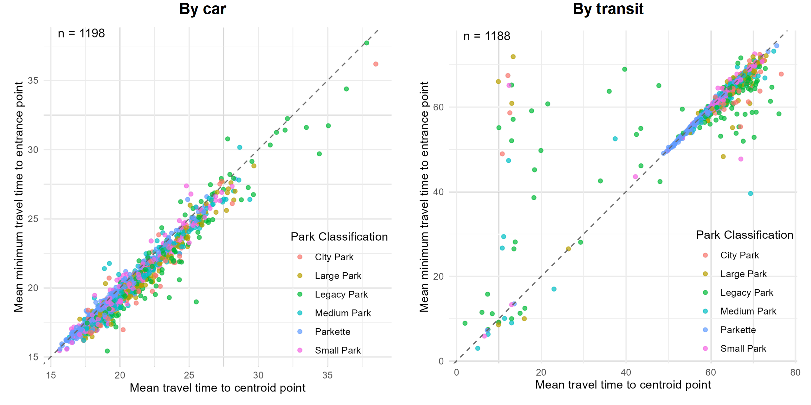
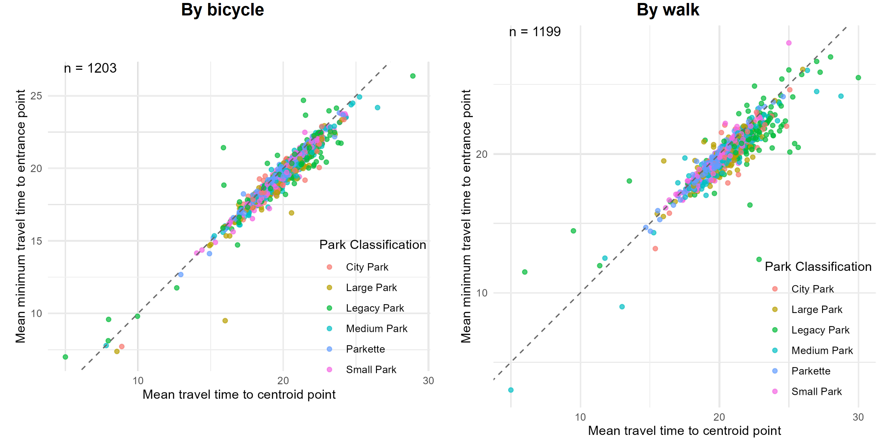
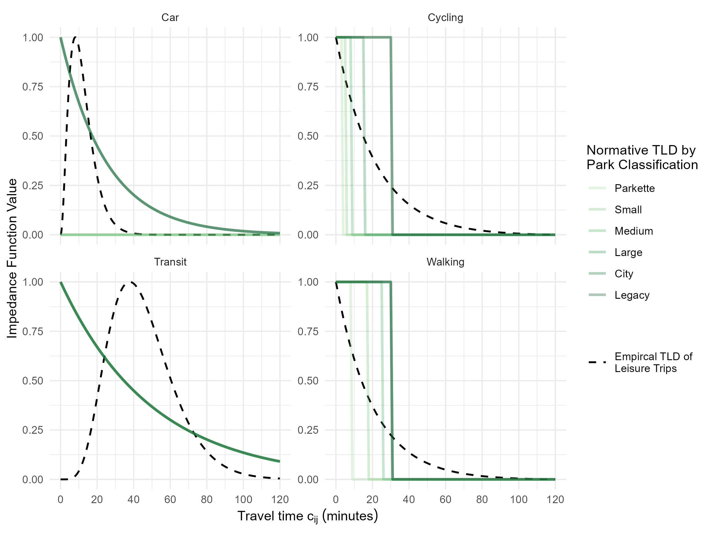

# CHP 2 - Totally constrained spatial access to park space

<!-- Required to number equations in HTML files -->
<script type="text/x-mathjax-config">
MathJax.Hub.Config({
  TeX: { equationNumbers: { autoNumber: "AMS" } }
});
</script>

```{r, echo=FALSE}
#setup
knitr::opts_chunk$set(echo = FALSE)
```

```{r}
#libraries
library(ggplot2)
library(sf)
library(dplyr)
library(patchwork)
library(grid)
```

```{r }
#data loading
load(file="./data/TO_census_21_DB.rda")
load(file="./data/TO_census_21_DA.rda")
DB_Centroids <- st_read("./data/DB_Centroids/DB_Centroids.shp", quiet = TRUE)
load(file="./data/parkland_edge_and_centroid_entrance_points.rda")
load(file="./data/parkland.rda")
```

```{r}
parkland_edge_and_centroid_entrance_points_groupedbypark <- parkland_edge_and_centroid_entrance_points |> st_drop_geometry() |> group_by(P_ID)|>
  summarise(count_of_entrance = n())

parkland_grouped <- parkland |> st_drop_geometry() |> group_by(P_ID)|>
  summarise(count_entrances_P_ID = mean(count_entrances_P_ID),
            area_ha = sum(area_ha)) |>
  mutate(park_size = case_when(area_ha < 0.5 ~ "Parkette",
                               area_ha >= 0.5 & area_ha < 1.5 ~ "Small Park",
                               area_ha >= 1.5 & area_ha < 3.0 ~ "Medium Park",
                               area_ha >= 3.0 & area_ha < 5.0 ~ "Large Park",
                               area_ha >= 5.0 & area_ha < 8.0 ~ "City Park",
                               area_ha >= 8.0 ~ "Legacy Park"))
```

## Introduction

Urban greenspace has many benefits for residents and the environment: it is linked to wellbeing [], higher rates of physical activity [], and contributes to reducing urban island heating as well as mitigating carbon pollution in combating climate change []. Parkland, or greenspace that is owned and operated by a locality, can also be framed as a public service. In this way, the spatial accessibility to parkland should be concerned with ensuring it is distributed in an equitable way. 

In this chapter, the empirical example of parkland city of Toronto will be detailed, including (1) the spatial resolution of the zoning system and the residing population, (2) the assumptions associated with calculating parkland entrance points, and the (3) assumed interaction with parkland. (4) Following the data, the totally-constrained accessibility measure is briefly summarised. The calculated results are presented and interpreted in a policy-relevant lens: namely, the amount of parkland that is accessible per zone, identification of zones with low and high accessibility.

Notably, this process of methods, data and results presentation was done in consultation with staff from the City of Toronto. They are actively working on developing the Transportation Equity Policy Framework and are partners of the Mobilizing Justice Partnership. All data is openly available, but is edited by the city staff (as attributed) or using assumptions the city staff were agreement with.

## Methods and Data

### Origins: the dissemination block and associated census data

The most disaggregated level that census variables (e.g., household income, proportion commute mode) is available is the level of the dissemination area (DA). Census zoning systems are designed by Statistics Canada to represent the population's socioeconomic characteristics as homogeneously, with disaggregated systems (like the DA) requiring to nest within more aggregated systems while remaining a relatively compact geographic size [@statcan_DAdef_2021]. Each DA in the Toronto metropolitan area represents population between `r TO_census_21_DA$Population |> quantile(0.25) |> as.numeric()` (Q1) to `r TO_census_21_DA$Population |> quantile(0.75) |> as.numeric()`(Q3)) and each representing between `r as.numeric(quantile(TO_census_21_DA[[1]], 0.25))` sq km (Q1) to `r as.numeric(quantile(TO_census_21_DA[[1]], 0.75))` sq km (Q3)) in area.

However, population data is available at an even more disaggregated level, the dissemination blocks (DB). The DB is an artifact of the road network [@statcan_DBdef_2021], with between 2 to 5 DBs being typically nested within one DA <!-- `r TO_census_21_DB |> st_drop_geometry() |> group_by(DA_UID) |> summarise(count = n()) |> pull(count) |> summary()`-->. The more accurately the origin point represents the known residing population, the more accurately the routed travel time and hence the accessibility results along with its associated assumptions, can be understood. Moreover, the highest level of spatial disaggregation available, is typically the preferred appropriate: to reduce issues associated with the scale effect of the modifiable areal unit problem (MAUP) []. 

For these reasons, points that are representative of the population within each DB was calculated using the methodology described by Statistics Canada [@statcan_reppoint_2021]. These representative points are available through Statistics Canada at the DA level, however, DB level points are not. hence, the calculated DB points, or the DB weighted centroids, were generated by the staff at the City of Toronto, and sent to the author on May 2, 2025. The methodology to prepare the points is summarised as follows: (1) if the DB contained no address points, then the geometric centroid of the DB was used, (2) if the DB contains 1 or more address points, then the central point between the dwelling weighted address points was calculated. If this point was not with the DB boundaries, it was manually moved into the DB.

To contextualise the Toronto metropolitan area, the population (per DB) and the associated DA boundaries plus the cities that compose the Toronto metropolitan area are visualised in Figure \ref{fig:chp2-toronto_CMA_plot}.
 
```{r ,fig.align='center', out.width="6in", fig.cap="\\label{fig:chp2-toronto_CMA_plot}Map of Toronto CMA with population per DB from the 2021 Census"} 


```

To contextualise the city of Toronto, the focus of this analysis, Figure \ref{fig:chp2-toronto_popden_NIAs_plot} demonstrates the 158 neighbourhoods in Toronto according to improvement classification: either a "Neighbourhood Improvement Area" (NIA), "Emerging Neighbourhood" (EA), or neither, based on an analysis conducted by the City. The methodology was based on the development of a composite indicator including dimensions of relative marginalization of the population who resides in these neighbourhood and of the neighbourhood infrastructure itself, such as variables reflecting economic opportunities (e.g., unemployment), social development (e.g., highschool graduation), participation in decision-making (e.g., voting), neighbourhood infrastructure (e.g., walkability, community places for meetings), and health (e.g., premature mortality) [@toronto_neighbourhoods2024; @toronto_NEI_2014]. Overall, higher-population neighbourhoods are concentrated near the lake in the downtown core. Most NIAs are located in the east and northwest of the city and tend to have lower population densities, though two high-density NIAs are located in downtown.

```{r ,fig.align='center', out.width="6in", fig.cap="\\label{fig:chp2-toronto_popden_NIAs_plot}Map of the 158 Toronto neighbourhoods, with 'Improvement' classification and population density from the 2021 Census"} 

```

And lastly, the Figure \ref{fig:chp2-toronto_popden_DBCent_plot} displays the calculated DB weighted centroids, used as the origins in the accessibility analysis. There are `r DB_Centroids |> nrow()` points within the City, more spatially clustered in areas with higher population density.   

```{r ,fig.align='center', out.width="6in", fig.cap="\\label{fig:chp2-toronto_popden_DBCent_plot}Map of the City of Toronto's DB weighted centroids atop the population density from the 2021 Census"} 

```

### Toronto parkland destinations and normative travel behaviour

Parkland is defined as city operated and/or owned 'parks' identified in the greenspaces shapefile available through the city's official Open Data portal [@toronto_greenspaces2025]. These are the same park assets that are identified as part of the Parkland Strategy report commissioned by the City of Toronto [@toronto_parkland2019 p.20]. This report serves as a guideline for assumptions made regarding park classification and interaction catchments based on park classification. Toronto's parkland is visualized in Figure \ref{fig:chp2-parkland_paths_plot}. Of note, other Open Spaces include in the greenspaces shapefile are federally or provincially owned/operated spaces, school yards, cemeteries, and hydro corridors. These spaces are not assumed to be Toronto operated and/or owned parkland, hence are not included in this analysis. These greenspaces are reflected as 'no population' DBs.

```{r ,fig.align='center', out.width="6in", fig.cap="\\label{fig:chp2-parkland_paths_plot}Map of the City of Toronto's Parkland (with paths or no paths) atop the population density from the 2021 Census"} 

```

As retrieved from @toronto_parkland2019 [pg.15], the parkland can be categorized by size: 'Parkette' (<0.5 ha) (`r ((parkland_grouped |> filter(park_size == "Parkette") |> nrow())/nrow(parkland_grouped)) |> scales::percent()` of all parks), 'Small Park' (0.5–1.5 ha) (`r ((parkland_grouped |> filter(park_size == "Small Park") |> nrow())/nrow(parkland_grouped)) |> scales::percent()`), 'Medium Park' (1.5–3.0 ha) `r ((parkland_grouped |> filter(park_size == "Medium Park") |> nrow())/nrow(parkland_grouped)) |> scales::percent()`, 'Large Park' (3.0–5.0 ha) `r ((parkland_grouped |> filter(park_size == "Large Park") |> nrow())/nrow(parkland_grouped)) |> scales::percent()`, 'City Park' (5.0–8.0 ha) `r ((parkland_grouped |> filter(park_size == "City Park") |> nrow())/nrow(parkland_grouped)) |> scales::percent()`, and 'Legacy Park' (>8.0 ha) `r ((parkland_grouped |> filter(park_size == "Legacy Park") |> nrow())/nrow(parkland_grouped)) |> scales::percent()`. Interaction with parks can be assumed in a variety of ways, but in this analysis, it is normatively [@paezMeasuringAccessibilityPositive2012] assume interaction based on the park classification catchments described in @toronto_parkland2019. Parkettes are assumed to only be accessible within a 10-minute travel window, small parks within 20 minutes, and medium parks within 30 minutes. In contrast, large, city, and legendary parks are considered to have citywide appeal, attracting people throughout the city regardless of travel time. 

How parks can potentially be accessed is assumed based on their entrances. Entrances are not explicitly available, so they are assumed. They are calculated based on the parkland edge intersection with each path within the park itself or intersecting the park edge. `r parkland_grouped |> filter(is.na(count_entrances_P_ID)) |>  unique() |> length()` of the the `r nrow(parkland_grouped)` parks have paths, each with anywhere between `r parkland_edge_and_centroid_entrance_points_groupedbypark$count_of_entrance |> min()` to `r parkland_edge_and_centroid_entrance_points_groupedbypark$count_of_entrance |> max()` (median of `r parkland_edge_and_centroid_entrance_points_groupedbypark$count_of_entrance |> median()`) entrances. The remaining  `r nrow(parkland_grouped)- (parkland_grouped |> filter(is.na(count_entrances_P_ID)) |>  unique() |> length())` parks do not have paths, and hence their entrances cannot be precisely assumed. Parks without an entrance are significantly smaller in area (i.e., median of `r parkland_grouped |> filter(is.na(count_entrances_P_ID)) |> pull(area_ha) |> median() |> round(2)` ha as opposed to the median of area parks with paths which is `r parkland_grouped |> filter(!is.na(count_entrances_P_ID)) |> pull(area_ha) |> median() |> round(2)` ha). Upon visual inspection using Google Maps streetview, parks with no paths often contain a playground, some sport amenity or gardens within the center. Some of them are unfurnished -containing only mowed grass. For these parks with no internal paths, it is assumed then that these spaces can be entered from any direction and that the geometry centroid is the point of interest  calculated and assumed as the entrance point. This point is snapped onto the transportation network based on an origin's shortest path, as will be later described in the routing subsection. 

As a visualisation, Figure \ref{fig:chp2-park_entrance_example_plot} contains a panel of three DAs in Toronto, each displaying the roads, parks, and assumed park entrances. Readers should note that in the first two panels, these parks contain multiple entrance points, corresponding to where the edge of the paths within the parks intersect with the edge of the park boundary. These plots showcase different DAs that represent the diversity in DA size and park composition across the city. The first plot showcases a relatively small DA, near the downtown core of the city featuring high density of population, other amenities and multimodal transportation systems. This DA is unique in the area, as it features a large planned 'Legacy' park by the name of Christie Pits. Planned parks are typically square or rectangular and can be accessed from most of the sides. They are also contained within the city in all areal sizes. The second plot contains a larger DA, north of downtown, that contains a few parks and near higher density suburban built form. One is the Roycroft Park Lands, a large 'City' (smaller than Legacy), part of the Don River wetlands with maintained trails, enjoyed as nature reserve. Note it's long shape and minimal entrances. Natural parklands like Roycroft Park Lands are common along wetlands and other preserved natural spaces; they are typically larger in size (Medium, Large, or City parks) hence offer a lot of parkland space to those near their entrances. In the third plot, the DA is also large but with lower density suburban built form, and mostly residential. It contains only one small park: Pleasantview Park. This park contains no internal pathways, a playground in the middle of the park with no other amenities. 

```{r ,fig.align='center', out.width="6in", fig.cap="\\label{fig:chp2-park_entrance_example_plot} Three DAs featuring parkland, road network by OSM tag, and park entrances. From top to bottom: planned Legacy park Christie Pits near the downtown core, parks north of the downtown core preserving natural space, and planned park with no paths in a more suburban DA."} 

```

### Multimodal origin to destination routing and trip lengths

Routing of travel times was done using the travel_time_matrix() function in {r5r}, an R package that provides an R-interface for the Java-based R5 Routing engine [@pereiraR5rRapidRealistic2021]. The function was run four time, one for bicycle, car, transit and walking modes, producing four separate travel time matrices. Each origin destination pair has an associated shortest travel time, selected by the function based on all possible origin destination routes given the input road network (and transit schedule, for the transit mode). The road network is an edited version of OpenStreetMaps (OSM) street network (December 9, 2022) and edited General Transit Feed Specification (GTFS) files (February 4, 2024) for transit operating within the City i.e., GO (regional commuter train and bus service), TTC (local subway, lightrail, and bus network), and the UP Express (regional commuter train line). The files were edited by city staff to more accurately reflect access into TTC subway stations and reflect the transit schedule for the week of February 4 2025. 

Concerning the inputs for the 'travel_time_matrix()' function for all modal travel time calculations: the origins are the DB weighted centroids (`r DB_Centroids |> nrow()` locations), the destinations are points representing the `r parkland_grouped |> nrow()` parks and the OSM road network were used. Some parks have multiple pieces, separated by the road network: in total, there are `r parkland |> nrow()` park pieces, each with between `r parkland$count_entrances_P_piece_ID |> min(na.rm=TRUE)` and `r parkland$count_entrances_P_piece_ID |> max(na.rm=TRUE)` path entrances (median `r parkland$count_entrances_P_piece_ID |> median(na.rm=TRUE)` entrances) or 1 park piece centroid. In total, there are `r parkland_edge_and_centroid_entrance_points |> nrow()` possible destination points (`r parkland_edge_and_centroid_entrance_points |> st_drop_geometry() |> filter(entrance_type == "Edge intersection")  |> nrow()` path entrances and  `r parkland_edge_and_centroid_entrance_points |> st_drop_geometry() |> filter(entrance_type != "Edge intersection")  |> nrow()` centroids) for each of the `r DB_Centroids |> nrow()` origins. 

For the motorized modes, a maximum travel time of 120 minutes was selected. For transit, the GTFS files and a departure time of between 11:00-11:15am (i.e., a 15 minute departure window) on February 8th 2025 was used, to reflect a Saturday afternoon transit schedule. Travel speeds reflect the posted speeds and intersections as gleaned from the OSM road network, and for transit, the scheduled transit arrival times at stops according to the GTFS file. For non-motorized modes, a maximum travel time of 30 minutes was selected, and the default travel speeds of 3.6 km/h for walk and 12 km/h for cycling was assumed. The travel time thresholds of 120 minutes and 30 minutes was set to normatively reflect the likelihood to travel to parks, by mode.

<!-- numbers from 03-selecting-tts.qmd, would take about ~30min to run...--> It is worthwhile summarising the multimodal travel time matrices. Notably, within a 120 minutes trip by motorized modes, the majority of DBs can reach all parks by car (with exception to the 6 on the Toronto Islands, inaccessible by car), i.e., the median DB can reach 1601 out of the 1607 parks, while the most isolated can still reach 184 parks. By contrast, within a 120 minute trip or less by transit, a median DB can only reach 1116 parks, with the most central DB reaching 1539 parks meaning 4% of parks are feasibly unreachable by transit for DBs in the City of Toronto. These parks are located at the edges of the city in that are transit poor, as will be demonstrated and discussed in the findings. Comparing this reach to the lower range non-motorized modes, the number of parks reachable by foot or by cycle within 30 minutes from a DB is much lower: a median DB can only reach 15 parks (max. 61 parks for the most central DB) by walking and 86 parks (max. 295 parks for the most central DB) by cycling.

As a final note on routing assumptions, it's useful to compare travel times to park centroids versus park path entrances. For the 1204 parks with known path entrances, centroids were also computed and travel times from all DBs to all centroids were calculated. This comparison highlights the impact of the R5 routing algorithm, namely, how the routed travel times can differ depending on how the destination points are ‘snapped’ to the nearest road segment. If a point is not already on the road network, R5 snaps it to the nearest network segment, adding a walking time penalty based on distance. This snapping algorithm prioritizes minimizing overall travel time from the origin. Since edge entrances are typically already on the network, their snapping penalty is minimal. In contrast, centroid points--especially in large and irregular natural parks—may snap to parts of the road network that are unreachable by certain roads (e.g., far enough away from bus stops, or bike lanes), inflating travel times. Hence: when paths within the parks are available from the OSM network, they are used, as it more accurately reflects the points at each the parks can actually be entered from. But when the park has no entrances, it is assumed that the centroid (or the middle of the park itself) is the destination point, and the associated snapping penalty is folded into the calculated travel time. The following Figure \ref{fig:chp2-ent_vs_cent_tt_car_transit_scatter} and Figure \ref{fig:chp2-ent_vs_cent_tt_cycle_walk_scatter} demonstrate the relationship between the minimum travel time used in the analysis for each parks with path entrances and the travel time if its centroid point was used, along with a 45 degree dashed line representing a perfect linear relationship.

Regarding the motorized modes in Figure \ref{fig:chp2-ent_vs_cent_tt_car_transit_scatter}), the relationship appears to be roughly, with centroid times being consistently lower than path entrance times--except for a few parks that fall to the left of the dashed line. Parks with entrance times that are larger than their centroid times have entrances that are not in opportune positions on the network relative to the snapped centroid point, and vice versa for entrances that have _lower_ travel times than their centroid points which is often the case. Transit shows a similar trend but with more noise. A few parks exhibit exceptionally high transit times relative to their centroid times. These are typically larger parks where the centroid snaps to a location near access points to the transit system, but the _actual_ path entrances are not in proximity to those opportune system access point. Since the road network for cars is more continuous and the system is more evenly accessible (e.g., the majority of roads can be driven on, whereas the transit system can only be entered in specific points), this discrepancy is not observed in the car mode. This comparison underscores the importance of using realistic entrance points especially for larger parks with few entrance points and for modes like transit, which do not provide uniform access into the system.

```{r ,fig.align='center', out.width="6in", fig.cap="\\label{fig:chp2-ent_vs_cent_tt_car_transit_scatter} Scatter plot of car and transit travel times from origins to destinations by destination type for each park (either mininum median travel time to park centroid, or minimum median travel time to park entrance). "} 

```

Figure \ref{fig:chp2-ent_vs_cent_tt_cycle_walk_scatter} captures the non-motorized modes, which exemplifies a similar pattern as the motorized modes, with centroid travel times beign typically longer than path entrance points in a linear relationship. However, like transit and car, travel by bike and walk demonstrate different levels of noise. As the travel time threshold is 30 minutes, distance can be traversed at a faster rate by bike than by foot, hence differences in distances between the path entrance point and the snapped centroid is less impact on the estimated travel time for bike mode. 

```{r ,fig.align='center', out.width="6in", fig.cap="\\label{fig:chp2-ent_vs_cent_tt_cycle_walk_scatter}  Scatter plot of cycle and walk travel times from origins to destinations by destination type for each park (either min mean travel time to park centroid, or to min mean travel time to park entrance). "} 

```

#### Normative park trip length
A key component of accessibility is how the cost of overcoming spatial separation to reach a destination is considered. In this analysis, access to parkland is modeled using distance catchments based on park size classifications from the @toronto_parkland2019 report, and modal options informed by discussions with city staff.

It is assumed that the smaller parks, i.e., parkette (<0.5ha), small parks (0.5-1.0 ha), and medium parks (1.5-3 ha) offer a service coverage of only 0.5km, 1.0km and 1.5km, respectively. Meaning, people are only likely to interact with the park within this travel distance. This assumption has to do with the qualities these parks possess, and the availability of similar parks in the area: namely, these smaller parks are often located in residential neighbourhoods, evenly spatially distributed, and often offer no exceptional amenity that can't be substituted by another similarly sized park nearby as inferred from @toronto_parkland2019. For larger parks, such as large parks (3-5 ha), city parks, and legacy parks, their service catchments are larger as they are more unique, attractive, and harder to substitute parks, as inferred from the @toronto_parkland2019 report. Large parks are assumed a service coverage of 3km and city and legacy parks are assumed to be attractive, and hence cover, the whole city.

```{r}
# Define the decay function
decay_func <- function(c) exp(-0.04 * c)
total_area <- integrate(decay_func, lower = 0, upper = 120)$value

# Cumulative distribution function (CDF)
cdf <- function(x) {
  integrate(decay_func, lower = 0, upper = x)$value / total_area
}

uniroot(function(x) cdf(x) - 0.5, lower = 0, upper = 120)$root
```

Trip lengths to parks vary by both travel mode and park classification. Based on assumptions drawn from @toronto_parkland2019 and discussions with city staff, travel impedance functions are created based on trip lengths that are _seen_ as acceptable. It is assumed that (1) non-motorized travelers can access all parks based on their service coverage catchment (i.e., a 0.5 km catchment for parkettes that translate to 8 mins of walking or 3 mins of cycling based on median travel speeds), however, they are constrained by their maximum travel time length of 30 minutes. (2) transit users can access all types of parks, but based on a negative exponential distance decay function ($f(c_{ij}) = e^{-0.02c_{ij}}$). This function has a median travel time of approximately 30 minutes, meaning that half of the total weight of the travel impedance function--representing the spatial separation between people and parks--comes from trips between 0 to 30 minutes, and the other half comes from trips between 30 to 120 minutes. The function captures the idea that the deterrent effect of distance increases gradually, assigning progressively less 'spatial interaction' weight to more distant parks, even though they remain reachable. (3) Car users are assumed _not_ to travel to smaller parks at all, and as such, these parks are excluded from accessibiltiy results for the car mode. For larger parks, car travel impedance is assumed also based on a negative exponential distance decay function, but with parameter $-0.04$ ($f(c_{ij}) = e^{-0.04c_{ij}}$), twice as steep as the transit impedance function. This reflects a  stronger deterrent effect with increasing travel time. Namely, with a median travel time of approximately 17 minutes, trips that are between 0 to 17 minutes are assigned half the weight of the travel impedance function and the remaining half is defused acrossed trips that are between 17 minutes to 60 minutes. Destinations 60 minutes are considered effectively unreachable, with the function modeled as 0 beyond this point. 

These assumptions on interaction with parks and trip lengths by mode have equity implications: 
- Smaller parks are assumed to only be attractive to, hence accessible for, non-motorized and transit users
- For larger parks which can be reached by all modes, car mode has the largest range and has a steep decay, meaning it may provide favourable spatial seperation weight, relative to other modes.
- Travel impedance for transit users is penalized more gradually, assuming broader reach to all park types
- Non-motorized users reach is constrained practically: they are assumed not to travel beyond 30 minutes
- For parks in less densely populated areas, i.e., with travel times by sustainable modes beyond 30 minutes, accessibility will only be present for car users. In sum, individuals in these areas who do not have access to a vehicle are effectively excluded.

These assumptions on interaction with parks and trip lengths by mode have equity implications:
- Smaller parks are assumed to be attractive only to non-motorized and transit users, and are therefore not included in the accessibility profile for car users.
- For larger parks, which are accessible by all modes, the car mode has the broadest assumed range and steepest decay, potentially resulting in more opportune spatial separation weighting relative to other modes.
- Transit users face a more gradual decay in travel impedance, reflecting broader assumed reach across all park types.
- Non-motorized users are assumed to be practically constrained in their reach, with travel limited to within 30 minutes on foot or by bike.
- Parks in lower-density areas requiring more than 30 minutes of travel by sustainable modes will contribute to high accessibility for car users exclusively. Individuals in these areas without access to a private vehicle are, effectively, excluded, and these zones will reflect very low levels of accessibility by sustainable modes. 

To summarise the modal $m$ travel behaviour based on parkland classification type $y$ as the resulting travel impedance functions $f^m(c^m_{ij})$ in Table \ref{tab:chp2-travel-impedance-by-park-mode}:

\begin{table}[ht]
\centering
\small
\begin{tabular}{|l|c|c|c|c|}
\hline
\textbf{Park Type} & \textbf{Car} & \textbf{Transit} & \textbf{Cycling} & \textbf{Walking} \\
\hline
Parkette &
0 &
$e^{-0.02} \cdot c_{ij}^{\text{transit}}$ &
$1$ if $c \leq 3$ min, else 0 &
$1$ if $c \leq 8$ min, else 0 \\
\hline
Small Park &
0 &
$e^{-0.02} \cdot c_{ij}^{\text{transit}}$ &
$1$ if $c \leq 5$ min, else 0 &
$1$ if $c \leq 17$ min, else 0 \\
\hline
Medium Park &
0 &
$e^{-0.02} \cdot c_{ij}^{\text{transit}}$ &
$1$ if $c \leq 8$ min, else 0 &
$1$ if $c \leq 25$ min, else 0 \\
\hline
Large Park &
$e^{-0.04} \cdot c_{ij}^{\text{car}}$ &
$e^{-0.02} \cdot c_{ij}^{\text{transit}}$ &
$1$ if $c \leq 15$ min, else 0 &
$1$ if $c \leq 30$ min, else 0 \\
\hline
City Park &
$e^{-0.04} \cdot c_{ij}^{\text{car}}$ &
$e^{-0.02} \cdot c_{ij}^{\text{transit}}$ &
$1$ if $c \leq 30$ min, else 0 &
$1$ if $c \leq 30$ min, else 0 \\
\hline
Legacy Park &
$e^{-0.04} \cdot c_{ij}^{\text{car}}$ &
$e^{-0.02} \cdot c_{ij}^{\text{transit}}$ &
$1$ if $c \leq 30$ min, else 0 &
$1$ if $c \leq 30$ min, else 0 \\
\hline
\end{tabular}
\caption{Normative travel impedance functions by parkland classification $y$ and mode $m$}
\label{tab:chp2-travel-impedance-by-park-mode}
\end{table}

To reiterate, the trip length based travel time behaviour summarised in Table \ref{tab:chp2-travel-impedance-by-park-mode} are _normative_--they represent a statement about what should be considered a reasonable travel time that defines parkland accessibility [@paezMeasuringAccessibilityPositive2012]. In practice, however, travel behaviour empirically may diverge from these normative statements. For example, empirical data from the 2023 Transportation Tomorrow Survey of trips made for 'leisure' purposes by different modes in the Greater Toronto Area region, reveals different patterns [@data_management_group_tts_2023]. Figure \ref{fig:chp2-norm_pos_impedance_mode_parktype_plot} compares this normative travel behaviour (green lines) from Table \ref{tab:chp2-travel-impedance-by-park-mode} with the TTS empirically derived curves (dashed lines). For this analysis, the normative curves (i.e., Table \ref{tab:chp2-travel-impedance-by-park-mode}) are used to define accessibility. This will enable the interpretation of results in terms of what _should_ be accessible via each mode, according to planning goals, rather than what currently is based on observed travel behaviour.

```{r ,fig.align='center', out.width="6in", fig.cap="\\label{fig:chp2-norm_pos_impedance_mode_parktype_plot}  Scatter plot of cycle and walk travel times from origins to destinations by destination type for each park (either min mean travel time to park centroid, or to min mean travel time to park entrance). "}

```

### Totally-constrained accessible parkland: all people demand it equally

#### A measure of parkland accessibility and population accessibility

Totally-constrained accessibility $V^T_{ij}$, a measure of parkland accessibility, is defined as follows:

$$
V^T_{ij} = K^T \cdot W_j^{(2)} \cdot f(c_{ij})
$$ {#eq-total-constrained-access}

Where:
- $V^T_{ij}$ is the number of opportunities that can be accessed at origin zone $i$ from destination zone $j$, 
- $f(c_{ij})$ is the cost of travel $c_{ij}$ from $i$ to $j$, 
- the destination zone attraction mass $W_j^{(2)}$ is the number of opportunities (i.e., the parkland in hectares at a park $j$), and 
- $K^T$ is the total constraint $\frac{D}{\sum_i\sum_j W^{(2)}_jf(c_{ij})}$ that serves to proportionally allocate the opportunities $D$ in the region and ensures units remain balanced.

Equation \ref{eq:total-constrained-access} represents totally-constrained access at $i$ from $j$, but it can be summarised as $V^T_i$ by summing all $V^T_{ij}$ for a specific $i$ (i.e., $V^T_i = \sum_j V^T_{ij}$). $V^T_i$ is linearly proportional to the Hansen-type accessibility measure $S_i = W^{(2)}_jf(c_{ij})$. Furthermore, it is worth reiterating that the sum of $V^T_{ij}$ across the region is equal to $D$ i.e., $\sum_i\sum_j V^T_{ij} = \sum_i V^T_{i} = D$. 

A measure of population accessibility $M^T_{ji}$ can also be defined using the totally-constrained formulation:
$$
M^T_{ji} = \hat K^T \cdot W_i^{(1)} f(c_{ji})
$$ {#eq-total-constrained-market}

Where:
- $M^T_{ji}$ is the number of population that can be accessed from origin zone $i$ by destination zone $j$, 
- $f(c_{ji})$ is the cost of travel $c_{ji}$ from $j$ to $i$, 
- the destination zone attraction mass $W_j^{(2)}$ is the number of opportunities (i.e., the parkland in hectares at a park $j$), and 
- $\hat K^T$ is the total constraint $\frac{O}{\sum_i\sum_j W^{(2)}_jf(c_{ji})}$ that serves to proportionally allocate the population $O$ in the region and ensures units remain balanced.

Equation \ref{eq:total-constrained-market} can also be summarised as $M^T_j$ by summing all $M^T_{ji}$ for a specific $i$ (i.e., $M^T_j = \sum_i M^T_{ji}$). $M^T_j$ is linearly proportional to the Hansen-type accessibility measure of market potential, hence, it is worth reiterating that the sum of $M^T_{ji}$ across the region is equal to $O$ i.e., $\sum_i\sum_j M^T_{ji} = \sum_i M^T_{j} = O$. 

#### Multimodal extension

This measure can also be extended to reflect multiple modes. In this analysis, four modes are considered: the motorized car and transit options, and the non-motorized cycling and walking options. From origins to destinations, each mode has a different travel impedance function $f^m(\cdot)$ and travel time cost $c^m_{ij}$ (note: $c^m_{ij}$ and $c^m_{ji}$ are assumed to be equal). The totally-constrained formula is modified as follows include a sub-index $m$: 

$$
V^{mT}_{ij} = K^{mT} \cdot W_j^{(2)} \cdot f^m(c^m_{ij})
$${#eq-total-constrained-multimodal-access}

Where:
- $V^{mT}_{ij}$ is the number of opportunities that can be accessed at origin zone $i$ from destination zone $j$ by mode $m$, 
- $f^m(c^m_{ij})$ is the cost of travel $c^m_{ij}$ by mode $m$ from $i$ to $j$, 
- the destination zone attraction mass $W_j^{(2)}$ is the number of opportunities (i.e., the parkland in hectares at a park $j$), and 
- $K^{mT}$ is the modal total constraint $\frac{D}{\sum_m\sum_i\sum_j W^{(2)}_jf^m(c^m_{ij})}$ that serves to proportionally allocate the opportunities $D$ in the region and ensures units remain balanced.

Summarising equation \ref{eq:total-constrained-multimodal-access} as a measure of modal totally-constrained accessibility $V^{mT}_i$ by summing all $V^{mT}_{ij}$ for a specific $i$ and $m$ (i.e., $V^{mT}_i = \sum_j V^{mT}_{ij}$). $V^{mT}_i$ can also be summed by mode to equal $V^{T}_i$ (i.e., $\sum_m V^{mT}_i = V^{T}_i$) and summed across the region to equal $D$ (i.e., $\sum_m\sum_i\sum_j V^{mT}_{ij} = \sum_m\sum_i V^{mT}_{i} = D$).

Transposing $i$ and $j$ and expressing $M^{mT}_{ji}$, the multimodal 'market potential' or the population accessible by mode can also be defined using the totally-constrained formulation, with similar parameters as previously defined.
$$
M^{mT}_{ji} = \hat K^{mT} \cdot W_i^{(1)} f^m(c^m_{ji})
$$ {#eq-total-constrained-multimodal-market}


#### Multimodal and multi-opportunity type extension

And lastly, the measure can also be extended to reflect multiple opportunities types (sub-index $y$), in addition to multiple modes.

$$
V^{ymT}_{ij} = K^{mT} \cdot W_j^{y} \cdot f^m(c^m_{ij})
$${#eq-total-constrained-multimodal-multiopp-access}

If there was a multiple population groups considered, then a $M^{ymT}_{ji}$ could be specified. But in this analysis, this data will not be incorporated. However, market potential per mode per park can be specified:

$$
M^{ymT}_{ji} = \hat K^{mT} \cdot W_i^{(1)} f^m(c^m_{ji})
$$ {#eq-total-constrained-multimodal-multiopp-market}


#### Representing constrained accessibility as a ratio

parkland accessible per capita:
$$
v^{T}_{i} = V^{T}_{i} /P_{i}^{m}
$${#eq-total-constrained-access-per-capita}

$$
v^{mT}_{i} = V^{mT}_{i} /P_{i}^{m}
$${#eq-total-constrained-multimodal-access-per-capita}

$$
v^{ymT}_{i} = V^{ymT}_{i} /P_{i}^{ym}
$${#eq-total-constrained-multimodal-multiopp-access-per-capita}

Per population $P_i$ per zone $i$ overall or a subset, as in population of mode user $m$ or population of mode user for a specific park classification $y$. 

This can likewise be applied to market potential, representing population accessible per parkland area:
$$
m^{T}_{j} = M^{T}_{j} /O_{j}^{m}
$${#eq-total-constrajned-access-per-capjta}

$$
m^{mT}_{j} = M^{mT}_{j} /O_{j}^{m}
$${#eq-total-constrajned-multjmodal-access-per-capjta}

Per parkland $O_j$ per zone $i$ overall or a subset, as in opportunities reached by mode $m$ or opportunities reached by mode of a specific park classification $y$. 

## Results

The figure demonstrates the accessible to all parks for each DB (recall, out of the total 1607 parks), as an overview of the city. 
[1 Toronto DB plot - featuring accessibility to all parks considering 'average' modal impedance]

If interested in the coverage of the parks, the following figure demonstrates the accessibility to people for each DB, in the context of their travel to parks. 
[1 Toronto DB plot - featuring accessibility to all people considering 'average' modal impedance]

### Potential access to parks

Focusing on the accessible number of parks: the following plot demonstrates a disaggregated version of figure above. Each plot demonstrates the number of parks that are accessible, by mode. Again, the embedded assumption is the number of parkland in the city is allocated to each DB based on the travel impedance of that mode's zone relative to all the travel impedance of all modes in the region.
[4 Toronto DB plots - featuring accessibility to all parks by mode]


[4 Toronto DB plots, summarised by neighbourhood - featuring accessibility to ONLY large parks by mode]

[4 Toronto DB plots, summarised by neighbourhood - featuring accessibility to ONLY small parks by mode]

[4 Toronto DB plots - featuring accessibility to all parks per capita by mode]

[summary table of top 5, middle 5, and bottom 5 neighbourhoods]


### Potential access to peopulation

If interested in using totally-constrained accessibility as an indicator of service provision, conceptualing the 'market pontential' variant is useful to yield values of 'number of people that can access parks' for the zonal unit of question. 

The following is the access to people, by mode. Notably, it is not correlated with opportunities, as there is a mis-match in population and parkland in certain neighbourhood (see fig..X)
[4 Toronto DB plots - featuring accessibility to all people by mode]


The following is the access to people, by mode:
[4 Toronto DB plots, summarised by neighbourhood - featuring accessibility to people from ONLY large parks by mode]

[4 Toronto DB plots, summarised by neighbourhood - featuring accessibility to people from ONLY small parks by mode]

[4 Toronto DB plots - featuring accessibility to all people per parkland capita by mode]

[summary table of top 5, middle 5, and bottom 5 neighbourhoods]


## Concluding remarks

- 