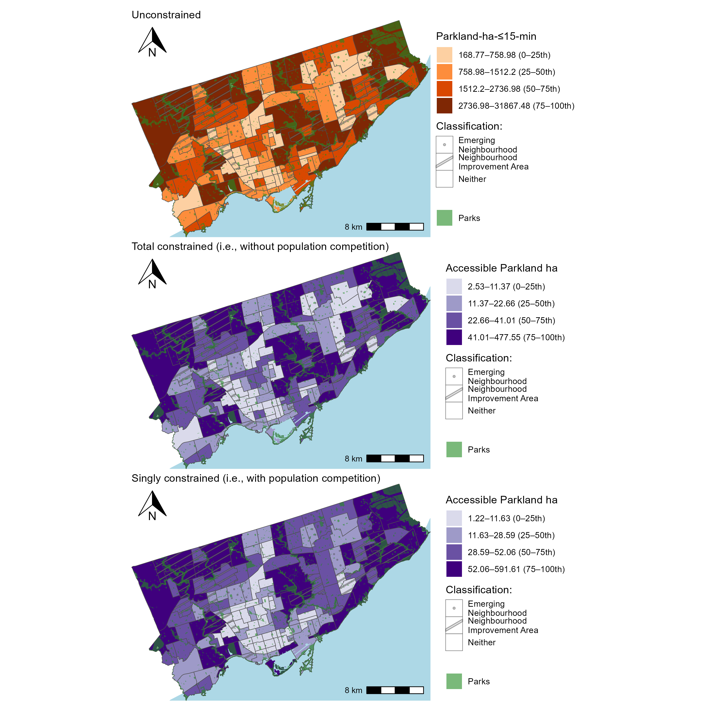
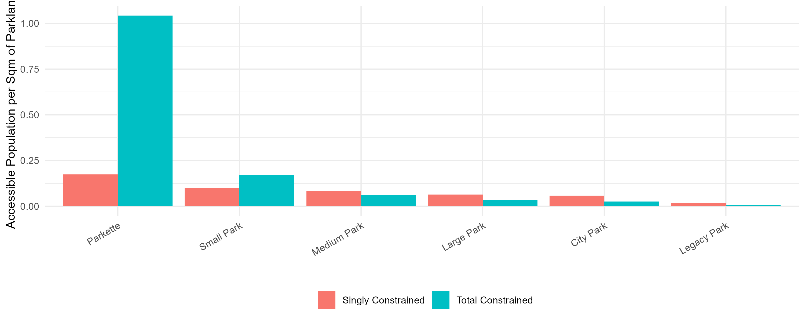

# Unimodal accessibility to parks in Toronto

<!-- Required to number equations in HTML files -->
<script type="text/x-mathjax-config">
MathJax.Hub.Config({
  TeX: { equationNumbers: { autoNumber: "AMS" } }
});
</script>

```{r include=FALSE}
knitr::opts_chunk$set(
  echo = FALSE,
  cache = FALSE,
  warning = FALSE,
  message = FALSE)
```

```{r}
library(sf)
library(dplyr)
load(file="./data/intermediate/access_WALK_i_df.rda")
load(file="./data/intermediate/access_WALK_i_neighbourhoods_df.rda")
access_WALK_i_neighbourhoods_df <- access_WALK_i_neighbourhoods |> st_drop_geometry()
load(file="./data/intermediate/access_WALK_j_neighbourhoods.rda")
```


## Overview

In this chapter, walking accessibility (i.e., unimodal) of parkland and population is presented: where population is assumed to be all people at each DB and parkland is in hectares per park. We adopt the normative impedance function for walking discussed in Chapter 3, i.e., if a park entrance can be reached within 15 minutes of walking than the park is assumed to be reachable and enters the calculation as a 1, and if not, it is assumed full not reachable and enters the accessibility calculation as a 0. 

In the first half of the chapter the focus is on _accessible parkland area_. Values of $V^0_i$, $V^T_i$ and $V^S_i$ are expressed at the DB level and at the neighbourhood level. Then, the accessible parkland per capita ratio is demonstrated, neighbourhoods are ranked and a discussion is detailed based on 'potential parkland service provision'. In the second half of the section, _accessible population_ $M^0_j$, $M^T_j$ and $M^S_j$ is presented per park and per parkland area ratios at the level of the park itself and the neighbourhood is discussed as the 'potential population served'.

## Accessible parkland (for the population)
Figure \ref{fig:chp4-parkland_access_DB_WALK_plots} demonstrates that the unconstrained, total constrained (i.e., without population competition) and singly constrained accessible parkland (i.e., with population competition). All three plots are binned by quartile: 0-25th, 25-50th, 50-7th, 75th-100th. Light grey areas are DBs with 0 parkland accessibility. Grey DBs have population but have no parkland accessibility, as their representative DB point cannot reach an assumed parkland entrance within 15 minutes of walking. These grey DBs are often in proximity to light grey DBs and typically are larger in area, contain limited pedestrian infrastructure, and fewer connections into parks that are proximate.

```{r ,fig.align='center', out.width="6in", fig.cap="\\label{fig:chp4-parkland_access_DB_WALK_plots}Accessibility to parkland area per DB in Toronto."}
knitr::include_graphics("./data/figures/chp4-parkland_access_DB_WALK_plots.png")
```

Also in Figure \ref{fig:chp4-parkland_access_DB_WALK_plots}, the total and singly constrained maps are shown in purple, reflecting constrained values (i.e., units of accessible parkland area). Their quartile bins are similar in magnitude, whereas the unconstrained plot's quartiles are not nor are the units comparable (representing units of parkland-ha-$\le$-15-minutes, a product of opportunity and impedance function). Within a 15 minute walk, only $7632.922$ hectares of Toronto's total $8037.547$ hectares of parkland (i.e., 95%) are reachable and end up being included in the accessibility calculations. Accordingly, the sums of the constrained accessibility measures across all DBs equals 7632.922 hectares. The parks that remain inaccessible vary in classification and assumed entrance type (centroid or edge). The characteristics of these unreachable parks are discussed further in the following subsection on the **accessible population to parkland** in Section \@ref(sec:accessible-pop). 

Across all plots in Figure \ref{fig:chp4-parkland_access_DB_WALK_plots}, DBs with no accessibility (i.e., light grey and grey) are represented. These areas correspond to the airport lands (Pearson airport) in the northwest; large indoor mall (Sherway Gardens) and the surrounding industrial and rail yard in the southwest; and natural areas in the northeast, including Rouge National Urban Park and the area surrounding Toronto Zoo, where protected lands, restrictive zoning, and steep terrain may limit development. Similar conditions are present in the city's centre near the Don Valley and associated river system, where floodplains and protected natural space restrict residential development.

Moreover, the total constrained plot in Figure \ref{fig:chp4-parkland_access_DB_WALK_plots} is proportional to the unconstrained plot by $K^T$. As reviewed in Chapter 3, mathematically $K^T$ is the sum of parkland area that can be walked to within 15 minutes (in ha) divided by the sum of total unconstrained accessibility in the city ($\frac{7632.922}{509354.5} = 0.01498548$). In this way, the total constrained plot can be similarly interpreted as the unconstrained plot (i.e.,15-minute cumulative opportunities measure) but in meaningful units: each DB’s value now represents the amount of parkland area that can be accessed (out of the total parkland area). Because the total constrained measure is directly proportional to the unconstrained accessibility measure, areas of high and low access follow the same spatial pattern across both plots. Since a 15-minute walk radius covers only a limited distance beyond a park, it can be noted that DBs located within or adjacent to large parks appear in the top accessibility quartile, while those near smaller parks fall into the lower quartiles. In this way, the spatial pattern of the total constrained measure largely reflects the distribution and size of the parks themselves.

Further inspecting Figure \ref{fig:chp4-parkland_access_DB_WALK_plots}, the singly constrained plot contains `r ((access_WALK_i_df |> filter(is.na(V_opp_i) | V_opp_i == 0) |> nrow()) / (access_WALK_i_df |> filter(is.na(V_tot_i) | V_tot_i == 0)|> nrow())) |> round(2)` times more DBs with no accessibility than the constrained plot (`r access_WALK_i_df |> filter(is.na(V_opp_i) | V_opp_i == 0) |> nrow()` DBs have no accessibility instead of out of `r access_WALK_i_df |> filter(is.na(V_tot_i) | V_tot_i == 0) |> nrow()` DBs out of the total `r access_WALK_i_df |> nrow()` DBs in the city). The singly constrained measure accounts for both reachability (travel impedance) _and_ population demand, so this measure yields zero accessibility for a DB containing no population but that still may be within a 15-minute walking distance of a park. Like the total constrained map, the singly constrained plot can be interpreted as a spatial diffusion of parkland, but one that reflects both travel impedance _and_ population demand.

As both the total and singly constrained measures use the same set and distribution of opportunities and travel impedance functions, they share similar spatial patterns in Figure \ref{fig:chp4-parkland_access_DB_WALK_plots}. However, they are still meaningfully diverge on account of population competition (i.e., a Pearson correlation of only `r cor(access_WALK_i_df$V_tot_i, access_WALK_i_df$V_opp_i, use = "complete.obs", method = "pearson")`. As the singly constrained measure considers population demand, DBs with a relatively high population within a 15-minute walking proximity to parks _always_ have high singly constrained accessible parkland, whereas this occurrence is only coincidental for the total constrained measure as population is not an input variable. Figure \ref{fig:chp4-singly_total_by_pop_heatmap} reflects this relationship between total constrained, singly constrained and this third variable: population.

```{r ,fig.align='center', out.width="6in", fig.cap="\\label{fig:chp4-singly_total_by_pop_heatmap}Heatmap of DB-level mean population per deciles, total constrained accessible parkland area deciles and singly constrained accessible parkland area deciles."}
knitr::include_graphics("./data/figures/chp4-singly_total_by_pop_heatmap.png")
```
Regarding DBs with high and low population in Figure \ref{fig:chp4-singly_total_by_pop_heatmap}. Notably, DBs with high singly constrained values and low total constrained values always have above average population (i.e., pinks, above 500 people per DB). Conversely, DBs with low singly constrained values always have low average population but can have any range of total constrained values. In this way, considering population competition introduces more variation in the results. Compared to the total constrained values, the singly constrained values are more often zero, and tend to be lower (median is `r access_WALK_i_df$V_opp_i |> median(na.rm=T) |> round(2)` for singly constrained and `r access_WALK_i_df$V_tot_i |> median(na.rm=T) |> round(2)` for total constrained) or higher (Q3 and max value of `r (access_WALK_i_df$V_opp_i |> quantile(probs = seq(0, 1, 0.25), na.rm = TRUE) |> data.frame() |> pull())[4] |> round(2)` and `r access_WALK_i_df$V_opp_i |> max(na.rm=T) |> round(2)` for singly constrained vs. `r (access_WALK_i_df$V_tot_i |> quantile(probs = seq(0, 1, 0.25), na.rm = TRUE) |> data.frame() |> pull())[4] |> round(2)` and  `r access_WALK_i_df$V_tot_i |> max(na.rm=T) |> round(2)` for total constrained).

Furthermore: the single constraint functions at a different scale than the total constraint. It allocates the area of each park to DBs that can reach it within 15 minutes, whereas the total constraint simply allocates the total parkland area, irrespective of the amount of area of the individual parks as long as the total constraint is satisfied. 

This dynamic can be observed just west from the center of the city near the shoreline in Figure \ref{fig:chp4-parkland_access_DB_WALK_plots} where the area is both relatively dense in population and well-served by smaller to medium sized parkland. As a result, it shows lower singly constrained accessibility values compared to total constrained values reflecting the adjustment for population demand.Put another way, areas over-allocated parkland area than what the population demands when refering to the total constrained measure. In contrast, further east along the shoreline, the population density is lower and the areas are rich in parkland area. These areas consequently exhibit higher singly constrained than total constrained values. Because population is low and green space is abundant, these areas can be seen to have under-allocated parkland relative to their population demand.

The over- and under- allocation of parkland area is another way to discuss the difference between singly and total constrained accessibility. In Figure \ref{fig:chp4-singly_total_by_parksize_scatter}, the sum of $V_{ij}^S$ and $V_{ij}^T$ flows from each park are calculated and plotted against one another. Recall that the sum of singly constrained flows to a park is equal to its actual area, since the singly constrained factor proportionally allocates only the park’s land area to reachable origins. This plot therefore illustrates how the total constrained measure allocates parkland area compared to a park's actual area. Parks plotted above the red 1:1 line allocate more accessible parkland than their actual area--indicating these parks are more centrally located or more accessible within the region. Parks below the line allocate less accessible area than they physically contain, suggesting they are more peripheral or less competitive. Interestingly, most parks fall below the line, under-allocating relative to their size. However, a small number--especially among the larger parks--allocate substantially more than their physical area. 

```{r ,fig.align='center', out.width="6in", fig.cap="\\label{fig:chp4-singly_total_by_parksize_scatter} Sum of constrained accessible parkland area flows from each park, reflecting the over and under allocation of total constrained accessible parkland area relative to actual parkland area (or singly constrained accessible parkland area). A plot for each park size classification."}

```

The top three such parks in each size category are labeled in Figure \ref{fig:chp4-singly_total_by_parksize_scatter}. These parks can be interpreted as having ‘over-allocated’ parkland, due to high desirability (i.e. demand by the origin mass) or centrality (i.e., low cost). In summary: parks above the line experience greater 'spatial demand' than parks below the line. Hence, accessibility flows from parks above the line (and parks below the line) may be especially susceptible to change depending on the constrained accessibility measure used. In essence, centrally located parks over-allocate relative to their actual area, while peripheral parks under-allocate--an imbalance corrected when population demand is incorporated in the singly constrained measure.

In summary: both constrained measures offer more interpretable insights than unconstrained accessibility. The total constrained measure is similar in spirit to commonly used metrics like the 15-minute opportunity, but with a meaningful twist: its units can be interpreted as accessible parkland area (in hectares or any area unit). Furthermore, the total constrained accessibility measure also over- and under- allocates relative to the amount of parkland area actually available from a specific park, echoing the issue of 'inflation' discussed in competitive accessibility literature [@paezDemandLevelService2019; @soukhovIntroducingSpatialAvailability2023]. In contrast, the singly constrained measure also offers the same enhanced interpretation of resulting values being in units, as well as being a 'competitive' accessibility measure. It incorporates both population demand and travel impedance, making allocation a function of both population demand for opportunities mediated by travel impedance as well as travel impedance to opportunities as the traditional unconstrained measure.

### Neighbourhood-level accessible parkland area

Another way of examining the accessibility data is by aggregating it to a spatial zoning system with more meaning for policy: such as the neighbourhood. These areas are City-designated 'social planning neighbourhoods' which are used by staff to collect data, plan and analyse service provision [@toronto_neighbourhoods2024]. Also each neighbourhood, as reviewed in Chapter 3, is labelled with either a Emerging Neighbourhood (EN), Neighbourhood Improvement Area (NIA), or neither classification; an additional dimension in determining if the area is should be prioritized or not from the point of equity. In the Figure \ref{fig:chp4-parkland_access_neighbourhood_WALK_plots}, all $V^0_{ij}$, $V^T_{ij}$ and $V^S_{ij}$ values are summed and presented at this level of aggregation.

```{r ,fig.align='center', out.width="6in", fig.cap="\\label{fig:chp4-parkland_access_neighbourhood_WALK_plots}Acessibility to parkland area per neighbourhood and neighbourhood classification in the city of Toronto."}

```

In Figure \ref{fig:chp4-parkland_access_neighbourhood_WALK_plots}, the unconstrained values are not fixed to any meaningful zonal or regional total whereas the sum of total constrained and singly constrained values equal to all the amount of parkland area in the city. For instance, in the top quantile, dark oranges represent 2737 'parkland-ha-$\le$-15-min' or greater, now summed at the area of the neighbourhood. Whereas the top quantile in the total constrained measure represent the 41 ha or greater that is accessible, directly in units of parkland area that can be accessed out of the total parkland hectares. Summing all DBs within a neighbourhood maintains this total constraint and hence this associated intuition. 

The same logic can be applied to the singly constrained measure, but with the additional consideration of population competition. And like Figure \ref{fig:chp4-parkland_access_DB_WALK_plots}, values between the measures in Figure \ref{fig:chp4-parkland_access_neighbourhood_WALK_plots} share some commonalities: unconstrained and total constrained measures still remain proportional (by $K^T$), and the singly constrained values match total constrained values in DBs with and near population values that are relatively average. Singly constrained values deviate when population is low (i.e., singly constrained values are lower than total constrained) and population is high (i.e., singly constrained values are higher than total constrained values). If the heatmap of these two measures and population was reproduced at the neighbourhood aggregation, the general trends would be similar as at the DB level.

However, the trends in the data are smoothed in this aggregation as shown in the density distribution plots of the constrained measures under the different aggregations in Figure \ref{fig:chp4-dist_db_vs_neigh_plots}. At both the DB and neighbourhood levels, the total constrained accessibility distribution is right-shifted and more dispersed compared to the singly constrained measure. This indicates that parkland is allocated more evenly under the total constraint, with fewer areas experiencing extremely high or low access. In contrast, the singly constrained measure shows a slightly more peaked and skewed distribution, reflecting localized competition for limited park space. At the DB-level, accessibility measures are more granular and variable, capturing finer differences in proximity and population competition. This results in a wider range and more extreme values, especially under the singly constrained measure, which reflects localized demand. At the neighbourhood-level, aggregating across DBs smooths out some of the variation and reduces some extremes. While this can enhance interpretability at a policy scale, it may also mask pockets of low or high access that could be critical. For this reason, examining patterns at the lowest level of aggregation should be considered best practice, alongside summing to zoning systems that have more significant meaning from a planning perspective (such as Neighbourhood).

```{r ,fig.align='center', out.width="6in", fig.cap="\\label{fig:chp4-dist_db_vs_neigh_plots}Density distribution of the constrained accessibility measure values at the dissemination block and neighbourhood block. For both aggregations, the datasets are truncated at top decible for the purpose of visualisation."}
knitr::include_graphics("./data/figures/chp4-dist_db_vs_neigh_plots.png")
```

Furthermore: since DBs reflect the smallest units of population from the census (range between 0 to 3375, median of 117 people), much smaller than the city-designed neighbourhoods (which range between 6419 to 33690, median of 17024 people), the following question may arise specifically for neighbourhoods: what is the accessible parkland ha per neighbourhood population? This per capita measure is visualised in Figure \ref{fig:chp4-parkland_access_neighbourhood_percapita_WALK_plots}. 

```{r ,fig.align='center', out.width="6in", fig.cap="\\label{fig:chp4-parkland_access_neighbourhood_percapita_WALK_plots}Map of Toronto CMA with accessibility to parklands per neighbourhood and neighbourhood classification"}
knitr::include_graphics("./data/figures/chp4-parkland_access_neighbourhood_percapita_WALK_plots.png")
```

```{r}
compare <- access_WALK_i_neighbourhoods_df |>
  group_by(CLASSIF9) |>
    summarise(vv_tot_neigh_med = median(vv_tot_neigh),
              vv_tot_neigh_sd = sd(vv_tot_neigh),
              
              vv_opp_neigh_med = median(vv_opp_neigh),
              vv_opp_neigh_sd = sd(vv_opp_neigh)) 
#compare #this is used for discussion in the para below.

compare2_opp <- access_WALK_i_neighbourhoods_df |> filter(V_opp_neigh <= 12 & CLASSIF9 != "Not an NIA or Emerging Neighbourhood") 

compare2_tot <- access_WALK_i_neighbourhoods_df |> filter(V_tot_neigh <= 12 & CLASSIF9 != "Not an NIA or Emerging Neighbourhood") 
```


In Figure \ref{fig:chp4-parkland_access_neighbourhood_percapita_WALK_plots}, all three accessibility measures are shown, though the unconstrained measure should be interpreted with caution. Since the unconstrained measure lacks a constraint, the units--parkland-hectares$\le$-15-minute' divided by neighbourhood population--are more complex to decipher. While neighbourhood population is a fixed and tangible quantity (i.e., a known share of the total population), the amount of 'parkland-hectares$\le$-15-minute' is not similarly bounded or consistently defined across the region. Hence, for a non-competitive yet interpretable alternative to the unconstrained measure, the per capita total constrained accessibility (second plot in Figure \ref{fig:chp4-parkland_access_neighbourhood_percapita_WALK_plots}) should be considered, as it retains intuitive units while incorporating the intuition of the unconstrained measure.

For the constrained measures in Figure \ref{fig:chp4-parkland_access_neighbourhood_percapita_WALK_plots}, park supply categories from the Toronto Parkland Report [@toronto_parkland2019] are used for the scale. This report quantifies the amount of parkland area into meaningful human-scaled bins: the area within a hula hoop (2 sqm), the space beneath a patio umbrella (4 sqm), the space within a bus shelter (12 sqm), and the canopy of a mid-size tree (28 sqm+). Figure \ref{fig:chp4-parkland_access_neighbourhood_percapita_WALK_plots} uses these relatable labels for accessible per capita parkland area, applied to constrained measures.

<!----unlike the intuitive but unconstrained form of accessibility analysis done in @toronto_parkland2019.

Notably, regarding the constrained accessibility values in Figure \ref{fig:chp4-parkland_access_neighbourhood_percapita_WALK_plots}, they align well with the @toronto_parkland2019 report parkland area categories. This is because constrained accessibility is measured in accessible parkland square metres per capita, which maps intuitively onto these tangible benchmarks. As well, the 500m threshold used to define parkland supply in @toronto_parkland2019 is also similar in range to a 15 minute walk travel time, captured in the travel impedance function used in the accessibility measures. In this way, the constrained values are expression of accessibility but in the language of parkland supply--helping bridge the proposed conceptual constrained accessibility methodology with and applied approaches (like that in the @toronto_parkland2019 report).
-->

The interquartile ranges of both constrained measures in Figure \ref{fig:chp4-parkland_access_neighbourhood_percapita_WALK_plots} correspond to the relatable bins, ranging between the area of a patio umbrella and a tree canopy, with medians just above the space of a bus shelter. Specifically: the total constrained accessibility interquartile range is  `r access_WALK_i_neighbourhoods_df$vv_tot_neigh |> quantile(0.25) |> round(1)` to `r access_WALK_i_neighbourhoods_df$vv_tot_neigh |> quantile(0.75) |> round(1)` accessible sqm of parkland per capita with a median of `r access_WALK_i_neighbourhoods_df$vv_tot_neigh |> median() |> round(1)` sqm per parkland per capita. The singly constrained accessibility score's interquartile range is `r access_WALK_i_neighbourhoods_df$vv_opp_neigh |> quantile(0.25) |> round(1)` to `r access_WALK_i_neighbourhoods_df$vv_opp_neigh |> quantile(0.75) |> round(1)`, with a median of `r access_WALK_i_neighbourhoods_df$vv_opp_neigh |> median() |> round(1)` sqm of parkland per capita. No neighbourhood has 0 accessible parkland area. 

In Figure \ref{fig:chp4-parkland_access_neighbourhood_percapita_WALK_plots}, as previously noted, the singly constrained values are generally more dispersed than the total constrained values (i.e., tending to be both higher or lower), so a similar pattern is expected in the per capita scores. And this holds true: the spatial distribution of raw scores and per capita rates closely align. For example, both measures show lower values (oranges and reds) concentrated downtown and higher values (greens) in the centre part of the city near the Don Valley system. However, some areas diverge: along the shoreline east of downtown where residential density is lower but green space is plentiful, per capita scores are especially high for the singly constrained measure but only moderately high for the total constrained measure.

The discussion of how neighbourhoods change value depending on the measure used is important, as the purpose of aggregating the constrained measures at the neighbourhood level can be to identify priority areas. To use common terminology: this analysis considers NIA and EN labelled neighbourhoods as priority areas. Interestingly, observing Figure \ref{fig:chp4-parkland_access_neighbourhood_percapita_WALK_plots} however, not all NIA/EN are equal in terms of accessible parkspace; some have plenty of accessible per capita parkland area while others do not. Regarding parkland supply thresholds, the @toronto_parkland2019 report selects the normative threshold of parkland area of 12 sqm (bus shelter) per capita as a value below that should be considered priority. And as an additional point of reference, this is slightly more than the 9 sqm per inhabitant recommended by the WHO [@OECDFrameworks2013]. Hence, in this analysis, it is assumed then that neighbourhoods that are NIA/EN and contain below 12 sqm parkland area that is accessible per capita are priority neighbourhoods for incerased parkland area supply.

Using these two criteria and depending on which constrained per capita measure is used, either `r compare2_opp |> nrow()` or `r compare2_tot |> nrow()` of the `r access_WALK_i_neighbourhoods_df |> filter(CLASSIF9 != "Not an NIA or Emerging Neighbourhood") |> nrow()` NIA/EN neighbourhoods (out of 158 neighbourhoods overall) fall below the 12 sqm threshold for accessible parkland area per capita. Overall, the competitive (singly constrained) measure tends to produce consistently higher per capita values than the total constrained measure, reflecting the effect of population demand. These patterns for NIA, EN and neither neighbourhood classification scores are summarized in the boxplots in Figure \ref{fig:chp4-parkland_access_neighbourhood_percapita_WALK_boxplots}. 

```{r ,fig.align='center', out.width="6in", fig.cap="\\label{fig:chp4-parkland_access_neighbourhood_percapita_WALK_boxplots} Boxplot of singly constrained and total constrained per capita neighbourhood values summarised by type of neighbourhoof classification. "}

```

From Figure \ref{fig:chp4-parkland_access_neighbourhood_percapita_WALK_boxplots}, it can be observed that the majority of NIAs have per capita scores above 12 sqm, especially when considering the singly constrained measure. However, some NIAs fall below this threshold under both measures<!----these include `r compare2_opp |> filter(CLASSIF9 == "Neighbourhood Improvement Area") |> pull(N_name) |> paste(collapse = ", ") |> cat()`-->--while others fall below only under the total constrained measure.<!--, such as `r compare2_tot |> filter(CLASSIF9 == "Neighbourhood Improvement Area" & vv_opp_neigh > 12) |> pull(N_name) |> paste(collapse = ", ") |> cat()`.--> The neighbourhoods below the threshold on both measures tend to be relatively dense (compared to other NIAs) and lack large parks, while those below only on the total constrained measure often contain large parks but only a portion of the population can access them. When population demand is considered (i.e., singly constrained) as the amount of area for the population is sufficiently high to exceed the threshold.

Also from Figure \ref{fig:chp4-parkland_access_neighbourhood_percapita_WALK_boxplots}, it can be observed that EN appear to diverge the most (relative to other neighbourhood classifications) depending on the measure used. No EN falls below the threshold for both measures, but four neighbourhoods fall below it when only the total constrained measure is considered<!--, namely: `r compare2_tot |> filter(CLASSIF9 == "Emerging Neighbourhood") |> pull(N_name) |> paste(collapse = ", ") |> cat()`-->. These neighbourhoods share similar characteristics with the NIAs that fall below the threshold considering the total constrained measure, i.e., large in area and only have a large park accessible to part of the neighbourhood population, which results in high total constrained access for that specific portion but low accessibility when aggregated across the entire neighbourhood. Conversely, when the (relatively) lower levels of population demand is considered in the singly constrained measure, singly constrained per capita scores exceed the threshold.

Lastly, gleaned from Figure \ref{fig:chp4-parkland_access_neighbourhood_percapita_WALK_boxplots}, neighbourhoods without either classification have median per capita scores close to 12 sqm, with singly constrained scores that are generally higher and more dispersed. Interestingly, the neighbourhoods with the lowest and highest per capita singly constrained scores tend to be in this group, located either west of the downtown core or along the shoreline as previously noted.

In summary, although some NIA and EN neighbourhoods do not meet the 12 sqm threshold, the majority exceed it under both constrained accessibility measures. This presents an optimistic outlook regarding accessible parkland area (as measured in this analysis) in the identified priority neighbourhoods.

Going beyond the NIA/EN classifications, another notable aspect of the difference in the total and singly constrained scores is its spatial distribution. How this difference results in a change of parkland area per capita category (i.e., 0-2, 2-4, 4-12, 12-28, or 28+ sqm per capita) is visualised in Figure \ref{fig:chp4-diff_singly_access_neighbourhood_parkland_percapita_WALK_plot}. While the choice of measure may not drastically impact the identification of NIA/EN neighbourhoods below the 12 sqm threshold (with exception of a few, as discussed), it does produce different results overall i.e., the range of difference in neighbourhood values are between -95.08 and 111.60 accessible parkland sqm per capita. This distinction could be important in other contexts and may influence policy decisions.

```{r ,fig.align='center', out.width="6in", fig.cap="\\label{fig:chp4-diff_singly_access_neighbourhood_parkland_percapita_WALK_plot} Difference in per capita constrained accessibility to parklands per neighbourhood values. Namely, singly constrained per capita minus total constrained per capita. "}
knitr::include_graphics("./data/figures/chp4-diff_singly_access_neighbourhood_parkland_percapita_WALK_plot.png")
```
```{r}
access_WALK_i_neighbourhoods_df <- access_WALK_i_neighbourhoods_df |>
  mutate(diff = vv_opp_neigh - vv_tot_neigh,
         pop_den = Population/area_sqm)

compare <- access_WALK_i_neighbourhoods_df |>
  mutate(access_change = case_when( 
           diff > 0 ~ "Pop comp results in more access",
           diff < 0 ~ "Pop comp results in less access",
           TRUE ~ "No change"),
         cat_diff = as.numeric(vv_opp_neigh_cat) - as.numeric(vv_tot_neigh_cat),
         cat_diff = factor(cat_diff, levels = c(-2, -1, 0, 1, 2))) |>
  group_by(CLASSIF9, access_change) |>
    summarise(count = n())
```

The change in categories visualised in Figure \ref{fig:chp4-diff_singly_access_neighbourhood_parkland_percapita_WALK_plot} can be interpreted as the effect of population competition on the change in neighbourhood accessible parkland area category. Positive values (shown in purple) indicate neighbourhoods with higher per capita accessible parkland when population demand is considered--suggesting these areas are more regionally competitive in being allocated potential parkland area access. Negative values (in red) highlight neighbourhoods that appear to have higher access only when travel impedance is considered, but lower in value once competition is factored in. Overall, moderately high positive differences typically occur in neighbourhoods identified as having high amount of accessible parkland area--such as along the eastern shoreline or near the Don Valley--and where population is relatively low. This results in less competition hence higher per capita singly constrained accessibility (relative to total constrained). In contrast, neighbourhoods with negative values (reds), such as those slightly west and north of downtown, tend to have relatively lower reachable parkland area and higher population demand, meaning the singly constrained values are lower than the total constrained values. As a note: the pockets of constrained measure differences were discussed regarding the raw constrained measures at the DB level in Figure \ref{fig:chp4-parkland_access_DB_WALK_plots}. An alignment of patterns across aggregation, normalisation (i.e., per capita), and absolute change, demonstrates the flexibility and robustness of the constrained framework.

Furthermore, differences showcased in Figure \ref{fig:chp4-diff_singly_access_neighbourhood_parkland_percapita_WALK_plot} could have important policy implications, if a different sqm threshold was selected. 12 sqm is relatively low, what if a higher threshold was selected? For example, `r compare[2,3]` of the `r compare[2,3] + compare[1,3]` ENs and `r compare[4,3]` of the `r compare[4,3] + compare[3,3]` NIAs see higher per capita access under the singly constrained measure. By contrast,  `r (compare[6,3] / (compare[6,3] + compare[5,3])) |> as.numeric() |> scales::percent()` neighbourhoods not classified as NIA or EN have lower accessibility according to the singly constrained measure (`r compare[6,3]` out of `r compare[6,3]+compare[5,3]` neighbourhoods). This suggests that considering population competition tends to yield higher scores for NIAs and ENs (due to their proximity to larger parkland areas and relatively lower populations) while neighbourhoods without a classification see marginally lower accessibility scores when competitive is considered. Overall, the choice of constraint leads to different outcomes, making it crucial to select the appropriate measure based on available population data and whether the opportunity is characterised as an exhaustible or inexhaustible resource.

<!-- However, the difference in these per capita rates--and in the raw values aggregated at the neighbourhood themselves--are no longer as clearly related to population nor the amount of park space as previous outlined. This is because these values are aggregated to a coarser spatial scale and divided by population, which obscures some of the finer-scale spatial dynamics. Still, they relate closely to the concept introduced in Figure \ref{fig:chp4-singly_total_by_parksize_scatter}: the difference between how much parkland is allocated versus how much parkland actually exists. -->

<!-- Under the total constrained measure: neighbourhoods with more parks that allocate _less_ than their park area tend to have parks that are below the red line shown in Figure \ref{fig:chp4-singly_total_by_parksize_scatter} and can be perceived as parks with greater "potential" that is not allocated away. However: this difference in allocation (between the actual area and total) results in a _positive_ difference in neighbourhood accessibility allocation when calculating the singly constrained neighbourhood value (i.e. purple DBs). And this relationship is roughly linear (Figure \ref{fig:chp4-diff_in_parkallocated_and_neigh_plot}). -->

<!-- 
```{r, message=FALSE}
access_WALK_i_neighbourhoods_df <- access_WALK_i_neighbourhoods_df |>
  mutate(diff = vv_opp_neigh - vv_tot_neigh,
         pop_den = Population/area_sqm)
compare <- access_WALK_i_neighbourhoods_df |>
  mutate(access_change = case_when( 
           diff > 0 ~ "Pop comp results in more access",
           diff < 0 ~ "Pop comp results in less access",
           TRUE ~ "No change")) |>
  group_by(CLASSIF9, access_change) |>
    summarise(count = n())
#compare
```
-->
<!-- While this relationship is not perfectly captured due to difference in zonal aggregations and spatial structure of the travel impedance allocation. Nonetheless, the pattern reinforces a key point: when population demand is not used to constrain the allocation of accessible parkland, as in the total constrained measure, parkland is allocated freely based on travel impedance alone. As a result, centrally located parks over-allocate relative to their actual area, while peripheral parks under-allocate--an imbalance corrected when population demand is incorporated in the singly constrained measure. Also note: only 1149 parks out of the total 1581 parks that entered the accessibility calculation are shown in Figure \ref{fig:chp4-diff_in_parkallocated_and_neigh_plot}: parks with differences that match in magnitude. Parks that do not match in magnitude are few, and tend to be very small (likely due to discrepancies due to aggregation inconsistencies across spatial units. -->

<!-- ```{r ,fig.align='center', out.width="6in", fig.cap="\\label{fig:chp4-diff_in_parkallocated_and_neigh_plot}Difference in 'accessible' parkland allocated from parks in a neighbourhood and the difference in neighbourhood constrained accessibility measure (difference is singly constrained minus total constrained)."} -->
<!-- knitr::include_graphics("./data/figures/chp4-diff_in_parkallocated_and_neigh_plot.png") -->
<!-- ``` -->

<!-- From another examination vantage point: depending on what constrained measure is used, neighbourhoods can dramatically change rank. Of the 158 neighbourhoods, 154 changed rank, with 75 increasing in rank (i.e, higher per capita value when singly constrained is used compared total constrained) and 79 decreasing in rank. The top 10 neighbourhoods that increased rank (purples) and top 10 that decreased rank (reds) are in Figure \ref{fig:chp4-rank_change_parkland_access_neigh_plot}. From those familiar with Toronto, top 10 are neighbourhoods with a good amount of parkland, and well residential. These neighbourhoods are like Highland Creek which jumped 85 ranks when using the singly constrained measure. This neighbourhood is relatively low population and contains a high amount of green space that is not easily reached by other populations. Hence: it has relatively low amount of accessible parkspace without considering competition (6.24 sq m per capita) but a high amount when competition is factored into proportional allocation (27.9 sq m per capita). Conversely, neighbourhoods that are centrally located to plenty of parkspace but are also relative proximate to a high amount of population decreased in rank when considering competition, like Cabbagetown-South St. James Town which dropped 73 ranks, from 26.3 sq m per capita in the total constrained measure to 7.65 sq m per capita in singly constrained measures.  -->

<!-- ```{r ,fig.align='center', out.width="6in", fig.cap="\\label{fig:chp4-rank_change_parkland_access_neigh_plot}Change in neighbourhood rank using singly to total constrained accessible parkland measure for top negative and positive change-rank neighbourhoods."} -->
<!-- knitr::include_graphics("./data/figures/chp4-rank_change_parkland_access_neigh_plot.png") -->
<!-- ``` -->

<!-- Figure \ref{fig:chp4-all_rank_change_parkland_access_neigh_plot} summarises the change in rank of all neighbourhoods depending on what constrained per capita measure is used. The four neighbourhoods that did not change rank are along the x axis in black, the top 10 negative and positive rank-changed neighbourhoods (as seen in Figure \ref{fig:chp4-rank_change_parkland_access_neigh_plot}) are coloured in red and purple respectively  and the rest of the neighbourhoods are grey points. The smoothed curved trend line demonstrates the general increasing trend. For neighbourhoods with high total constrained ranks, their rank using singly constrained accessibility decreases (i.e., a much lower $v^S_i$ than $v^T_i$), and as the rank of the neighbourhood decreases considering the total constrained score - their singly constrained scores increase and hence rank higher by these scores (i.e., a higher $v^S_i$ than $v^T_i$). Overall: neighbourhoods in these extreme ends are especially sensitive to changing rank: i.e., especially neighbourhoods with parks that are central, and especially those that are larger, over-allocated their accessible parkland, while parks in neighbourhoods that are not that central (and/or smaller) under allocated --both these allocation types were 'corrected' with the proportional and zonal allocation of the singly constrained accessibility measure. Neighbourhoods with constrained values that are more similar tend to see changes in rank that are more modest and in either directions, in part as a product of rank changes in the extreme cases.  -->

<!-- ```{r ,fig.align='center', out.width="6in", fig.cap="\\label{fig:chp4-all_rank_change_parkland_access_neigh_plot}Change in neighbourhood rank using singly to total constrained accessible parkland measure for all neighbourhoods."} -->
<!--  -->
<!-- ``` -->

### Summary
The total and singly constrained (opportunity-constrained) accessibility measures offer intuitive ways to interpret values at the zonal level, as they are expressed in meaningful units of accessible parkland area. This contrasts with the unconstrained measure, where values--beyond simply being high or low--lack clear interpretability, especially due to the absence of constraints on either population or opportunity. Importantly, the total constrained measure retains proportionality with conventional methods (e.g., 15-minute catchments), but does so while preserving interpretable units. The singly constrained measure goes a step further by incorporating population demand, offering a more restrictive--but theoretically more realistic--representation of access where competition for finite opportunities (like parkland) exists.

The figures in this section highlight how neighbourhood rankings shift depending on whether a competitive (singly constrained) or non-competitive (total constrained) measure is used. These shifts demonstrate that each measure reflects a different allocation logic, and neither is inherently better. The appropriate choice depends on the analyst’s assumptions about the competitive nature of the opportunity and the population:

- Does the opportunity lack scarcity or competition, such that allocation based solely on regional travel impedance (as in the total constrained measure) is appropriate?
- Or, does the opportunity reflect a finite, competitive resource (e.g., parkland area), in which case allocation should also account for local population demand (as in the singly constrained measure)?

If the opportunity is indeed competitive (arguably: most real-world opportunities are), then the analyst must ensure there is adequate zonal information about the population that demands it. For instance, if park space is considered inexhaustible--meaning that its value is not impacted based on how many people demanding are near it--then the total constrained measure may suffice. However, this is not often the case.

For example, a large park like Queen’s Park, surrounded by high population density, may offer meaningful access to everyone nearby. If everyone (within a 15-minute distance) visited, it is not hard to imagine that the park's 'accessibility' would not change (i.e., it would suffer too much population congestion). Indeed: this is captured by the singly constrained measure. However, consider for example a parkette that is near the same highly dense population. As it is smaller in park size, it makes more intuitive sense to see this park as more exhaustive, i.e., if everyone within 15-minutes visited its accessibility would certainly diminish due to population congestion as it is a small park by area. It could be conceptualised that both a large park and a small park are exhaustible: based on the demanding population (in proximity) per parkland _area_. In this sense, the singly constrained approach offers a more nuanced and realistic measure than the total constrained measure. It recognizes that parkland is a finite, exhaustible resource, especially in dense urban areas as well as accounting for the 'resilience' of exhaustibility of a larger park due to its larger area. 

## Accessible population (to the parkland) {#sec:accessible-pop}

From another analytical vantage point, a policy analyst may be interested in conducting this investigation from the perspective of _accessible population_, i.e., understanding which parks are serving what amount of population. This is essentially the transpose of the accessibility measures discussed in the preceding section: instead of measuring accessible parkland per population zone, accessible population per park is examined.

Since parks serve as the destination zones (with each park represented by its nearest reachable entrance), the lowest level of aggregation for $M^0_{ij}$, $M^T_{ij}$, and $M^S_{ij}$ is at the park level ($j$). Thus, the summaries $M^0_j$, $M^T_j$, and $M^S_j$ represent the population potentially served by each park under the unconstrained, total constrained, and singly constrained measures, respectively. These are shown in Figure \ref{fig:chp4-pop_access_DB_WALK_plots}. The unconstrained measure can be interpreted as unconstrained "market potential". The constrained measure reflect a constrained version of this market potential. <!--: total constrained measure introduces a realistic intuition by allocating the total population in the region to each park by its associated travel impedance, while the singly constrained measure allocates each zonal population considering associated reachable parkland area (i.e., the park supply) as well as associated travel impedance.--> All three plots are binned into quartiles (0–25th, 25–50th, 50–75th, 75–100th percentile) for ease of visualisation. White areas indicate non-park zones, while grey parks are not accessible to any population within a 15-minute walk. As in the previous section, the unconstrained and total constrained measures remain proportionally equivalent.

```{r ,fig.align='center', out.width="6in", fig.cap="\\label{fig:chp4-pop_access_DB_WALK_plots}Accessibility to population per park in the city of Toronto."}
knitr::include_graphics("./data/figures/chp4-pop_access_DB_WALK_plots.png")
```

Figure \ref{fig:chp4-pop_access_DB_WALK_plots} visualises the unconstrained and total constrained measures that are proportional in their magnitude as maintained by the $\hat K^T$ balancing factor, and the singly and total constrained values are within similar ranges with the singly constrained measure demonstrating a larger range and variance than the total constrained measure. Beyond these commonalities, the constrained values from Figure \ref{fig:chp4-pop_access_DB_WALK_plots} should be interpreted as the accessible population as opposed to the accessible parkland area. As well, each constrained measure sums across the region to equal the total amount of population that we assume can reach parks: 2761103 people.

Unlike the DBs, a spatial unit with less significance for planning (compared to the neighbourhood aggregation at least), the park itself is worth examining. Due to the proportionality, parks per park size classification can be compared by their ratios of _accessible population_ to their park size as shown in Figure \ref{fig:chp4-pop_access_byparksize_WALK_plot}. It can be seen that Parkettes and Small Parks serve population at a more efficient parkland area rates than the larger parks using the total constrained measure. Furthermore, when parkland supply is considered (i.e., allocation is based on the area of the park itself and its travel impedance and not only its proximity to population and associated travel impedance), the intensity of the dynamic changes. For instance, smaller parks are still more 'efficient' than larger parks but not as much. Small Parks do not 'over' allocated, despite their tendancy to be more centrally located. Conversely, larger parks tend to be allocated more to populations, though are relatively less centrally located as the populations face lower competition. Overall, depending on which measure is used: their efficiency of 'population service' will differ.

```{r ,fig.align='center', out.width="6in", fig.cap="\\label{fig:chp4-pop_access_byparksize_WALK_plot}Constrained accessible population per parkland area by park size classification."}

```
<!--
Furthermore: parks can be ranked by this accessible population per the park's area rate. This rate expresses the park's potential 'population serviced' per sq m. It can be used to rank the parks by how centrally they are located near population per area for the city: to determine which parks are located near the highest amount of potential population, i.e., parks with the most population (to reach) potential. These parks should be flagged as parks that should be most concerned with population congestion. Conversely, parks that rank low are of least concern (at a per sq m rate). 

On this topic: Figure \ref{fig:chp4-pop_access_byparksize_WALK_rankchange_plot} visualises how park rankings shift depending on whether the total or singly constrained measure is used, with parks grouped by size classification. Notably, smaller parks--particularly parkettes, small parks, and some medium parks--often see sharp drops in rank under the singly constrained measure. These parks typically score higher under total constrained accessibility because they are centrally located and close to higher population densities. However, when the supply of parks (typically larger) is considered (i.e., singly constrained), accessibility declines. Examples include Old Mill Parkette, Ormskirk Park, and R.V. Burgess Park, all of which are situated in residential areas near much larger parks.

```{r ,fig.align='center', out.width="6in", fig.cap="\\label{fig:chp4-pop_access_byparksize_WALK_rankchange_plot}Change in park rank based on constrained accessible population per parkland area measures by park size classification."}

```

While a clear uniform trend across all parks does not emerge in Figure \ref{fig:chp4-pop_access_byparksize_WALK_rankchange_plot}, a pattern among larger parks (Legacy, City, and Large classifications) can be seen. These larger parks tend to have mid to low ranks under the total constrained measure but often climb in rank under the singly constrained measure. For example, McGregor Park sees a significant boost due to its central location to population and competitive supply advantage. In contrast, large parks with initially low total constrained values experience only modest changes (e.g., small increase in rank for Colonel Danforth Park and slight decline for Coxwell Ravine Park). Overall, this suggests that larger parks tend to attract more population simply by virtue of their size, and when park supply is explicitly considered--as in the singly constrained measure--their accessibility increases relative to smaller parks competing in denser park environments.
-->
### Neighbourhood-level accessible population

Like in the preceding section of the chapter, the neighbourhood can serve as a useful spatial unit for analysis. They align well with both population distribution and parkland organisation in the city. The majority of parks are fully contained within a single neighbourhood, allowing for meaningful calculation of ratios such as accessible population per unit of parkland. Additionally, from an equity perspective, neighbourhood-level analysis enables examination of how different types of parks serve populations across neighbourhoods with varying characteristics, supporting more targeted policy evaluation.

In the Figure \ref{fig:chp4-pop_access_neighbourhood_WALK_plots}, all $M^0_{ij}$, $M^T_{ij}$ and $M^S_{ij}$ values are aggregated at the level of the neighbourhood. They can also be divided by parkland area in that neighbourhood (as determined by summing and splitting, if needed, of parkland area within each neighbourhood) and demonstrated as accessible population per parkland sqm as in Figure \ref{fig:chp4-pop_access_neighbourhood_perparland_WALK_plots}. 

```{r ,fig.align='center', out.width="6in", fig.cap="\\label{fig:chp4-pop_access_neighbourhood_WALK_plots}Accessibility to population per neighbourhood in Toronto."}
knitr::include_graphics("./data/figures/chp4-pop_access_neighbourhood_WALK_plots.png")
```

```{r ,fig.align='center', out.width="6in", fig.cap="\\label{fig:chp4-pop_access_neighbourhood_perparland_WALK_plots} Accessibility to population per parkland sqm at level of the neighbourhood for Toronto."}
knitr::include_graphics("./data/figures/chp4-pop_access_neighbourhood_perparland_WALK_plots.png")
```

```{r}
compare3 <- access_WALK_j_neighbourhoods |>
  group_by(CLASSIF9) |>
    summarise(mm_tot_neigh_med = median(mm_tot_neigh),
              mm_tot_neigh_sd = sd(mm_tot_neigh),
              
              mm_pop_neigh_med = median(mm_pop_neigh),
              mm_pop_neigh_sd = sd(mm_pop_neigh))
#compare #this is used for discussion in the para below.

compare4 <- access_WALK_i_neighbourhoods_df |>
  group_by(CLASSIF9) |>
    summarise(vv_tot_neigh_med = median(vv_tot_neigh),
              vv_tot_neigh_sd = sd(vv_tot_neigh),
              
              vv_opp_neigh_med = median(vv_opp_neigh),
              vv_opp_neigh_sd = sd(vv_opp_neigh))
#compare3
```


Referring to Figure \ref{fig:chp4-pop_access_neighbourhood_WALK_plots} and Figure \ref{fig:chp4-pop_access_neighbourhood_perparland_WALK_plots}, the unconstrained measures are once again shown on their own scale, while the constrained measures are displayed using a shared colour scheme and are within similar ranges. Visually, there is a notable contrast between the total and singly constrained measures: the total constrained map shows higher accessible population values in the downtown core (near the center and shoreline) while the singly constrained map highlights higher values in the northeast and northwest.

The pattern in Figure \ref{fig:chp4-pop_access_neighbourhood_WALK_plots} reflects some intuitive spatial dynamics. The downtown area has a dense population and numerous centrally located parks (especially small ones), resulting in high "market potential" under the total constrained measure. However, once parkland supply and population competition are considered (as in the singly constrained measure) these same areas score relatively lower. In contrast, areas in the northeast and northwest, with both substantial parkland and nearby pockets of higher population (and pockets of _no population_), show higher accessibility under the singly constrained measure These neighbourhoods have a more favorable population-to-parkland ratio than the downtown core (i.e., a higher supply of parkland relative to the population in proximity), leading to higher values.

While the raw neighbourhood-level values of the two constrained measures show distinct patterns, normalizing by parkland area (i.e., calculating the accessible population per sqm of parkland) reveals greater similarity between them (Figure \ref{fig:chp4-pop_access_neighbourhood_perparland_WALK_plots}). This is likely because population is typically more spatially clustered than parkland, leading to different distributions of values at the neighbourhood scale. Consequently, neighbourhoods with high or moderate accessible population under both constrained measures may still show more similar normalized values if parkland availability is either very low or very high, thereby producing more comparable ratios between the measures.

Overall, the constrained measure plots in Figure \ref{fig:chp4-pop_access_neighbourhood_perparland_WALK_plots} are interesting as they can be understood to reflect, roughly, how efficiently population is being served by park space in the neighbourhood. This ratio may be useful in flipping the investigation of 'where to put new parkland supply' to identifying which neighbourhoods could benefit most efficiently in enhancements to existing parkland area.

Furthermore, non-NIA/ENs and those that are NIA/EN can be investigated. Notably, non-NIA/ENs tend to have _higher_ accessible population per sqm of parkland: population more 'efficiently' utilises parkland area. Under the total constrained measure, their median is 0.078 people/sqm, and 0.089 people/sqm under the singly constrained measure. In contrast, EN/NIA neighbourhoods show much lower medians (total: 0.038 and 0.029, singly: 0.062 and 0.045). This finding mirrors the per capita neighbourhood _accessible parkland_ analysis findings. However, the choice of aggregation unit and denominator will strongly influences results, and analysts must be attentive to these decisions when interpreting accessibility metrics.

### Summary

Ultimately, examining population-constrained accessibility from the park itself _and_ from the neighbourhood provides valuable insight for planning of parkland service through the perspective of population potentially served. It allows analysts to:
- Understand how many people are served by each park, both in total and per parkland (or summed and normalized by some other zonal unit variable);
- Identify over- or under-performing parks. For example, parks near large populations but lacking amenities may represent strategic opportunities for investment to improve service efficiency.

In sum, analyzing the _accessible population_ approach can serve as a complimentary way in analyzing parkland service provision, among other questions that relate to how accessible the population is to opportunities.

## Conclusion

This chapter presents the calculated accessibility scores across the following dimensions:

1. Unimodal total constrained **accessible parkland** summarised per origin zone $V_i^T$ (i.e., DB) and then per neighbourhood. All people (in DBs) to all parkland area (in parks) by a 15-minute walk is assessed. This measure can be interpreted as "how much parkland area is potentially reachable by the walking-population from this zone?". The measure is also presented as a 'parkland provision' ratio of parkland per walking-population. 
2. Unimodal total constrained **accessible population** summarised per destination zone $M_j^T$ (i.e., the park itself) and then per neighbourhood. This measure is the $ij$ transpose of $V_i^T$, and can be interpreted as "how much walking-population is potentially reachable from this park?".  The measure is also presented as a potential population 'service catchment' or a ratio of population potential per parkland area at the park level and at the neighbourhood level.
3. Both of the above constrained accessibility measures are compared to the conventional calculation of accessibility, or what is referred to in this work as unimodal unconstrained **accessible parkland** summarised per each DB $V_i^0$ and **accessible population** summarised per park $M_j^0$. These measures assess the same walking network but do not consider any zonal or regional constraints. As such, these conventional measures only offer insight into the proportion of potential reachability. Unlike the constrained measures, no provision or catchment ratio can be meaningfully calculated for these measures.

Overall, constrained accessibility provides a more interpretable and policy-relevant framework than unconstrained methods. These measures allow analysts to:

- Identify DBs with poor access to parkland. This could be DBs in equity-seeking neighbourhoods (NIA), helpful in highlighting areas that may warrant new parks or improved access.
- Identify parks with low population reach, revealing underutilized assets or areas where connectivity enhancements could expand service reach. This can be seen as a transpose understanding of the first point, but with its interpretation meant for a different communication.

However, the analysis in this chapter only considered accessibility by one mode: walking. A key consideration is missing: parks can be reached not only by walking, but by other more far-reaching modes. People travel by transit, cycling, and driving--each with their own distinct behavioural patterns (as discussed in Chapter 3). Unconstrained accessibility measures do not have consistent methodologies for considering multiple modes, but as introduced, the constrained measures can be extended to consider multimodal analysis. Hence, in the following chapter, the multimodal extension of the constrained measures will be detailed and compared, when possible, to the unconstrained case.