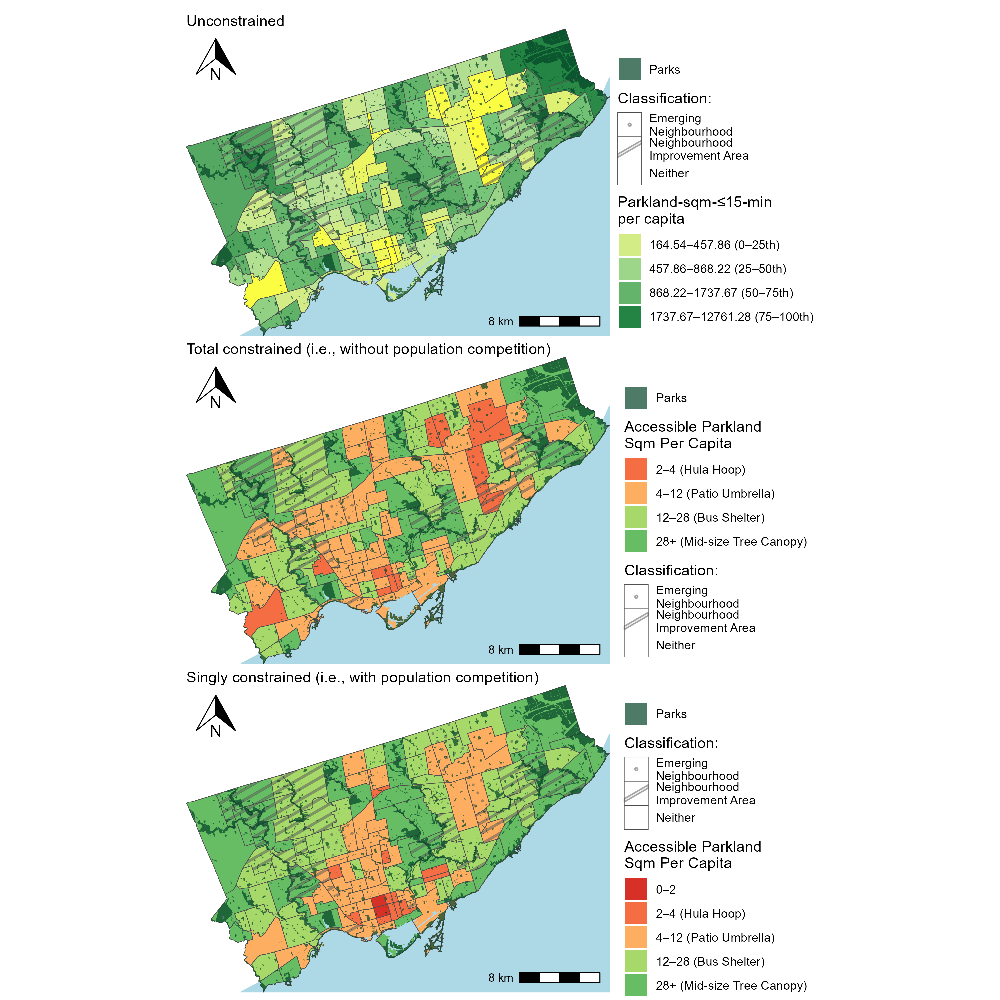

# CHP 4 - Comparing unconstrained, total constrained, singly constrained accessibility of Toronto's parklands

<!-- Required to number equations in HTML files -->
<script type="text/x-mathjax-config">
MathJax.Hub.Config({
  TeX: { equationNumbers: { autoNumber: "AMS" } }
});
</script>

```{r include=FALSE}
knitr::opts_chunk$set(
  echo = FALSE,
  cache = FALSE,
  warning = FALSE,
  message = FALSE)
```

```{r}
load(file="./data/access_WALK_i_df.rda")
load(file="./data/access_WALK_i_neighbourhoods_df.rda")
```


## Overview

In this chapter, walking accessibility (i.e., unimodal) of parkland and population is presented: where population is assumed to be all people at each DB and parkland is in hectares per park. We adopt the normative impedance function for walking discussed in Chapter 3, i.e., if a park entrance can be reached within 15 minutes of walking than the park is assumed to be reachable and enters the calculation as a 1, and if not, it is assumed full not reachable and enters the accessibility calculation as a 0. 

In the first half of the chapter the focus is on _accessible parkland area_. Values of $V^0_i$, $V^T_i$ and $V^S_i$ are expressed at the DB level and at the neighbourhood level. Then, the accessible parkland per capita ratio is demonstrated, neighbourhoods are ranked and a discussion is detailed based on 'potential parkland service provision'. In the second half of the section, _accessible population_ $M^0_j$, $M^T_j$ and $M^S_j$ is presented per park and per parkland area ratios at the level of the park itself and the neighbourhood is discussed as the 'potential population served'.

## Accessible parkland (for the population)
Figure \ref{fig:chp4-parkland_access_DB_WALK_plots} demonstrates that the unconstrained, total constrained (i.e., without population competition) and singly constrained accessible parkland (i.e., with population competition). All three plots are binned by quartile: 0-25th, 25-50th, 50-7th, 75th-98th (the top 2 percentile is exceptionally high for a few DBs: and is clipped and set to the 98th percentile value). White areas are DBs with 0 parkland accessibility or outside the Toronto boundary. Grey DBs have population but have no parkland accessibility, as their representative DB point cannot reach an assumed parkland entrance within 15 minutes of walking. Also of note, the total and singly-constrained are visualised on the same scale as there both represent the same units of "accessible parkland ha" per da, whereas the unconstrained measure is in units of 'parkland-ha-$\le$-15-minutes' (i.e., opportunities $x$ impedance function). It is notable that within a 15 minute walk, only $7632.922$ hectares of the total $8037.547$ hectares of parkland can be reached and hence enters the accessibility calculations ($\%95$). Hence: the sums of the constrained accessibility measures across all DBs equals 7632.922 hectares. Parks that cannot be reached are diverse in their classification and in their entrance point type (assumed centroid or edge entrance) as well as park size, qualities of these unreachable parks is discussed in the next subsection related to 'accessible population (to parkland)'. 

```{r ,fig.align='center', out.width="6in", fig.cap="\\label{fig:chp4-parkland_access_DB_WALK_plots}Map of Toronto CMA with accessibility to parklands per DB."}

```

Across all plots in Figure \ref{fig:chp4-parkland_access_DB_WALK_plots}, white DBs (dissemination blocks with no population nor access) are represented. These areas correspond to the airport lands (Pearson airport) in the northwest; large indoor mall (Sherway Gardens) and the surrounding industrial and rail yard in the southwest; and natural areas in the northeast, including Rouge National Urban Park and the Toronto Zoo, where protected lands, restrictive zoning, and steep terrain limit development. Similar conditions are present in the city's centre near the Don Valley and associated river system, where floodplains and protected natural space restrict residential development. 

Likewise, grey DBs (DBs with no access) are present across all three plots. These DBs are in proximity to white DBs and typically contain restricted pedestrian infrastructure and connections into park that are nearby (i.e., due to steep terrain as in the case in the Don Valley system or lack of parkland in close proximity like near the indoor mall and industrial lands in the southwest). The number of grey DBs are the same in both the unconstrained and total constrained plots. Moreover, these two plots share another commonality: the total constrained plot is proportional (by $K^T$) to the unconstrained plot. As reviewed in Chapter 3, mathematically $K^T$ is the sum of parkland area that can be walked to within 15 minutes (in ha) divided by the sum of total unconstrained accessibility in the city ($ \frac{7632.922}{509354.5} = 0.01498548$). So the total constrained plot can be understood like you would a 15-minute cumulative opportunities measure (i.e., displayed in the unconstrained plot) but in interpretable units. Namely, each DB in the total constrained plot represents the amount of parkland area that can be accessed within a 15 minute walk for that DB out of the total parkland in the area. Put another way, this plot can be understood as if the parkland area in the city (shown in Figure \ref{fig:chp3-parkland_paths_plot}) was proportionally extended beyond the park boundaries based on the population's ability to reach it within a walking travel time of 15 minutes or less. It can be thought of as a map reflecting the _accessible_ parkland area allocated to a DB. As it is proportional to the unconstrained plot, so it can also be read through the interpretation of _high_ and _low_ accessibility areas. Spatially, as a 15-minute walking distance to parks is a relatively small area beyond a park, areas of high accessible parkland are on top of or in close proximity to parks, hence this plot mirrors the spatial distribution of the parks themselves (Figure \ref{fig:chp3-parkland_paths_plot}). DBs within/near large parks are top quartile in accessible parkland area while areas within proximity to smaller parks are in the bottom quartiles.

Further inspecting Figure \ref{fig:chp4-parkland_access_DB_WALK_plots}, the singly constrained plot contains `r access_WALK_i_df |> filter(is.na(V_opp_i) | V_opp_i == 0) |> nrow() / access_WALK_i_df |> filter(is.na(V_tot_i) | V_tot_i == 0) |> nrow()` times more white DBs (i.e., DBs with no population or access) than the constrained plot (`r access_WALK_i_df |> filter(is.na(V_opp_i) | V_opp_i == 0) |> nrow()` DBs instead of  out of `r access_WALK_i_df |> filter(is.na(V_tot_i) | V_tot_i == 0) |> nrow()` DBs out of the total `r access_WALK_i_df |> nrow()` DBs in the city). This is because this measure considers population in how the proportionality factor allocates parkland area in addition to travel impedance (i.e., if a park can be reached within 15 minutes or not). Hence, if a DB has no population but is within its DB point can reach a park entrance within 15 minutes, it is still allocated no singly constrained accessible due to having no opportunity 'demand'. This additional consideration allows the singly constrained measure to be considered a competitive accessibility measure, whereas the total constrained measure does not allocate based on population demand. In the same way as the total constrained plot can be interpreted as a plot of parkland area that extends beyond the parks boundaries, the singly constrained plot can also be interpreted this way but based on an allocation that proportionally reflects the 15-minute travel time distance _and_ the amount of population in the DB. Visually, singly and total constrained measures appear to mirror some similar trends (i.e., correlation of `r cor(access_WALK_i_df$V_tot_i_capped, access_WALK_i_df$V_opp_i_capped, use = "complete.obs", method = "pearson")`), however their trends are still divergent. A variable that is included in the proportional allocation factor in the singly constrained measure is DB _population_. DBs with a relatively high population in 15-minute walking proximity to parks always have high singly constrained accessible parkland, whereas this occurrence is only coincidental for the total constrained measure as population is not an input variable. Figure \ref{fig:chp4-singly_total_by_pop_heatmap} reflects the relationship between total constrained, singly constrained and this third variable: population.
```{r ,fig.align='center', out.width="6in", fig.cap="\\label{fig:chp4-singly_total_by_pop_heatmap}Heatmap of DB-level population, total constrained and singly constrained accessible parkland binned by decible."}
knitr::include_graphics("./data/figures/chp4-singly_total_by_pop_heatmap.png")
```


In Figure \ref{fig:chp4-singly_total_by_pop_heatmap}, DBs with a higher mean population (i.e., pinks, above 500 people per DB) tend to be assigned high singly constrained accessibility. Conversely, DBs in 15-minute walking proximity but with low population are proportionally allocated less parkland area in the singly constrained measures.  This relationship is in part due to the consideration and role of population in the singly constrained measure. DBs in 15-minute walking proximity are allocated proportionally more parkland area if their population is relatively high, and vice versa. Since the total constrained measure does not consider population demand, it is not a function of population. In fact, in this empirical example it appears the opposite relationship tends to be true: with _some_ DBs with lower total constrained accessibility calculated for DBs with higher population. These DBs are high population but not that proximate to a relatively large amount of parkland area. However, these same DBs score singly constrained values that are opposite: due to their high population (relative to their neighbourhooding DBs) and their proximity to some parkland area --they are assigned a _high_ amount of accessible parkland. These are DBs that are efficient in parkland area accessibility when population competition is considered, but not when population competition is not considered. Furthermore, population competition tends to introduce larger distribution and more unequal distribution of accessibility, as the additional dynamic of proportional allocation of parkland area at the zonal level is introduced (as opposed to simply regional allocation as in the total constrained measure). In fact, the total constrained values tend to be lower than the singly constrained values and larger in range (median is `r access_WALK_i$V_tot_i_capped |> median(na.rm=T)` vs. `r access_WALK_i$V_opp_i_capped |> median(na.rm=T)` with a lower SD of `r access_WALK_i$V_tot_i_capped |> sd(na.rm=T)` vs. `r access_WALK_i$V_opp_i_capped |> sd(na.rm=T)`).

Furthermore: the singly constrain proportionally allocates the area of each park to DBs that can reach it within 15 minutes. Consider a single park: as the 15-minute walking range is spatially small, the DB population size tends not to vary significantly within this range. Hence, the parkland is proportionally allocated evenly. However, what varies is the size of the park. For a large park, with say, few entrances and DBs that have low populations: these DBs will be allocated plenty of parkland ha despite their lower populations, just because they are the only ones that can access this park due to the restrictive 15-minute walk assumption. Their singly constrained values will be _higher_ than their total constrained values. Conversely, a small park near many high population DBs has a low amount of hectares to be allocated to the nearby DBs, hence those DBs will have even lower singly constrained accessibility than their total constrained value. This can be observed, for instance, slightly west from the center of the city near the shoreline in Figure \ref{fig:chp4-parkland_access_DB_WALK_plots}, which is an area near the downtown core  relatively dense but relatively green as well. This area has lower quantiles of singly constrained accessibility than totally constrained due to the consideration of _population_. Conversely, further west in the city near the shoreline is more suburban but still green, hence there are pockets that have higher quantiles of singly constrained accessibility than total constrained as population is relatively lower and green space is relatively more plentiful.  

Another way to examine the relationship between singly and total constrained accessibility is to sum the $V_{ij}^S$ and $V_{ij}^T$ flows to each park and plot them against one another, as shown in Figure \ref{chp4-singly_total_by_parksize_scatter}. Recall that the sum of singly constrained flows to a park is equal to its area, since this constraint proportionally allocates only the park’s land area to reachable origins. This plot therefore illustrates how the total constrained measure compares to a park's actual size. Total constrained accessibility reflects how much parkland is effectively allocated to the origin zone, accounting for both travel impedance and population demand relatively. Parks plotted above the red 1:1 line allocate more accessible parkland than their actual area--indicating these parks are more centrally located or more accessible within the region. Parks below the line allocate less accessible area than they physically contain, suggesting they are more peripheral or less competitive. Interestingly, most parks fall below the line, under-allocating relative to their size. However, a small number--especially among the larger parks--allocate substantially more than their physical area. The top three such parks in each size category are labeled in Figure \ref{chp4-singly_total_by_parksize_scatter}. These parks can be interpreted as having ‘over-allocated’ parkland, potentially due to high desirability or centrality. In summary: parks above the line experience greater 'spatial demand' than parks below the line. Hence, accessibility flows from parks above the line (and parks really below the line) are especially suspectible to change depending on the constrained accessibility measure used. 

```{r ,fig.align='center', out.width="6in", fig.cap="\\label{fig:chp4-singly_total_by_parksize_scatter}Heatmap of DB-level population, total constrained and singly constrained accessible parkland binned by decible."}
knitr::include_graphics("./data/figures/chp4-singly_total_by_parksize_scatter.png")
```

Overall, both constrained measures offer more interpretable insights than unconstrained accessibility. The total constrained measure is similar in spirit to commonly used metrics like the 15-minute opportunity, but with a meaningful twist: its units can be interpreted as accessible parkland area (in hectares or any area unit). In contrast, the singly constrained measure also uses the same units, but incorporates both population demand and travel impedance, making allocation a function of both park size and spatial accessibility. 

So when should one use singly constrained versus total constrained accessibility? It depends on how the analyst conceptualises the nature of parkland as a resource that is demanded by the population. If park space is considered inexhaustible--meaning that its value does not diminish based on how many people are near it--then the total constrained measure may suffice. For example, a large park like Queen’s Park, surrounded by high population density, may still offer meaningful access to everyone nearby. If everyone (within a 15-minute distance) visited, it is not hard to imagine that the parks 'accessibility' would not change (i.e., it would suffer too much population congestion). However, consider for example a parkette that is near the same highly dense population. As it is smaller in park size, it makes more intuitive sense to see this park as more exhaustive, i.e., if everyone within 15-minutes visited its accessibility would certainly diminish due to population congestion as it is a small park by area. It could be conceptualised that both a large park and a small park are exhaustible: based on the demanding population (in proximity) per parkland _area_. In this sense, the singly constrained approach offers a more nuanced and realistic measure than the total constrained measure. It recognizes that parkland is a finite, exhaustible resource, especially in dense urban areas as well as accounting for the resilience of exhaustibility of a larger park (due to its larger area).

### Neighbourhood-level accessible parkland area (to the population within 15-minute walking range)

Another way of examining the accessibility data is by aggregating it to a spatial zoning system with more meaning: such as the city of Toronto neighbourhoods. These neighbourhoods are City-designated 'social planning neighbourhoods' which are used by staff to collect data, plan and analyse service provision [@toronto_neighbourhoods2024]. The neighbourhoods, as reviewed in Chapter 3, were labelled with Emerging Neighbourhood (EN) and Neighbourhood Improvement Area (NIA) classification. In the Figure \ref{fig:chp4-parkland_access_neighbourhood_WALK_plots}, all $V^0_{ij}$, $V^T_{ij}$ and $V^S_{ij}$ values are presented at this level of aggregation.
```{r ,fig.align='center', out.width="6in", fig.cap="\\label{fig:chp4-parkland_access_neighbourhood_WALK_plots}Map of Toronto CMA with accessibility to parklands per neighbourhood and neighbourhood classification"}
knitr::include_graphics("./data/figures/chp4-parkland_access_neighbourhood_WALK_plots.png")
```

In the Figure \ref{fig:chp4-parkland_access_neighbourhood_WALK_plots}, as can be seen the unconstrained values are not fixed to any sort of zonal or regional total whereas the sum of total constrained and singly constrained values equal to all the amount of parkland ha accessible within 15-minute. For instance, in the top quantile dark oranges represent 3210 'parkland-ha-$\le$-15-min' or greater, now summed at the area of the neighbourhood. Whereas the top quantile in the total constrained measure represent _accessible_ 48.11 ha or greater, directly in units of parkland ha that can be accessed out of the total parkland hectares. Summing all DBs within a neighbourhood maintains this total constraint and hence the associated intuition. The same logic can be applied to the singly constrained measure, but with the additional consideration of population competition. And like Figure \ref{fig:chp4-parkland_access_DB_WALK_plots}, values between the measures in Figure \ref{fig:chp4-parkland_access_neighbourhood_WALK_plots} share some commonalities: unconstrained and total constrained measures still remain proportional (by $K^T$), and the singly constrained values match total constrained values in DBs with and near population values that are relatively average. Singly constrained values deviate when population is low (i.e., singly constrained values are lower than total constrained) and population is high (i.e., singly constrained values are higher than total constrained values). If the heatmap of these two measures and population was reproduced at the neighbourhood aggregation, the general trends would be similar as at the DB level.

However, the trends in the data are more smoothed out in this aggregation. As shown in Figure \ref{fig:chp4-dist_db_vs_neigh_plots},

At both the DB and neighbourhood levels, the total constrained accessibility distribution is right-shifted and more dispersed compared to the singly constrained measure. This indicates that parkland is allocated more evenly under the total constraint, with fewer areas experiencing extremely high or low access. In contrast, the singly constrained measure shows a slightly more peaked and skewed distribution, reflecting localized competition for limited park space. At the DB-level, accessibility measures are more granular and variable, capturing finer differences in proximity and population competition. This results in a wider range and more extreme values, especially under the singly constrained measure, which reflects localized demand. At the neighbourhood-level, aggregating across DBs smooths out some of the variation and reduces some extremes. While this can enhance interpretability at a policy scale, it may also mask pockets of low or high access that could be critical. For this reason, examining patterns at the lowest level of aggregation is best practice, alongside summing to zoning systems that have more significant meaning from a planning perspectiev (such as Neighbourhood).

```{r ,fig.align='center', out.width="6in", fig.cap="\\label{fig:chp4-dist_db_vs_neigh_plots}Density distribution of the constrained accessibility measure values at the dissemination block and neighbourhood block. For both aggregations, the datasets are truncated at top decible for the purpose of visualisation."}

```

Furthermore: since DBs are designed to be the smallest units of population with as homogeneous census profiles as possible (range between 0 to 3375, median of 117 people), much smaller than the city-designed neighbourhoods (range between 6419 to 33690, median of 17024 people), the following question may arise specifically for neighbourhoods: what is the accessible parkland ha per neighbourhood population? This per capita measure is visualised in \ref{fig:chp4-parkland_access_neighbourhood_percapita_WALK_plots.png}. All three accessibility measures are shown, though the unconstrained measure should be interpreted with caution. Because it lacks a population constraint, the units--parkland-hectares$\le$-15-minute' divided by neighbourhood population--can be misleading. While neighbourhood population is a fixed and tangible quantity (a known share of the total population), the amount of 'parkland-hectares$\le$-15-minute' is not similarly bounded or consistently defined across the region. As a result, the regional sum of the unconstrained measure lacks clear meaning, making comparisons or interpretations less intuitive than with constrained measures. Hence, for a non-competitive yet interpretable alternative to the unconstrained measure, the per capita total constrained accessibility should be considered, as it retains intuitive units while incorporating the intuition of the unconstrained measure.

```{r ,fig.align='center', out.width="6in", fig.cap="\\label{fig:chp4-parkland_access_neighbourhood_percapita_WALK_plots.png}Map of Toronto CMA with accessibility to parklands per neighbourhood and neighbourhood classification"}

```
```{r}
compare <- access_WALK_i_neighbourhoods_df |>
  group_by(CLASSIF9) |>
    summarise(vv_tot_neigh_med = median(vv_tot_neigh),
              vv_tot_neigh_sd = sd(vv_tot_neigh),
              
              vv_opp_neigh_med = median(vv_opp_neigh),
              vv_opp_neigh_sd = sd(vv_opp_neigh))
#compare #this is used for discussion in the para below.

compare2 <- access_WALK_i_neighbourhoods_df |>
  group_by(CLASSIF9) |>
    summarise(vv_tot_neigh_med = median(vv_tot_neigh),
              vv_tot_neigh_sd = sd(vv_tot_neigh),
              
              vv_opp_neigh_med = median(vv_opp_neigh),
              vv_opp_neigh_sd = sd(vv_opp_neigh))
```


As can be surmised and as discussed at the level of the DB for the raw scores, depending on the constrained measure used, results can be quite different. However, when inspecting the neighbourhood level values, the median per capita values that consider competition (i.e., singly constrained) yield scores that are higher than the total constrained measures. For EN and NIA, values are 18.4 sq m per capita and 22.2 sq m per capita for NIAs assuming the singly constrained measure and 13 sq m per capita and 20.9 sq m per capita considering the non-competitive measure (i.e., total constrained). These neighbourhoods make up 43 of the 158 neighbourhoods in the city, with the neighbourhoods of neither classification also demonstrating a similar trend (i.e., 15.2 sq m per capita considering competition and 13.4 sq m per capita considering the total constrained accessibility per capita). The spatial distribution of the impact of population competition (i.e., difference between singly and total constrained per capita measures) is visualised spatially in Figure \ref{fig:chp4-diff_singly_access_neighbourhood_parkland_percapita_WALK_plot}.

```{r ,fig.align='center', out.width="6in", fig.cap="\\label{fig:chp4-diff_singly_access_neighbourhood_parkland_percapita_WALK_plot} Difference in per capita constrained accessibility to parklands per neighbourhood values. Namely, singly constrained per capita  minus total constrained per capita. "}

```

```{r, message=FALSE}
access_WALK_i_neighbourhoods_df <- access_WALK_i_neighbourhoods_df |>
  mutate(diff = vv_opp_neigh - vv_tot_neigh,
         pop_den = Population/area_sqm)
compare <- access_WALK_i_neighbourhoods_df |>
  mutate(access_change = case_when( 
           diff > 0 ~ "Pop comp results in more access",
           diff < 0 ~ "Pop comp results in less access",
           TRUE ~ "No change")) |>
  group_by(CLASSIF9, access_change) |>
    summarise(count = n())
#compare
```

From Figure \ref{fig:chp4-diff_singly_access_neighbourhood_parkland_percapita_WALK_plot}, the difference in per capita scores between the singly constrained and total constrained measures can be interpreted as the effect of population competition. Positive values (in purple) indicate neighbourhoods with higher per capita accessible parkland when population competition is considered—that is, they are more regionally competitive in capturing parkland access. In contrast, negative values (in red) suggest neighbourhoods that are less competitive once population is factored in, having higher per capita access only when travel impedance is considered alone. These differences have important policy implications. For example, 8 of the 10 EN and 19 of the 33 NIAs have higher per capita access under the total constrained measure, meaning their populations benefit when competition is accounted for. In contrast, neighbourhoods outside of these categories are more likely to be negatively affected--with 64 neighbourhoods showing higher access under the singly constrained measure, compared to 51 that benefit more under total constrained. This suggests that population competition presents NIA and EN as having higher parkland accessibility, in part due to their proximity to a larger amount of parkland area and lower amount of population, while more established (non NIA or EN) neighbourhoods may lose relative access under competitive allocation.

However, the difference in these per capita rates--and in the raw values aggregated at the neighbourhood themselves--are no longer as clearly related to population nor the amount of park space as previous outlined. This is because these values are aggregated to a coarser spatial scale and divided by population, which obscures some of the finer-scale spatial dynamics. Still, they relate closely to the concept introduced in Figure \ref{fig:chp-singly_total_by_parksize_scatter}: the difference between how much parkland is allocated versus how much parkland actually exists.

Under the total constrained measure: neighbourhoods with more parks that allocate _less_ than their park area tend to have parks that are below the red line shown in Figure \ref{fig:chp4-singly_total_by_parksize_scatter} and can be perceived as parks with greater "potential" that is not allocated away. However: this difference in allocation (between the actual area and total) results in a _positive_ difference in neighbourhood accessibility allocation when calculating the singly constrained neighbourhood value (i.e. purple DBs). And this relationship is roughly linear (Figure \ref{fig:chp4-diff_in_parkallocated_and_neigh_plot}).

While this relationship is not perfectly captured due to difference in zonal aggregations and spatial structure of the travel impedance allocation. Nonetheless, the pattern reinforces a key point: when population demand is not used to constrain the allocation of accessible parkland, as in the total constrained measure, parkland is allocated freely based on travel impedance alone. As a result, centrally located parks over-allocate relative to their actual area, while peripheral parks under-allocate--an imbalance corrected when population demand is incorporated in the singly constrained measure. Also note: only 1149 parks out of the total 1581 parks that entered the accessibility calculation are shown in Figure \ref{fig:chp4-diff_in_parkallocated_and_neigh_plot}: parks with differences that match in magnitude. Parks that do not match in magnitude are few, and tend to be very small (likely due to discrepancies due to aggregation inconsistencies across spatial units.

```{r ,fig.align='center', out.width="6in", fig.cap="\\label{fig:chp4-diff_in_parkallocated_and_neigh_plot}Difference in 'accessible' parkland allocated from parks in a neighbourhood and the difference in neighbourhood constrained accessibility measure (difference is singly constrained minus total constrained)."}

```

From another examination vantage point: depending on what constrained measure is used, neighbourhoods can dramatically change rank. Of the 158 <!-- this is pulled from qmd 06-->neighbourhoods, 154 changed rank, with 75 increasing in rank (i.e, higher per capita value when singly constrained is used compared total constrained) and 79 decreasing in rank. The top 10 neighbourhoods that increased rank (purples) and top 10 that decreased rank (reds) are in Figure \ref{fig:rank_change_parkland_access_neigh_plot}. From those familiar with Toronto, top 10 are neighbourhoods with a good amount of parkland, and well residential. These neighbourhoods are like Highland Creek which jumped 85 ranks when using the singly constrained measure. This neighbourhood is relatively low population and contains a high amount of green space that is not easily reached by other populations. Hence: it has relatively low amount of accessible parkspace without considering competition (6.24 sq m per capita) but a high amount when competition is factored into proportional allocation (27.9 sq m per capita). Conversely, neighbourhoods that are centrally located to plenty of parkspace but are also relative proximate to a high amount of population decreased in rank when considering competition, like Cabbagetown-South St. James Town which dropped 73 ranks, from 26.3 sq m per capita in the total constrained measure to 7.65 sq m per capita in singly constrained measures. 

```{r ,fig.align='center', out.width="6in", fig.cap="\\label{fig:chp4-rank_change_parkland_access_neigh_plot}Change in neighbourhood rank using singly to total constrained accessible parkland measure for top negative and positive change-rank neighbourhoods."}

```

Figure \ref{fig:all_rank_change_parkland_access_neigh_plot} summarises the change in rank of all neighbourhoods depending on what constrained per capita measure is used. The four neighbourhoods that did not change rank are along the x axis in black, the top 10 negative and positive rank-changed neighbourhoods as seen in Figure \ref{fig:rank_change_parkland_access_neigh_plot} in red and purple respective along with the rest of the neighbourhoods in grey. The smoothed curved trend line demonstrates the general trend: a general increasing trend. For neighbourhoods with high total constrained ranks, their rank using singly constrained accessibility decreases (i.e., a much lower $v^S_i$ than $v^T_i$), and as the rank of the neighbourhood decreases considering the total constrained score - their singly constrained scores increase and hence rank higher by these scores (i.e., a higher $v^S_i$ than $v^T_i$). Overall: neighbourhoods in these extreme ends are especially sensitive to changing rank: i.e., especially neighbourhoods with parks that are central, and especially those that are larger, over-allocated their accessible parkland, while parks in neighbourhoods that are not that central (and/or smaller) under allocated --both these allocation types were 'corrected' with the proportional and zonal allocation of the singly constrained accessibility measure. Neighbourhoods with constrained values that are more similar tend to see changes in rank that are more modest and in either directions, in part as a product of rank changes in the extreme cases. 

```{r ,fig.align='center', out.width="6in", fig.cap="\\label{fig:chp4-all_rank_change_parkland_access_neigh_plot}Change in neighbourhood rank using singly to total constrained accessible parkland measure for all neighbourhoods."}
knitr::include_graphics("./data/figures/chp4-all_rank_change_parkland_access_neigh_plot.png")
```
In summary, the total and singly constrained (opportunity-constrained) accessibility measures offer intuitive ways to interpret values at the zonal level, as they are expressed in meaningful units of accessible parkland area. This contrasts with the unconstrained measure, where values--beyond simply being high or low--lack clear interpretability, especially due to the absence of constraints on either population or opportunity. Importantly, the total constrained measure retains proportionality with conventional methods (e.g., 15-minute catchments), but does so while preserving interpretable units. The singly constrained measure goes a step further by incorporating population demand, offering a more restrictive--but theoretically more realistic--representation of access where competition for finite opportunities (like parkland) exists.

The figures in this section highlight how neighbourhood rankings shift depending on whether a competitive (singly constrained) or non-competitive (total constrained) measure is used. These shifts demonstrate that each measure reflects a different allocation logic, and neither is inherently better. The appropriate choice depends on the analyst’s assumptions about the nature of the opportunity:
- Does the opportunity lack scarcity or competition, such that allocation based solely on regional travel impedance (as in the total constrained measure) is appropriate?
- Or, does the opportunity reflect a finite, competitive resource (e.g., parkland area), in which case allocation should also account for local population demand (as in the singly constrained measure)?

If the opportunity is indeed competitive—and most real-world opportunities are—then the analyst must ensure there is adequate zonal information about the population that demands it. In this analysis, a normative assumption is made that all people should have access to the opportunity, making the singly constrained model especially relevant for evaluating spatial equity. However, if using population as done in this empirical example in inappropriate (i.e., all people should not enter the calculation), the results will  _differ_ hence impacting conclusions made for policy.

## Accessible population (to the parkland)

From another analytical vantage point, a policy analyst may be interested in conducting this investigation from the perspective of _accessible population_, i.e., understanding which parks are serving what amount of population. This is essentially the transpose of the accessibility measures discussed in the preceeding section: instead of measuring accessible parkland per population zone,  accessible population per park is examined.

Since parks serve as the destination zones (with each park represented by its nearest reachable entrance), the lowest level of aggregation for $M^0_{ij}$, $M^T_{ij}$, and $M^S_{ij}$ is at the park level ($j$). Thus, the summaries $M^0_j$, $M^T_j$, and $M^S_j$ represent the population potentially served by each park under the unconstrained, total constrained, and singly constrained measures, respectively. These are shown in Figure \ref{fig:chp4-parkland_access_DB_WALK_plots}. The unconstrained measure can be interpreted as "market potential," reflecting pure travel-time-based reachability. The total constrained measure introduces a realsitic intuition by allocating the total population in the region to each park by its associated travel impedance, while the singly constrained measure allocates each zonal population considering associated reachable parkland area (i.e., the park supply) as well as associated travel impedance. All three plots are binned into quartiles (0–25th, 25–50th, 50–75th, 75–100th percentile). White areas indicate non-park zones, while grey parks are not accessible to any population within a 15-minute walk. As in the previous section, the unconstrained and total constrained measures remain proportionally equivalent, and both the total and singly constrained results are shown on a common scale to support direct comparison.

```{r ,fig.align='center', out.width="6in", fig.cap="\\label{fig:chp4-parkland_access_DB_WALK_plots}Map of Toronto CMA with accessibility to population per park."}
knitr::include_graphics("./data/figures/chp4-pop_access_DB_WALK_plots.png")
```

Figure \ref{fig:chp4-parkland_access_DB_WALK_plots} visualises the unconstrained and total constrained measures that are proportional in their magnitude as maintained by the $\hat K^T_j$ balancing factor, and the singly and total constrained values are placed on the same scale with the singly constrained measure demonstrating a larger range and variance than the total constrained measure. Beyond these commonalities, the constrained values from Figure \ref{fig:chp4-parkland_access_DB_WALK_plots} should be interpreted as the accessible population (within 15 minutes of walking) as opposed to the accessible parkland area (within 15 minutes of walking). As well, each constrained measure sums across the region to equal the total amount of population that can reach parks within 15 minutes: 2761103 people.

Unlike the DBs, a spatial unit without as much significance for planning (compared to the neighbourhood), the park itself is worth examining. Due to the proportionality, parks per park size classification can be compared by their ratios of _accessible population_ to their park size as shown in Figure \ref{fig:pop_access_byparksize_WALK_plot}. It can be seen that Parkettes and Small parks serve population at a more efficient rate (i.e., their parkland area) than the larger parks using the total constrained measure. But the moment that their parkland supply is considered (i.e., allocation is based on the area of the park itself and its travel impedance -- and not just its proximity to population and associated travel impedance), the intensity of the dynamic changes. In fact, when parkland supply is considered, smaller parks are still more 'efficient' than larger parks but not by _that_ much. Again: this is because small parks are not allowed to be 'over' allocated, despite their centrality to population due to the constrained measure. Conversely, larger parks are _more_ allocated to populations though these parks are relatively less centrally located as the populations face lower competition. Depending on how the opportunity type is considered, either measure can be used: but how parks rank and their efficiency of 'population service' will differ (as in the transpose expression of _accessible parkland area_).

```{r ,fig.align='center', out.width="6in", fig.cap="\\label{fig:chp4-pop_access_byparksize_WALK_plot}Constrained accessible population per parkland area by park size classification: total constrained vs. singly constrained."}
knitr::include_graphics("./data/figures/chp4-pop_access_byparksize_WALK_plot.png")
```

Furthermore: parks can be ranked by this accessible population per the park's area rate. This rate expresses the park's potential 'population serviced' per sq m. It can be used to rank the parks by how centrally they are located near population per area for the city: to determine which parks are located near the highest amount of potential population, i.e., parks with the most population (to reach) potential. These parks should be flagged as parks that should be most concerned with population congestion. Conversely, parks that rank low are of least concern (at a per sq m rate). 

On this topic: Figure \ref{fig:chp4-pop_access_byparksize_WALK_rankchange_plot} visualises how park rankings shift depending on whether the total or singly constrained measure is used, with parks grouped by size classification. Notably, smaller parks--particularly parkettes, small parks, and some medium parks--often see sharp drops in rank under the singly constrained measure. These parks typically score higher under total constrained accessibility because they are centrally located and close to higher population densities. However, when the supply of parks (typically larger) is considered (i.e., singly constrained), accessibility declines. Examples include Old Mill Parkette, Ormskirk Park, and R.V. Burgess Park, all of which are situated in residential areas near much larger parks.

```{r ,fig.align='center', out.width="6in", fig.cap="\\label{fig:chp4-pop_access_byparksize_WALK_rankchange_plot}Change in park rank based on constrained accessible population per parkland area measures by park size classification."}
knitr::include_graphics("./data/figures/chp4-pop_access_byparksize_WALK_rankchange_plot.png")
```

While a clear uniform trend across all parks does not emerge in Figure \ref{fig:chp4-pop_access_byparksize_WALK_rankchange_plot}, a pattern among larger parks (Legacy, City, and Large classifications) can be seen. These larger parks tend to have mid to low ranks under the total constrained measure but often climb in rank under the singly constrained measure. For example, McGregor Park sees a significant boost due to its central location to population and competitive supply advantage. In contrast, large parks with initially low total constrained values experience only modest changes (e.g., small increase in rank for Colonel Danforth Park and slight decline for Coxwell Ravine Park). Overall, this suggests that larger parks tend to attract more population simply by virtue of their size, and when park supply is explicitly considered--as in the singly constrained measure--their accessibility increases relative to smaller parks competing in denser park environments.

### Neighbourhood-level accessible population (to the parkland within 15-minute walking range)

Moving forward, the neighbourhood can serve as a useful spatial unit for analysis as well, as it aligns well with both population distribution and parkland organization. The majority of parks are fully contained within a single neighbourhood, allowing for meaningful calculation of ratios such as accessible population per unit of parkland. Additionally, from an equity perspective, neighbourhood-level analysis enables examination of how different types of parks serve populations across neighbourhoods with varying characteristics, supporting more targeted planning and policy evaluation.

In the Figure \ref{fig:chp4-pop_access_neighbourhood_WALK_plots}, all $M^0_{ij}$, $M^T_{ij}$ and $M^S_{ij}$ values are aggregated at the level of the neighbourhood. They can also be divided by parkland area in that neighbourhood (as determined by summing and splitting, if needed, parkland area within each neighbourhood) and demonstrated as accessible population per parkland sq m as in Figure \ref{fig:chp4-pop_access_neighbourhood_perparland_WALK_plots}. 

```{r ,fig.align='center', out.width="6in", fig.cap="\\label{fig:chp4-pop_access_neighbourhood_WALK_plots}Map of Toronto CMA with accessibility to accessible population per neighbourhood for unconstrained, total constrained and singly constrained measures."}
knitr::include_graphics("./data/figures/chp4-pop_access_neighbourhood_WALK_plots.png")
```

```{r ,fig.align='center', out.width="6in", fig.cap="\\label{fig:chp4-pop_access_neighbourhood_perparland_WALK_plots} Map of Toronto CMA with accessibility to accessible population per parkland sqm at level of the neighbourhood for unconstrained, total constrained and singly constrained measures."}
knitr::include_graphics("./data/figures/chp4-pop_access_neighbourhood_perparland_WALK_plots.png")
```

```{r}
compare3 <- access_WALK_j_neighbourhoods |>
  group_by(CLASSIF9) |>
    summarise(mm_tot_neigh_med = median(mm_tot_neigh),
              mm_tot_neigh_sd = sd(mm_tot_neigh),
              
              mm_pop_neigh_med = median(mm_pop_neigh),
              mm_pop_neigh_sd = sd(mm_pop_neigh))
#compare #this is used for discussion in the para below.

compare4 <- access_WALK_i_neighbourhoods_df |>
  group_by(CLASSIF9) |>
    summarise(vv_tot_neigh_med = median(vv_tot_neigh),
              vv_tot_neigh_sd = sd(vv_tot_neigh),
              
              vv_opp_neigh_med = median(vv_opp_neigh),
              vv_opp_neigh_sd = sd(vv_opp_neigh))
#compare3
```


Referring to Figure \ref{fig:chp4-pop_access_neighbourhood_WALK_plots} and Figure \ref{fig:chp4-pop_access_neighbourhood_perparland_WALK_plots}, the unconstrained measure is once again shown on its own scale, while the constrained measures are displayed using a shared scale. Visually, there is a notable contrast between the total and singly constrained measures: the total constrained map shows higher accessible population values in the downtown core (near the center and shoreline) while the singly constrained map highlights higher values in the northeast and northwest.

The pattern in Figure \ref{fig:chp4-pop_access_neighbourhood_WALK_plots} reflects some intuitive spatial dynamics. The downtown area has a dense population and numerous centrally located parks (especially small ones), resulting in high "market potential" under the total constrained measure. However, once parkland supply and population competition are considered (as in the singly constrained measure) these same areas score relatively lower. In contrast, areas in the northeast and northwest, with both substantial parkland and nearby pockets of higher population (and pockets of _no population_), show higher accessibility under the singly constrained measure These neighbourhoods have a more favorable population-to-parkland ratio than the downtown core (i.e., a higher supply of parkland relative to the population in proximity), leading to higher values.

While these patterns are distinct for the raw neighbourhood level values, normalizing by parkland area (i.e., calculating accessible population per square metre of parkland) reveals greater similarity between the two constrained measures (i.e., Figure \ref{fig:chp4-pop_access_neighbourhood_perparland_WALK_plots}). This suggests that, at the neighbourhood level, accessible population tends to scale with available parkland. Nonetheless, the per-parkland-area ratio may be useful for identifying neighbourhoods where additional parkland would be most efficient, i.e., neighbourhoods with high accessible population per unit of existing parkland.


Compared to the previous subsection, the analysis of _accessible population_ per neighbourhood offers a complementary perspective: neighbourhoods that are neither NIA or EN tend to have _higher_ accessible population per square metre of parkland. Under the total constrained measure, their median is 0.078 people/sq m, and 0.089 people/sq m under the singly constrained measure. In contrast, EN and NIA neighbourhoods show much lower medians (total: 0.038 and 0.029, singly: 0.062 and 0.045). This suggests that, from either constrained perspective, parks in non-NIA/EN neighbourhoods are more efficiently reachable. This finding mirrors the per capita neighbourhood _accessible parkland_ analysis findings. However, unlike the preceding per capita accessible parkland analysis, the rank ordering of neighbourhood classifications remains more consistent between the two constrained _accessible population_ measures. This consistency may be due to the way parkland area is aggregated and allocated across neighbourhood boundaries, as well as how ratios (e.g., population per parkland sq m) are calculated. This reinforces a broader point previosuly raised: the choice of aggregation unit and denominator strongly influences results, and analysts must be attentive to these decisions when interpreting accessibility metrics.

Ultimately, examining population-constrained accessibility from the park itself _and_ from the neighbourhood provides valuable insight for planning of parkland service through the perspective of population potentially served. It allows analysts to:
- Understand how many people are served by each park, both in total and per parkland (or summed and normalized by some other zonal unit variable);
- Identify over- or under-performing parks. For example, parks near large populations but lacking amenities may represent strategic opportunities for investment to improve service efficiency.

In sum, analyzing the _accessible population_ approach can serve as a complimentary way in analyzing parkland service provision.

## Conclusion

This chapter presents the calculated accessibility scores across the following dimensions:

1. Unimodal total constrained **accessible parkland** summarised per origin zone $V_i^T$ (i.e., DB) and then per neighbourhood. All people (in DBs) to all parkland area (in parks) by a 15-minute walk is assessed. This measure can be interpreted as "how much parkland area is potentially reachable by the walking-population from this zone?". The measure is also presented as a 'parkland provision' ratio of parkland per walking-population. 
2. Unimodal total constrained **accessible population** summarised per destination zone $M_j^T$ (i.e., the park itself) and then per neighbourhood. This measure is the $i$ -> $j$ transpose of $V_i^T$, and can be interpreted as "how much walking-population is potentially reachable from this park?".  The measure is also presented as a potential population 'service catchment' or a ratio of population potential per parkland area at the park level and at the neighbourhood level.
3. Both of the above constrainde accessibility measures are compared to the conventional calculation of accessibility, or what is referred to in this work aas unimodal unconstrained **accessible parkland** summarised per each DB $V_i^0$ and **accessible population** summarised per park $M_j^0$. These measures assess the same walking network but do not consider any zonal or regional constraints. As such, these conventional measures only offer insight into the proportion of potential reachability. Unlike the constrained measures, no provision or catchment ratio can be meaningfully calculated for these measures.

Overall, constrained accessibility provides a more interpretable and policy-relevant framework than unconstrained methods. These measures allow analysts to:
- Identify DBs with poor access to parkland. This could be DBs in equity-seeking neighbourhoods (NIA), helpful in highlighting areas that may warrant new parks or improved access.
- Identify parks with low population reach, revealing underutilized assets or areas where connectivity enhancements could expand service reach. This can be seen as a transpose understanding of the first point, but with its interpretation meant for a different communication.

However, the analysis in this chapter has only considered walking accessibility. One key consideration is missing: parks can be reached not only by walking. People travel by transit, cycling, and driving--each with their own distinct behavioural patterns (as discussed in Chapter 3). The unconstrained accessibility measure does not have a consistent methodology in considering multiple mode, but the constrained measures can be formulated to consider these modes. Hence, in the following chapter, the multimodal extension of the measures will be detailed. 

