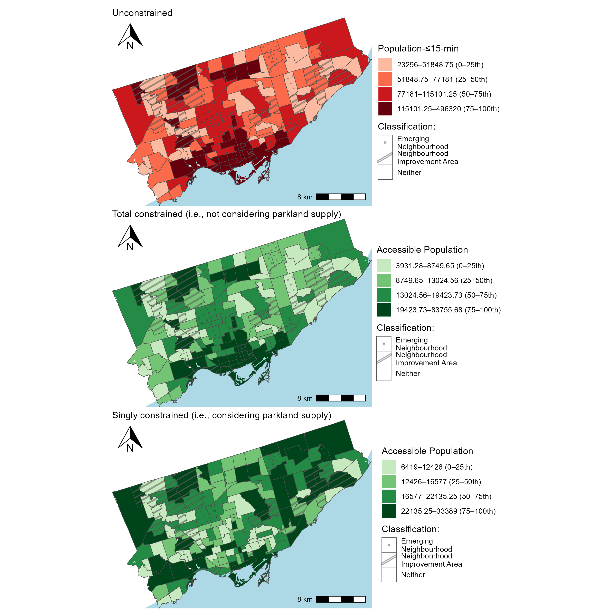
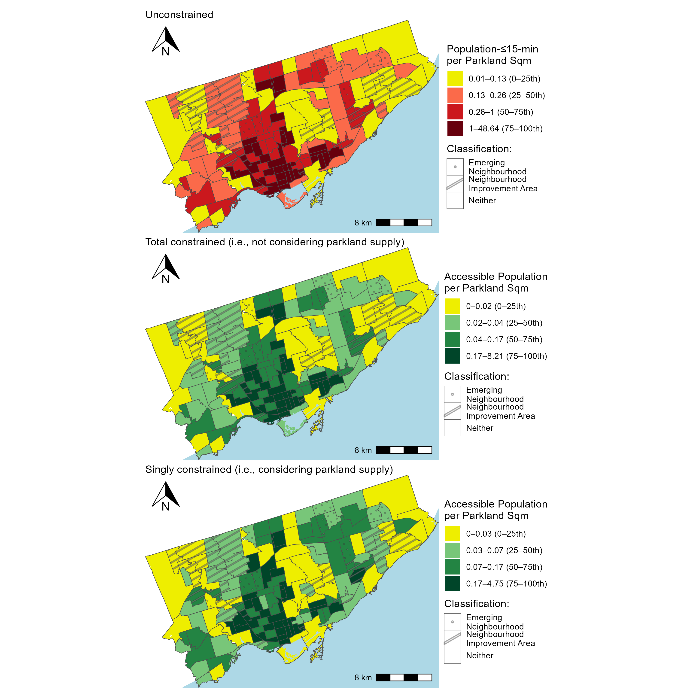

# CHP 4 - Comparing unconstrained, total constrained, singly constrained accessibility of Toronto's parklands

<!-- Required to number equations in HTML files -->
<script type="text/x-mathjax-config">
MathJax.Hub.Config({
  TeX: { equationNumbers: { autoNumber: "AMS" } }
});
</script>

```{r include=FALSE}
knitr::opts_chunk$set(
  echo = FALSE,
  cache = FALSE,
  warning = FALSE,
  message = FALSE)
```

```{r}
load(file="./data/access_WALK_i_df.rda")
load(file="./data/access_WALK_i_neighbourhoods_df.rda")
```


## Overview

1. Unimodal total constrained **accessible parkland** summarised per each DB $V_i^T$; All people to all parkland by walking will be assessed: all people will be assumed to be walking. Can be interpreted as "how much parkland area is potentially reachable by the walking-population from this park?". Will be presented as a 'parkland provision' ratio of parkland per walking-population. 
2. Unimodal total constrained **accessible population** summarised per park $M_j^T$; the transpose of $V_i^T$. Namely, all parkland to all people by walking will be assessed. Can be interpreted as "how much walking-population is potentially reachable from this park?". Will be presented as a potential population 'service catchment' or a ratio of population potential per parkland area.
3. The first two measures will be compared to a unimodal unconstrained **accessible parkland** summarised per each DB $V_i^0$ and **accessible population** summarised per park $M_j^0$, representing the traditional accessibility measure calculation method. Like the other two, all people (assumed to be walking) to all parkland will be assessed. Will be interpreted as "the proportion of parkland area that is potentially reachable by the walking-population from this park" and "the proportion of walking population that is potentially reachable by the park". No 'parkland provision' or 'service catchment' ratio can be calculated.


In this chapter, walking accessibility (i.e., unimodal) of parkland and population is presented: where population is assumed to be all people at each DB and parkland is in hectares per park. We adopt the normative impedance function for walking discussed in Chapter 3, i.e., if a park entrance can be reached within 15 minutes of walking than the park is assumed to be reachable and enters the calculation as a 1, and if not, it is assumed full not reachable and enters the accessibility calculation as a 0. 

In the first half of the chapter the focus is on _accessible parkland area_. Values of $V^0_i$, $V^T_i$ and $V^S_i$ are expressed at the DB level and at the neighbourhood level. Then, the accessible parkland per capita ratio is demonstrated, neighbourhoods are ranked and a discussion is detailed based on 'potential parkland service provision'. 

Next, $M^0_j$, $M^T_j$ and $M^S_j$ as the accessible population along with per parkland ratios in discussion with potential population served. <!--COMEBACKHERE -->

## Accessible parkland (for the population)
Figure \ref{fig:chp4-parkland_access_DB_WALK_plots} demonstrates that the unconstrained, total constrained (i.e., without population competition) and singly constrained accessible parkland (i.e., with population competition). All three plots are binned by quartile: 0-25th, 25-50th, 50-7th, 75th-98th (the top 2 percentile is exceptionally high for a few DAs: and is clipped from the dataset and set at the 98th percentile value). White areas are DBs with 0 parkland accessibility or outside the Toronto boundary. Grey DBs have population but have no parkland accessibility, as their representative DB point cannot reach an assumed parkland entrance within 15 minutes of walking. Also of note, the total and singly-constrained are visualised on the same scale as there both represent the same units of "accessible parkland ha" per da, whereas the unconstrained measure is in units of 'parkland-ha-$\le$-15-minutes' (i.e., opportunities $x$ impedance function). It is notable that within a 15 minute walk, only $7632.922$ hectares of the total $8037.547$ hectares of parkland can be reached and hence enters the accessibility calculations ($\%95$). Hence: the sums of the constrained accessibility measures across all DBs equals 7632.922 hectares. Parks that cannot be reached are diverse in their classification and in their entrance point type (assumed centroid or edge entrance) as well as park size, qualities of these unreachable parks is discussed in the next subsection related to 'accessible population (to parkland)'. 

```{r ,fig.align='center', out.width="6in", fig.cap="\\label{fig:chp4-parkland_access_DB_WALK_plots}Map of Toronto CMA with accessibility to parklands per DB."}
knitr::include_graphics("./data/figures/chp4-parkland_access_DB_WALK_plots.png")
```

Across all plots in Figure \ref{fig:chp4-parkland_access_DB_WALK_plots}, white DBs (dissemination blocks with no population nor access) are represented. These areas correspond to the airport lands (Pearson airport) in the northwest; large indoor mall (Sherway Gardens) and the surrounding industrial and rail yard in the southwest; and natural areas in the northeast, including Rouge National Urban Park and the Toronto Zoo, where protected lands, restrictive zoning, and steep terrain limit development. Similar conditions are present in the city's centre near the Don Valley and associated river system, where floodplains and protected natural space restrict residential development. 

Likewise, grey DBs (DBs with no access) are present across all three plots. These DBs are in proximity to white DBs and typically contain restricted pedestrian infrastructure and connections into park that are nearby (i.e., due to steep terrain as in the case in the Don Valley system or lack of parkland in close proximity like near the indoor mall and industrial lands in the southwest). The number of grey DBs are the same in both the unconstrained and total constrained plots. Moreover, these two plots share another commonality: the total constrained plot is proportional (by $K^T$) to the unconstrained plot. As reviewed in Chapter 3, mathematically $K^T$ is the sum of parkland area that can be walked to within 15 minutes (in ha) divided by the sum of total unconstrained accessibility in the city ($ \frac{7632.922}{509354.5} = 0.01498548$). So the total constrained plot can be understood like you would a 15-minute cumulative opportunities measure (i.e., displayed in the unconstrained plot) but in interpretable units. Namely, each DB in the total constrained plot represents the amount of parkland area that can be accessed within a 15 minute walk for that DB out of the total parkland in the area. Put another way, this plot can be understood as if the parkland area in the city (shown in Figure \ref{fig:chp3-parkland_paths_plot}) was proportionally extended beyond the park boundaries based on the population's ability to reach it within a walking travel time of 15 minutes or less. It can be thought of as a map reflecting the _accessible_ parkland area allocated to a DB. As it is proportional to the unconstrained plot, so it can also be read through the interpretation of _high_ and _low_ accessibility areas. Spatially, as a 15-minute walking distance to parks is a relatively small area beyond a park, areas of high accessible parkland are on top of or in close proximity to parks, hence this plot mirrors the spatial distribution of the parks themselves (Figure \ref{fig:chp3-parkland_paths_plot}). DBs within/near large parks are top quartile in accessible parkland area while areas within proximity to smaller parks are in the bottom quartiles.

Inspecting Figure \ref{fig:chp4-parkland_access_DB_WALK_plots}, the singly constrained plot contains `r access_WALK_i_df |> filter(is.na(V_opp_i) | V_opp_i == 0) |> nrow() / access_WALK_i_df |> filter(is.na(V_tot_i) | V_tot_i == 0) |> nrow()` times more white DBs (i.e., DBs with no population or access) than the constrained plot (`r access_WALK_i_df |> filter(is.na(V_opp_i) | V_opp_i == 0) |> nrow()` DBs instead of  out of `r access_WALK_i_df |> filter(is.na(V_tot_i) | V_tot_i == 0) |> nrow()` DBs out of the total `r access_WALK_i_df |> nrow()` DBs in the city). This is because this measure considers population in how the proportionality factor allocates parkland area in addition to travel impedance (i.e., if a park can be reached within 15 minutes or not). Hence, if a DB has no population but is within its DB point can reach a park entrance within 15 minutes, it is still allocated no singly constrained accessible due to having no opportunity 'demand'. This additional consideration allows the singly constrained measure to be considered a competitive accessibility measure, whereas the total constrained measure does not allocate based on population demand. In the same way as the total constrained plot can be interpreted as a plot of parkland area that extends beyond the parks boundaries, the singly constrained plot can also be interpreted this way but based on an allocation that proportionally reflects the 15-minute travel time distance _and_ the amount of population in the DB. Visually, singly and total constrained measures appear to mirror some similar trends (i.e., correlation of `r cor(access_WALK_i_df$V_tot_i_capped, access_WALK_i_df$V_opp_i_capped, use = "complete.obs", method = "pearson")`), however there are distinct. A variable that is included in the proportional allocation factor in the singly constrained measure is DB _population_. DBs with a relatively high population in 15-minute walking proximity to parks always have high singly constrained accessible parkland, whereas this occurrence is only coincidental for the total constrained measure as population is not an input variable. Figure \ref{fig:chp4-singly_total_by_pop_heatmap} reflects the relationship between total constrained, singly constrained and population.
```{r ,fig.align='center', out.width="6in", fig.cap="\\label{fig:chp4-singly_total_by_pop_heatmap}Heatmap of DB-level population, total constrained and singly constrained accessible parkland binned by decible."}

```


In Figure \ref{fig:chp4-singly_total_by_pop_heatmap}, it can be observed that _only_ DBs with a higher mean population (i.e., pinks, above 500 people per DB) are assigned high singly constrained accessibility. This is in part due to the role of population in the singly constrained measure. DBs in 15-minute walking proximity are allocated proportionally more parkland area if their population is relatively high. Conversely, DBs in 15-minute walking proximity but with low population are proportionally allocated less parkland area by both the total constrained and singly constrained measures: with the toal constrained potentially a coincidence, wherease the singly constrained (as it is a function of population) in part due to it. In fact, the total constrained values tend to be lower than the singly constrained values and larger in range (median is `r access_WALK_i$V_tot_i_capped |> median(na.rm=T)` vs. `r access_WALK_i$V_opp_i_capped |> median(na.rm=T)` with a lower SD of `r access_WALK_i$V_tot_i_capped |> sd(na.rm=T)` vs. `r access_WALK_i$V_opp_i_capped |> sd(na.rm=T)`), as the additional variable of population and the zonal allocation of parkland (as oposed to regional allocation) introduces new spatial dynamics.

Furthermore: the singly constrain proportionally allocates the area of each park to DBs that can reach it within 15 minutes. Consider a single park: as the 15-minute walking range is spatially small, the DB population size tends not to vary significantly within this range. Hence, the parkland is proportionally allocated evenly. However, what varies is the size of the park. For a large park, with say, few entrances and DBs that have low populations: these DBs will be allocated plenty of parkland ha despite their lower populations, just because they are the only ones that can access this park due to the restrictive 15-minute walk assumption. Their singly constrained values will be _higher_ than their total constrained values. Conversely, a small park near many high population DBs has a low amount of hectres to be allocated to the nearby DBs, hence those DBs will have even lower singly constrained accessibility than their total constrained value. This can be seen for instance slightly west from the center of the city near the shoreline in Figure \ref{fig:chp4-parkland_access_DB_WALK_plots}, which is an area near the down core so relatively dense but relatively green as well. This area has lower quantiles of singly constrained accessibility than totally constrained due to the consideration of _population_. Conversely, further west in the city near the shoreline is more suburban but still green, hence there are pockets that have higher quantiles of singly constrained accessibility than total constrained as population is relatively lower and green space is relatively more plentiful.  

A way of examining the differences between the total and singly constrained accessibility is by summing their $V_{ij}^T$ and $V_{ij}^S$ flows to the park itself, and plotting the values against each other as shown in Figure \ref{chp4-singly_total_by_parksize_scatter}. Recall: the sum of singly constrained values for each park is equal to the area of the park itself, as this in the single constraint (only the parkland area of each park is proportionally allocated to origins that can reach it). In this way, this plot also sheds light on what the total constraint is in relation to parkland area. It can be thought of as the amount of accessible parkland that ends up being allocated relative to the travel-impedance attractiveness of other parks in the region. For parks with values above the red line (slope of 1), these parks allocate total constrained accessible parkland that exceed the amount of actual parkland area. One could interpret these parks as more centrally located and attractive in the region than parks below the line. Conversely, parks below the red line are less attractive and give less of their 'accessible parkland' than their actual parkland area. These parks may be in less centrally opportune areas, and could benefit from travel impedance improvements. If the consideration for population doesn't matter than... <!-- what could this mean?-->

```{r ,fig.align='center', out.width="6in", fig.cap="\\label{fig:chp4-singly_total_by_parksize_scatter}Heatmap of DB-level population, total constrained and singly constrained accessible parkland binned by decible."}
knitr::include_graphics("./data/figures/chp4-singly_total_by_parksize_scatter.png")
```

In sum: both constrained measures the constrained measures are more interpretable. The total constrained is proportional to the commonly used 15-minute opportunity, but with additional meaning attributed to understanding units as 'accessible parkland ha' whereas the singly constrained measure can be understand using similar intuitive with the units but with allocation being a function of both population demand and impedance based on the park itself, as opposed to just impedance at a different scale (total). But: why would you use singly- versus total? Let's examine the values at a spatial resolution that is more interpretable and intentional: neighbourhoods... <!-- BRAINSTORM: what's another way of discussing the differences in the singly- vs. total constrained measures?-->

### Neighbourhood-level accessible parkland area (to the population within 15-minute walking range)

One way of looking at the data is by aggregation to spatial zoning system with more meaning: such as city of Toronto neighbourhoods. These neighbourhoods are City-designated 'social planning neighbourhoods' which are used by staff to collect data, plan and analyse service provision [@toronto_neighbourhoods2024]. The neighbourhoods, as reviewed in Chapter 3, were labelled with emerging neighbourhood (EN) and neighbourhood improvement area (NIA) classification. In the Figure \ref{fig:chp4-parkland_access_neighbourhood_WALK_plots}, all $V^0_{ij}$, $V^T_{ij}$ and $V^S_{ij}$ values are presented at this level of aggregation.
```{r ,fig.align='center', out.width="6in", fig.cap="\\label{fig:chp4-parkland_access_neighbourhood_WALK_plots}Map of Toronto CMA with accessibility to parklands per neighbourhood and neighbourhood classification"}
knitr::include_graphics("./data/figures/chp4-parkland_access_neighbourhood_WALK_plots.png")
```

In the Figure \ref{fig:chp4-parkland_access_neighbourhood_WALK_plots}, as can be seen the unconstrained values are not fixed to any sort of zonal or regional total whereas the sum of total constrained and singly constrained values equal to all the amount of parkland ha accessible within 15-minute. For instance, in the top quantile dark oranges represent 3210 'parkland-ha-$\le$-15-min' or greater, now summed at the area of the neighbourhood. Whereas the top quantile in the total constrained measure represent _accessible_ 48.11 ha or greater, directly in units of parkland ha that can be accessed out of the total parkland hectares. Summing all DBs within a neighbourhood maintains this total constraint and hence the associated intuition. The same logic can be applied to the singly constrained measure, but with the additional consideration of population competition. And like Figure \ref{fig:chp4-parkland_access_DB_WALK_plots}, values between the measures in Figure \ref{fig:chp4-parkland_access_neighbourhood_WALK_plots} share some commonalities: unconstrained and total constrained measures still remain proportional (by $K^T$), and the singly constrained values match total constrained values in DBs with and near population values that are relatively average: values deviate when population is low (i.e., singly constrained values are lower) and population is high (i.e., singly constrained values are higher) (i.e., if the heatmap was reproduced at this aggregation, the general trends would be similar). Also, the trends in the data are more smoothed out in this less granual aggreation of the neighbourhood:  different aggregation (where the total constrained distribution is more right shifted than the singly constrained slop at the neighbourhood aggregation, where the opposite is true at the raw DB aggregation):

```{r ,fig.align='center', out.width="6in", fig.cap="\\label{fig:chp4-dist_db_vs_neigh_plots}Density distribution of the constrained accessibility values at the dissemination block and neighbourhood block, truncated at top decible for the purpose of visualisation."}
knitr::include_graphics("./data/figures/chp4-dist_db_vs_neigh_plots.png")
```

Since DBs are designed to be the smallest units of population with as homogeneous census profiles as possible (range between 0 to 3375, median of 117 people), much smaller than the city-designed neighbourhoods (range between 6419 to 33690, median of 17024 people), the following question may arise specifically for neighbourhoods: what is the accessible parkland ha per neighbourhood population? This per capita measure is visualised in \ref{{fig:chp4-parkland_access_neighbourhood_percapita_WALK_plots.png}. All three accessibility measures are shown, though the unconstrained measure should _really_ be taken with caution. Since the unconstrained measure is unconstrained-- the introduction of population increases the complexity of unit intuition, making the value in units of 'parkland-ha-$\le$-15-minute per neighbourhood population'. This is troublesome as neighbourhood population _is_ intuitively constrained to a tangible known (i.e., each neighbourhood population is a proportion of the total population) whereas there is no consistent and tangible known 'parkland-ha-$\le$-15-minute' value -- the regional sum of this score is not inherently meaningful.  

```{r ,fig.align='center', out.width="6in", fig.cap="\\label{fig:chp4-parkland_access_neighbourhood_percapita_WALK_plots.png}Map of Toronto CMA with accessibility to parklands per neighbourhood and neighbourhood classification"}
knitr::include_graphics("./data/figures/chp4-parkland_access_neighbourhood_percapita_WALK_plots.png")
```
```{r}
compare <- access_WALK_i_neighbourhoods_df |>
  group_by(CLASSIF9) |>
    summarise(vv_tot_neigh_med = median(vv_tot_neigh),
              vv_tot_neigh_sd = sd(vv_tot_neigh),
              
              vv_opp_neigh_med = median(vv_opp_neigh),
              vv_opp_neigh_sd = sd(vv_opp_neigh))
#compare #this is used for discussion in the para below.

compare2 <- access_WALK_i_neighbourhoods_df |>
  group_by(CLASSIF9) |>
    summarise(vv_tot_neigh_med = median(vv_tot_neigh),
              vv_tot_neigh_sd = sd(vv_tot_neigh),
              
              vv_opp_neigh_med = median(vv_opp_neigh),
              vv_opp_neigh_sd = sd(vv_opp_neigh))
```


As can be surmised and as discussed at the level of the DB for the raw scores, depending on the constrained measure used, results can be quite different. However, when inspecting the neighbourhood level values, the median rates that consider competition (i.e., singly constrained) yield values that are higher than the total constrained measures. For EN and NIA, values are 18.4 sqkm per capita and 22.2 for NIA assuming the singly constrained measure and vs 13 sqkm pr capita and 20.9sqkm per capita consider the non-competitive i.e., total constrained measure. These neighbourhoods make up 43 of the 158 neighbourhoods in the city, with the neighbourhoods of neither classification also demonstrating a similar trend (i.e., 15.2 considering competition and 13.4 considering the total constrained accessibility per capita). The spatial distribution of the impact of population competition (i.e., diff between singly and total constrained per capita measures) can be visualised spatially (Figure \ref{fig:chp4-diff_singly_access_neighbourhood_parkland_percapita_WALK_plot}).

```{r ,fig.align='center', out.width="6in", fig.cap="\\label{fig:chp4-diff_singly_access_neighbourhood_parkland_percapita_WALK_plot}Map of Toronto CMA with accessibility to parklands per neighbourhood and neighbourhood classification"}
knitr::include_graphics("./data/figures/chp4-diff_singly_access_neighbourhood_parkland_percapita_WALK_plot.png")
```

```{r, message=FALSE}
access_WALK_i_neighbourhoods_df <- access_WALK_i_neighbourhoods_df |>
  mutate(diff = vv_opp_neigh - vv_tot_neigh,
         pop_den = Population/area_sqm)
compare <- access_WALK_i_neighbourhoods_df |>
  mutate(access_change = case_when( 
           diff > 0 ~ "Pop comp results in more access",
           diff < 0 ~ "Pop comp results in less access",
           TRUE ~ "No change")) |>
  group_by(CLASSIF9, access_change) |>
    summarise(count = n())
#compare
```

From Figure \ref{fig:chp4-diff_singly_access_neighbourhood_parkland_percapita_WALK_plot}, we can interpret the difference in per capita scores between singly constrained and total constrained values as the impact of competition. Values that are positive (purples) have higher per capita accessible parkland when population is considered: i.e., have populations that can reach parkland within 15-minutes that make them more regionally competitive. Negative (reds) neighbourhoods have per capita total constrained values that are larger than singly constrained values indicating the converse: that when population is considered, they are less competitive than just considering travel impedance alone. In fact: this can have implications on policy. Of the 10 Emerging Neighbourhoods, 8 of them have a higher accessible parkland per capita rate if population competition _is_ considered, this is a similar case for the 19 Neighbourhood Improvement Areas (of the 33). However, rates for neighbourhoods that are neither are more likely to be negatively impacted (i.e., 51 neighbourhoods have more access if population competition is considered where as 64 if population competition is not considered). 

The difference in these per capita rates, and in the rates themselves, are no longer as clearly related to population nor the amount of parkspace as previous discussed: as these values are aggregations at a higher resolution and divided by population. however, they are related to the concept discussed in Figure \ref{fig:chp-singly_total_by_parksize_scatter}, how much parkland more (or less) than the park's _actual_ park area is allocated. Regarding the total constrained measure: neighbourhoods with more parks that allocate _less_ than their park area tend to have parks that are below the red line shown in Figure \ref{fig:chp4-diff_singly_access_neighbourhood_parkland_percapita_WALK_plot} and can be percieved as parks with greater "potential" that is not allocated away. However: this difference in allocation (between the actual area and total) results in a _positive_ difference in neighbourhood accessibility allocation when calculating the singly constrained neighbourhood value (i.e. purple DAs). And this relationship is roughly linear (Figure \ref{fig:chp4-diff_in_parkallocated_and_neigh_plot}). While the relationship is not perfectly capture due to difference in zonal aggregations and spatial structure of the travel impedance allocation: it again reinforces clarity in thinking: when population demand is not considered and used to constrain the allocation of parkland allocated, the total sum of it is allocated freely based on travel impedance. For centrally located parks, they allocate _more_ than their actual amount of park space, and parks that are not centrally located allocate less. This is corrected by the consideration of population in the single constrained. Also note: only 1149 parks out of the total 1581 parks that entered the accessibility calculation are shown: parks with differences that match in magnitude. Parks that do not match in magnitude are few, and tend to be very small (discrepancies due to aggregation associated with different zonal systems).

```{r ,fig.align='center', out.width="6in", fig.cap="\\label{fig:chp4-diff_in_parkallocated_and_neigh_plot}Difference in 'accessible' parkland allocated from parks in a neighbourhood and the difference in neighbourhood constrained accessibility measure (difference is singly constrained minus total constrained)."}
knitr::include_graphics("./data/figures/chp4-diff_in_parkallocated_and_neigh_plot.png")
```

Moreover: neighbourhoods consistently changed rank. Of the 158 <!-- this is pulled from qmd 06-->neighbourhoods, 154 changed rank, with 75 increasing in rank (i.e, higher per capita value when singly constrained is used compared total constrained) and 79 decreasing in rank. The top 10 neighbourhoods that increased rank (purples) and top 10 that decreased rank (reds) are in Figure \ref{fig:rank_change_parkland_access_neigh_plot}. From those familiar with Toronto, top 10 are neighbourhoods with a good amount of parkland, and well residential. These neighbourhoods are like Highland Creek which jumped 85 ranks when using the singly constrained measure. This neighbourhood is relatively low population and contains a high amount of green space that is not easily reached by other populations. Hence: it has relatively low amount of accessible parkspace without considering competiton (6.24 sqm per capita) but a high amount when competition is factored into proportional allocation (27.9 sqm per capita). Conversely, neighbourhoods that are centrally located to plenty of parkspace but are also relative proximate to a high amount of population decreased in rank when considering competition, like Cabbagetown-South St. James Town which dropped 73 ranks, from 26.3 sqm per capita in the total constrained measure to 7.65 sqm per capita in singly constrained measures. 

```{r ,fig.align='center', out.width="6in", fig.cap="\\label{fig:chp4-diff_in_parkallocated_and_neigh_plot}Change in neighbourhood rank using singly to total constrained accessible parkland measure for top negative and positive change-rank neighbourhoods."}
knitr::include_graphics("./data/figures/chp4-rank_change_parkland_access_neigh_plot.png")
```

Figure \ref{fig:all_rank_change_parkland_access_neigh_plot} summarises the change in rank of all neighbourhoods. The four neighbourhoods that did not change rank are along the x axis in black, the top 10 negative and positive rank-changed neighbourhoods as seen in Figure \ref{fig:diff_singly_access_neighbourhood_parkland_percapita_WALK_plot} in red and purple respective along with the rest of the neighbourhoods in grey. The smoothed curved trend line demonstrates the general trend: a general increase in trend. For neighbourhoods with high total constrained ranks, their rank using singly constrained accessibility decreases (i.e., a much lower $v^S_i$ than $v^T_i$), and as the rank of the neighbourhood decreases considering the total constrained score - their singly constrained scores increase and hence rank higher by these scores (i.e., a higher $v^S_i$ than $v^T_i$). Overall: neighbourhoods in these extreme ends are especially sensitive to changing rank: i.e., especially neighbourhoods with parks that are central, and especially those that are larger, over-allocated their accessible parkland, while parks in neighbourhoods that are not that central (and/or smaller) under allocated -- both these allocation types were 'corrected' with the proportional and zonal allocation of the singly constrained accessibility measure. Neighbourhoods with cosntrained values that are more similar tend to see changes in rank that are more modest and in either directions, in part as a product of rank changes in the extreme cases. 

```{r ,fig.align='center', out.width="6in", fig.cap="\\label{fig:chp4-all_rank_change_parkland_access_neigh_plot}Change in neighbourhood rank using singly to total constrained accessible parkland measure for all neighbourhoods."}
knitr::include_graphics("./data/figures/chp4-all_rank_change_parkland_access_neigh_plot.png")
```


In summary, the total and singly constrained (opportunity-constrained) measures allow ones to interpret accessibility values per zone in ways that intuitively follows a line of reasoning understanding it as parkland area. This intuition is not had for the unconstrained measure, in which values beyond high and low cannot be understood. Thankfully, the total constrained measure is proportional to the conventional method, but with the units preserved. Furthermore, the singly constrained measure preserves its units with constrained but in a more restrictive way: one that considers population demand. The above figures discussed the dimensions in how the rank of neighbourhoods change when considering different ranks. Using the non-competitive and competitive measure clearly yields different results, but one is not better than the other. An analyst must ask specific questions about the nature of the competition for opportunities and allocation of opportunities to the population: 
- does the opportunity being proportionally allocated pose qualities that do not make it competitive, such that it being allocated via region-relative travel impedance is sufficient (total constrained accessibility)? Or does it have qualities that make the allocation via zonal-relative travel impedance and population needed (singly constrained accessibility).
- if there are qualities that make the opportunity competitive (most opportunities inherently are as they are scare such as a finite amount of parkland area), is there sufficient zonal information about the population that demands for this opportunity at each origin? One could normatively state, as done in this analysis, that _all_ people need access to the opportunity. 

## Accessible population (to the parkland)

From another perspective, a policy analyst may be interested in understanding which parks are serving what amount of population. This is the transpose of the total and singly constrained measure: these measures can be used to yield values of _accessible population_ per zonal unit (be it the park itself, our equivalent to the DB in the previous section) or the neighbourhood (as analysed in the previous section from the perspective of accessible parkland).

As our destination zone is the park itself (represented by the entrance that can be reached by an origin in the shorest amount of travel time), the lowest level of destination zone aggregation of $M^0_{ij}$, $M^T_{ij}$ and $M^S_{ij}$ is at the park $j$. Hence, this summary, $M^0_{j}$, $M^T_{j}$ and $M^S_{j}$ per park (i.e., the accessible number of _population_ per park or the population potentially served by each park) is shown in Figure \ref{fig:chp4-parkland_access_DB_WALK_plots}. The unconstrained measure can be considered 'market potential, the total constrained does not consider park supply (like population competition of the section preceeding, but its transpose) and singly constrained does consider park supply. All three plots are binned by quartile: 0-25th, 25-50th, 50-7th, 75th-100th. White areas are non-destination zone areas (i.e., no parks) and grey parks are those that are not accessible to any population (within a 15-minute walk). Like the preceding section, the unconstrained and total constrained accessibility are proportionally equivalent and total and singly-constrained are visualised on the same scale. 

```{r ,fig.align='center', out.width="6in", fig.cap="\\label{fig:chp4-parkland_access_DB_WALK_plots}Map of Toronto CMA with accessibility to population per park."}

```

Like in the preceding section Figure \ref{fig:chp4-parkland_access_DB_WALK_plots} visualises: the unconstrained and total constrained measures that are proportional in their magnitude as maintained by the $\hat K^T_j$ balancing factor, and the singly and total constrained values are placed on the same scale with the singly constrained measure demonstrating a larger range and variance than the total constraind measure. Beyond these commonalities, the constrained values from Figure \ref{fig:chp4-parkland_access_DB_WALK_plots} should be interpreted as the accessible population (within 15 minutes of walking) as opposed to the accessible parkland area (within 15 minutes of walking). As well, each constrained measure sums across the region to equal the total amount of population that can reach parks within 15 minutes: 2761103. 

Unlike the DBs, a spatial unit without as much significance for planning (compared to the neighbourhood), the park itself is worth examining. Due to the proportionality, parks per park size classification can be compared by their ratios of _accessible population_ to their park size as shown in Figure \ref{fig:pop_access_byparksize_WALK_plot}. It can be seen that Parkettes and Small parks serve population at a more efficient rate (i.e., their parkland area) than the larger parks using the total constraind measure. But the moment that their parkland supply is considered (i.e., allocation is based on the area of the park itself  and its travel impedance -- and not just its proximity to population and associated travel impedance), the intensity of the dynamic changes. In fact, when parkland supply is considered, smaller parks are still more 'efficient' than larger parks but not by _that_ much. Again: this is because small parks are not allowed to be 'over' allocated, despite their centrality to population due to the constrained measure. Conversely, larger parks are _more_ allocated to populations though these parks are reletively less centrally located as the populations face lower competition. Dpending on how the opportunity type is considered, either measure can be used: but how parks rank and their efficiency of 'population service' will differ. 

```{r ,fig.align='center', out.width="6in", fig.cap="\\label{fig:chp4-pop_access_byparksize_WALK_plot}Constrained accessible population per parkland area by park size classification: total constrained vs. singly constrained."}
knitr::include_graphics("./data/figures/chp4-pop_access_byparksize_WALK_plot.png")
```

Furthermore: parks can be ranked by this accessible population per the park's area rate. This rate expresses the park's potential 'population serviced' per sqm. It can be used to rank the parks by how centrally they are located near population per area for the city: to determine which parks are located near the highest amount of potential population, i.e., parks with the msot population (to reach) potential. These parks should be flagged as parks that shoudl be most concerned with population congestion. Conversely, parks that rank low are of least concern (at a per sqm rate that is). The following Figure \ref{fig:chp4-pop_access_byparksize_WALK_rankchange_plot} subsets the parks by their park size classification, demonstrating how all the parks change (or don't) in rank depending on which measure ratio is used. It's notable that some smaller parks i.e., parkettes, small parks and to some extent medium park ranks drop _dramatically_ when considering singly constrained measure as opposed to the total constrained measure --from ranks that are relatively high: as these parks are centrally located to enough population but also to other parkland supply that is much bigger than itself. For instance, Old Mill Parkette, the Small Park of Ormskirk Park and the Medium R.V. Burgess Park see some of the largest rank drops: these parks are all nestled in residential neighbourhoods, in close proximity to both population and to much larger parks. However, overall - there doesn't seen to be an overall trend other than changes at these outlier conditions, which also occur for larger parks. However, there appears to be a declining trend for how rank changes in larger parks (Legacy, City and Large). Larger parks tend to have relatively mid to low range ranked total constrained values. For parks with mid range ranks, they see a dramatic _climb_ in the ranks when considering singly constrained measures (e.g., MCGREGOR PARK) as these parks are centrally located enough, and when supply is considered -- they jump in the ranks. However, for larger parks that have low total constrained accessible, they only see a modest climb (e.g.,COLONEL DANFORTH PARK) or a slight drop (e.g.,COXWELL RAVINE PARK). Overall, larger parks _due to their own supply_ attract population. 

```{r ,fig.align='center', out.width="6in", fig.cap="\\label{fig:chp4-pop_access_byparksize_WALK_rankchange_plot}Change in park rank based on constrained accessible population per parkland area measures by park size classification."}
knitr::include_graphics("./data/figures/chp4-pop_access_byparksize_WALK_rankchange_plot.png")
```

Moving on, to examine the values at a spatial unit that makes sense both from the perspective of population and parkland, the neighbourhood is a good choice. The majority of parks are contained within one neighbourhood, so ratios of accessible population per parkland area can be tabulated. Further, from an equity perspective, the classification of the neighbourhood and how much population it serves, by the park type itself, can also be examined. 

### Neighbourhood-level accessible population (to the parkland within 15-minute walking range)

In the Figure \ref{fig:chp4-pop_access_neighbourhood_WALK_plots}, all $M^0_{ij}$, $M^T_{ij}$ and $M^S_{ij}$ values are aggregated at the level of the neighbourhood. They can also be divided by parkland area in that neighbourhood (as determined by summing and splitting, if needed, parkland area within each neighbourhood) and demonstrated as accessible population per parkland sqm as in Figure \ref{fig:chp4-pop_access_neighbourhood_perparland_WALK_plots}. Again, the unconstrained value is placed on its own scale while the constrained measures are placed on the same scale. Visually, the amount of accessible population between the total constrained and singly constrained measures appear different: the total constrained measure reflects more accessible population within the downtown core (near the center and shoreline of the city), whereas in the singly constrained map, a higher concentration of parkland 'market potential' (i.e., accessible population) is in the north east and north west of the city. This follows an intuitive pattern: population is concentrated in the downtown and, from inspecting the distribution of maps, plenty of centrally located alongside parks (especially smaller parks) -- hence there's plenty of market potential. However when the parkland supply and proportional allocation of population from origins is considered: these downtown areas do not preform as well relative to the areas of the city that have plentiful parkspace (such as the northeast and northwest) that are in proximity to pockets of high population. These areas have a high concentration of population near an even higher concentration of parkland supply than this same ratio in the downtown, hence this these values are higher than these areas in the total constrained measure. However, while these patterns are present in the raw constrained values, in the presentation of constrained accessibility values per parkland area - trends between the neighbourhoods look more similar between the two measures: meaning, the calculated _accessible_ population summed at a neighbourhood is roughly proportional to the parkland in the area inn this case. However, the per capita plots can be helpful in seeing what neighbourhoods have a high amount of accessible population per parkland sqm - and hence an added sqm of parkland may be most effectiently used in these neighbourhoods. 

```{r ,fig.align='center', out.width="6in", fig.cap="\\label{fig:chp4-pop_access_neighbourhood_WALK_plots}Map of Toronto CMA with accessibility to accessible population per neighbourhood for unconstrained, total constrained and singly constrained measures."}

```

```{r ,fig.align='center', out.width="6in", fig.cap="\\label{fig:chp4-pop_access_neighbourhood_perparland_WALK_plots} Map of Toronto CMA with accessibility to accessible population per parkland sqm at level of the neighbourhood for unconstrained, total constrained and singly constrained measures."}

```

```{r}
compare3 <- access_WALK_j_neighbourhoods |>
  group_by(CLASSIF9) |>
    summarise(mm_tot_neigh_med = median(mm_tot_neigh),
              mm_tot_neigh_sd = sd(mm_tot_neigh),
              
              mm_pop_neigh_med = median(mm_pop_neigh),
              mm_pop_neigh_sd = sd(mm_pop_neigh))
#compare #this is used for discussion in the para below.

compare4 <- access_WALK_i_neighbourhoods_df |>
  group_by(CLASSIF9) |>
    summarise(vv_tot_neigh_med = median(vv_tot_neigh),
              vv_tot_neigh_sd = sd(vv_tot_neigh),
              
              vv_opp_neigh_med = median(vv_opp_neigh),
              vv_opp_neigh_sd = sd(vv_opp_neigh))
#compare3
```

And compared to the preceeding subjection: we can learn something similar but from a different vantage point: that neighbourhoods that are neither NIA or EM have on average _more_ accessible population per parkland sqm (total constrained median of 0.078 people per sqm and 0.089 people per sqm for singly constrained) than EN and NIA (medan of 0.038 and 0.029 for total constrained and 0.062 and 0.045 for singly constrained), meaning -- if a park was located within these neighbourhoods it would stand to be more effiecently reachable, by either of the constrained measures perspective. The rank of which classification of neighbourhood has more median accessible population remains the same using either measure, unlike in the preceding _accessible parkland_ demonstrate of the neighbourhood per capita rates. This is in part due to the way zonal aggregation (e.g., splitting of parkland area per neighbourhood) as well as ratio creation's matching on the zone expresses values. Once again, this drive home the importance which the selection of the aggregation zone and the corresponding denominator (if used) to create a ratio. 

In this way, the population-constrained measures allow use to better plan for service of the opportunity from the perspective of the opportunity and destination itself. In this way, we can know:
- the amount of people being served by what park, both overall and on a per hectre basis
- what parks are under and over performing: hence if certain parks are not amenity rich but are in proximity to a high amount of people, it may be worthwhile increasing amenities -- financially efficient.


## Conclusion
- total does X
- Singly does Y

Overall: cosntrained accessibility offers analyst an ability to dive into the intiution of the scores in ways that unconstrained never allowed one to. I.e., what  DBs that have low parkland service -- DBs that should have more parks (if access is improved) -- ID those that are in equity seeking neighbourhoods. Or, what parks that have low population service provision -- parks that can serve more people (if access is improved) -- ID those that are in equity seeking neighbourhoods.

A piece is missing though: what about other modes? Certain parks i.e, (X numver of parks) cannot be reached by foot at all within 15 minutes. Furthermore, parks are accessible to people by _all_ modes, not only by walking. And these modes have different travel behaviours (as outlined in Chapter 3). In the following chapter, multimodal extension of the measures will be reviewed for this example.


