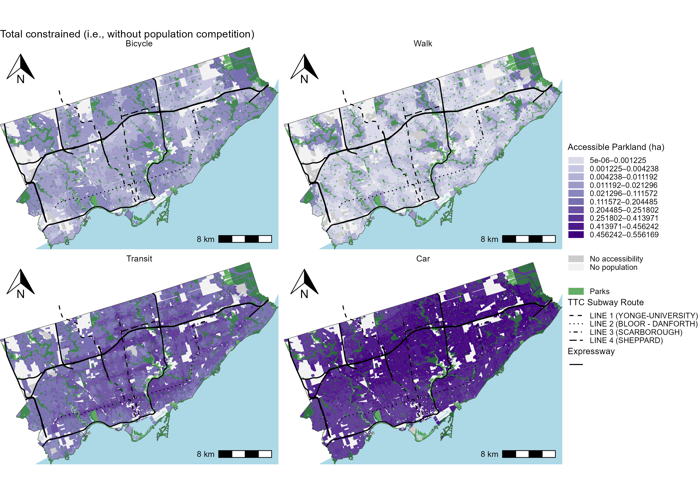
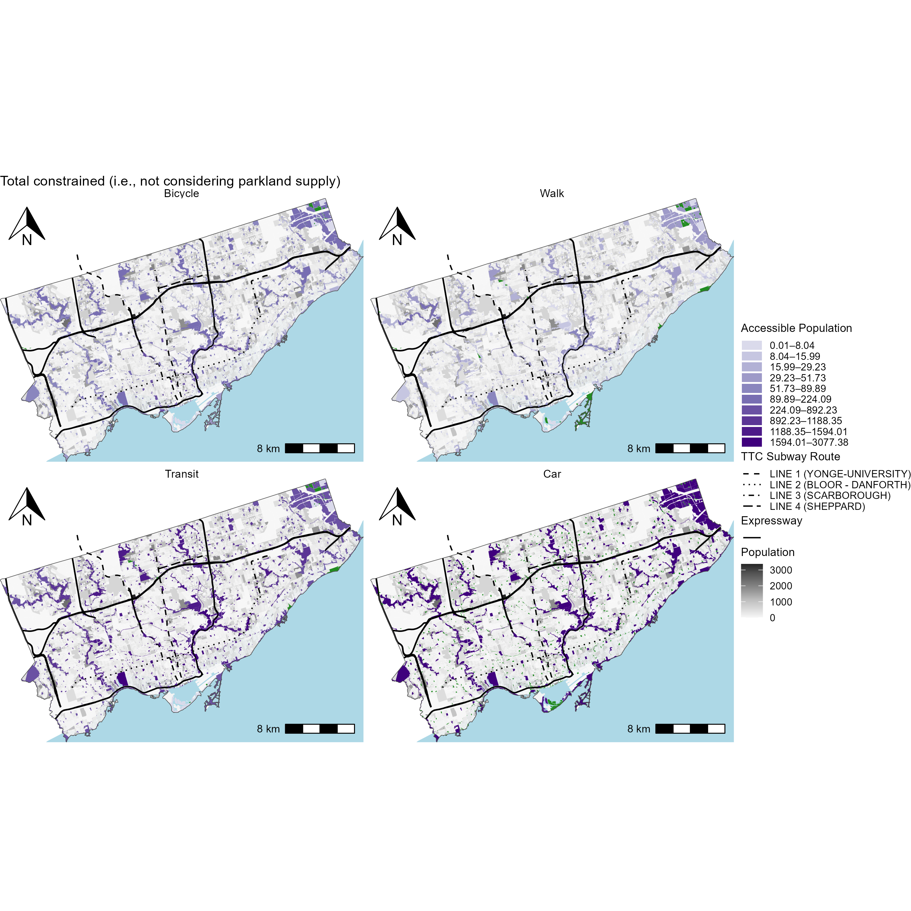
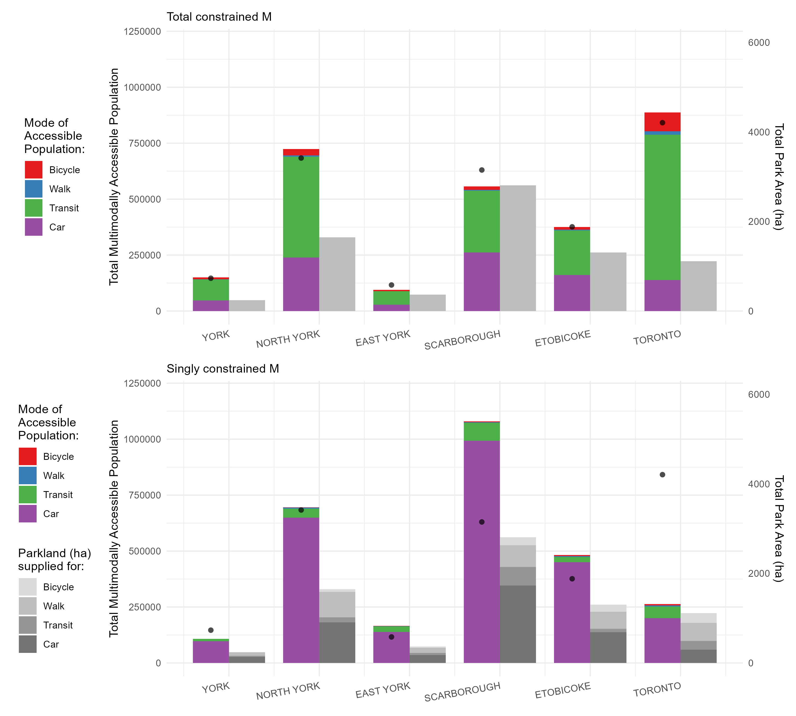

# CHP 5 - Comparing multimodal total-, singly and unconstrained accessibility of Toronto's parklands

<!-- Required to number equations in HTML files -->
<script type="text/x-mathjax-config">
MathJax.Hub.Config({
  TeX: { equationNumbers: { autoNumber: "AMS" } }
});
</script>

```{r include=FALSE}
knitr::opts_chunk$set(
  echo = FALSE,
  cache = FALSE,
  warning = FALSE,
  message = FALSE)
```

```{r}
library(dplyr)
library(sf)
library(scales)
load(file="./data/intermediate/access_allmodes_i_m_df.rda")
load(file="./data/intermediate/access_allmodes_j_m_df.rda")
access_allmodes_i_m_df <- access_allmodes_i_m_df |>mutate(prop_m = prop*Population)

load(file="./data/intermediate/parkland_grouped_wprops.rda") 
parkland_grouped_wprops <- parkland_grouped_wprops |> st_drop_geometry() |>
  rename( prop_walk_atpark = walk_prop, 
        prop_bike_atpark= bike_prop ,
         prop_transit_atpark= transit_prop,
         prop_car_atpark = car_prop)
load(file="./data/intermediate/TO_census_21_DB_wprops.rda")
```

## Overview

In this chapter, encorporates multiple modes, expressing multimodal accessibility of parkland from the perspective of parkland area and population. Like the unimodal example, origin and destinations are DB and park entrance points, and their weights are modal population per DB _or_ mode-specific parkland area (in hectares) per park. The normative impedance functions for all modes discussed in Chapter 3 are adopted. 

In the first half of the chapter the focus is on _accessible mulitmodal parkland area_. Values of $V^{m0}_i$, $V^{mT}_i$ and $V^{mS}_i$ are expressed at the DB level and the neighbourhood aggregation along with a comparison between multimodal accessible parkland area by walking and unimodal accessible parkland area values. Then, the accessible parkland per capita ratio is demonstrated, neighbourhoods are ranked and a discussion is detailed based on 'potential parkland service provision'. 

In the second half of the section, _accessible multimodal population_ $M^{m0}_j$, $M^{mT}_j$ and $M^{mS}_j$ is presented per park and per parkland area ratios at the level of the park itself and the neighbourhood is discussed as the 'potential population served'. This section is concluded by a comparison of multimodal parkland and population values aggregated by the 6 former municipal boundaries.

## Accessible multimodal parkland (for the population)

First turning to the concept of _accessible multimodal parkland_,  the results in this section include those calculated by unconstrained and constrained multimodal measure. Each measure yields different results (i.e., the amount of parkland area that is accessible by a certain mode at a specific zone) depending on the assumptions contained within the accessibility calculation. For the unconstrained measure, the values proportionally reflect the amount of accessible parkland area by mode: as there is not proportionality constant to maintain the resulting values units. For the constrained measures, the values remain a proportion of the regional total and/or the parkland area of each specific park allocated to each origin. Each origin can also be defined by the amount of mode-share present; the use of mode-share as an origin weight is only relevant for the singly constrained accessibility measure, and differences between results will be discussed. 

Beginning with unconstrained accessibility, Figure \ref{fig:chp5-mm_parkland_unconc_access_DB_plots} displays the unconstrained accessibility to parkland area, calculated for each mode separately. The scale is in quartiles. Also, DBs with no accessibility are shown in white while DBs with some census population but no access are shown in grey. As the impedance functions are assumed to be comparable, results are placed on the same scale across all four plots, but their units are different depending on the mode. For cycling and walking, it can be understood as accessible parkland-ha-within-15-minutes, whereas for transit and car it is parkland-ha-$e^{-0.02}$ and parkland-ha-$e^{-0.04}$. 

```{r ,fig.align='center', out.width="6in", fig.cap="\\label{fig:chp5-mm_parkland_unconc_access_DB_plots}Accessibility to parkland area per DB as measured by unconstrained accessibility for multiple modes."}
knitr::include_graphics("./data/figures/chp5-mm_parkland_unconc_access_DB_plots.png")
```

In Figure \ref{fig:chp5-mm_parkland_unconc_access_DB_plots}, it can be observed that many pockets of the city offer no access by bike, more access spatially for walk but lower, medium amount of access by transit and high amount by car (recall: motorized travelers can travel up to 120 minutes, though with diminishing liklihood and motorists do not access smaller parks). It is notable that in almost all DBs with population, motorists have accessibility. Furthermore, it is notable that there are bands of higher accessibility by transit running east-west and north-south; these higher bands correspond to lines of higher-frequency transit service (e.g., the subway and frequent light rail or bus service). High walking, and to a greater extend cycling accessibility surround areas with no population: these areas are DBs that consist of large park area. 

Figure \ref{fig:chp5-mm_parkland_total_conc_access_DB_plots} displays the accessibility to parkland area (in hectares) per DB as measured by the total constrained multimodal accessibility placed on the same scale coloured by quartiles. Again, these values are _proportional_ to the unconstrained measures, but they are explicit in their units: all in accessible parkland area, so explicitly travel impedance functions are taken as comparable as they are all within the $K^{mT}$ balancing factor (i.e., the sum of all unconstrained accessibility flow in the system across all modes is the denominator while the numerator is the sum of _all_ the parkland in the city ($8037.547$ ha). Together, at least one mode can reach every park unlike in the unimodal case where some parks could not be reached within a 15 minute walk).

As the system is constrained, values in the region can be discussed as proportions of the total parkland area in the region. The majority of parkland area (`r ((access_allmodes_i_m_df |> filter(mode == "Car") |> pull(V_tot_i_m) |> sum()) / (access_allmodes_i_m_df |> pull(V_tot_i_m) |> sum())) |> percent()`) is calculated to be accessible for car using population,  while  `r ((access_allmodes_i_m_df |> filter(mode == "Transit") |> pull(V_tot_i_m) |> sum()) / (access_allmodes_i_m_df |> pull(V_tot_i_m) |> sum())) |> percent()`,  `r ((access_allmodes_i_m_df |> filter(mode == "Bicycle") |> pull(V_tot_i_m) |> sum()) / (access_allmodes_i_m_df |> pull(V_tot_i_m) |> sum())) |> percent()` and `r ((access_allmodes_i_m_df |> filter(mode == "Walk") |> pull(V_tot_i_m) |> sum()) / (access_allmodes_i_m_df |> pull(V_tot_i_m) |> sum())) |> percent()` of the remaining parkland is accessible by transit, cycling and walking populations respectively.

Recall: this allocation works by taking the sum of total parkland area, and allocating it to origins based on the mode's relative travel impedance to reachable parkland area. The proportion of the population using the mode does not enter the equation. Hence, as car and transit are the furthest reaching modes these modes dominate allocation. Furthermore: car populations are assumed to not be able to reach smaller parkland area, but despite this assumption, car still dominates allocation, in part because larger parkland area dominates: `r ((parkland_grouped_wprops |> filter(area_ha <= 3) |> pull(area_ha) |> sum()) / (parkland_grouped_wprops |> pull(area_ha) |> sum())) |> percent()` of the total parkland area is small (i.e., parkettes, small and medium parks) and the remaining  `r ((parkland_grouped_wprops |> filter(area_ha > 3) |> pull(area_ha) |> sum()) / (parkland_grouped_wprops |> pull(area_ha) |> sum())) |> percent()` is large (i.e., large, city and legacy parks).

```{r ,fig.align='center', out.width="6in", fig.cap="\\label{fig:chp5-mm_parkland_total_conc_access_DB_plots}Accessibility to parkland area per DB as measured by total constrained multimodal accessibility."}

```

The spatial pattern within Figure \ref{fig:chp5-mm_parkland_singly_conc_access_DB_plots} appears quite a bit different than the total constrained measure. Firstly, many DBs in the north part of the city have no cycling mode share for leisure trips (but some census population). In this assessment, as their mode share is 0, they do not 'demand' for parkland area hence their accessibility is 0. In this sense, these cyclists contribute to taking parkland area from all other modes more intensely within the downtown core, by introducing more competition. For this reason, while cycling looked not as competitive as walking in the downtown core in the total constrained measure -- cycling looks much more competitive, outpacing walking in the singly constrained measure. Variability for transit and car also is more than in the total constrained modes. Particularly, transit looks more competitive than before, out preforming car mode (and all other modes) in certain pockets of the downtown. This is due to how proportional allocation works for the singly constrained measure: where now instead of just the total parkland area being allocated to each mode-group overall, each specifically park's area is allocated to each mode-group. This introduces another scale of dynamic, namely, the modal populations. 

```{r ,fig.align='center', out.width="6in", fig.cap="\\label{fig:chp5-mm_parkland_singly_conc_access_DB_plots}Accessibility to parkland area per DB as measured by singly constrained multimodal accessibility."}
knitr::include_graphics("./data/figures/chp5-mm_parkland_singly_conc_access_DB_plots.png")
```

### By neighbourhood

As done in the unimodal example, constrained accessibility values can be aggregated to another more meaningful zoning system: the neighbourhood.  Figure \ref{fig:chp5-mm_parkland_total_singly_access_neigh_plots} illustrates both the total constrained and singly constrained values. The total constrained measure can be interpreted as the unconstrained measure anchored to a known quantity: the total amount of parkland in the city that is reachable by at least one mode given travel impedance (`r access_allmodes_i_m_df |> pull(V_tot_i_m) |> sum()` ha out of 8,037.55 ha). The four plots of modal singly constrained measures also sum to the same total parkland area, but incorporate _modal population_ along with zonal allocation of opportunities in a constrained way. All values across both the total and singly constrained measures are presented on a common scale--from 0 to 110 hectares per neighbourhood-- along with the quartiles of each measures dataset. This is done as the units of the measures are the same, i.e., the amount of accessible parkland area per mode for each neighbourhood. And same as in Chapter 4, spatial variation is dampened both by aggregation to the neighbourhood scale (as compared to the DB) and by the varying distance-decay characteristics of each mode. 

Referring to the total constrained values in Figure \ref{fig:chp5-mm_parkland_total_singly_access_neigh_plots} it can be observed that every neighbourhood is populated with a value, unlike at the DB aggregation. This is due to aggregation, as the DBs are summed per neighbourhood to reflect the accessibility score of that neighbourhood. As the measure is constrained: summing each DB within a neighbourhood still preserves the constraint(s) satisfied by the measure. What is interesting though is, with the singly constrained measure, is that due to the large proportion of DBs with 0 cycling mode-share, there are certain neighbourhoods that too are devoid of cycling mode-share hence no _singly constrained_ cycling parkland accessibility is allocated. 

Furthermore in the singly constrained plots of Figure \ref{fig:chp5-mm_parkland_total_singly_access_neigh_plots}, the singly constrained cycling measure often yields higher values than the total constrained version. This occurs because parkland accessibility is not distributed to unpopulated zones, hence concentrating the parkland access in among fewer areas. A similar pattern is seen for walking mode, although at a smaller scale in magnitude to its relatively higher travel impedance. For transit and car modes, both constrained measures produce high values (often in the top quartile), and due to the coarse spatial scale of aggregation, differences between the two are less visually distinct.

```{r ,fig.align='center', out.width="6in", fig.cap="\\label{fig:chp5-mm_parkland_total_singly_access_neigh_plots}Accessibility to parkland area per neighbourhood summarised per neighbourhood as measured by total constrained multimodal accessibility (top) and singly constrained multimodal accessibility (bottom)."}
knitr::include_graphics("./data/figures/chp5-mm_parkland_total_singly_access_neigh_plots.png")
```
Before disaggregating results, it is important to clarify the relationship between the newly introduced multimodal accessibility measure and the unimodal framing presented in the previous chapter. To enable comparison, parkland area per capita is calculated for each neighbourhood using both the unimodal (walking-only for everyone) and multimodal (walking relative to cycling, car and transit) approaches. While both use the same travel impedance (e.g., 15-minute threshold), the denominators and accessible parkland totals differ: the unimodal measure considers total neighbourhood population and total accessible parkland via walking, whereas the multimodal measure considers only the walking population and the portion of parkland accessible within the full multimodal system. Notably, population is not part of the total constrained measure itself--it only informs the per capita representation. Figure \ref{fig:chp5-WALK_parkland_percapita_comparison_scatter} shows this relationship across neighbourhoods for both total and singly constrained measures, with outlying neighbourhoods labeled.

```{r ,fig.align='center', out.width="6in", fig.cap="\\label{fig:chp5-WALK_parkland_percapita_comparison_scatter}Nieghbourhood-level accessibility to parkland area per capita by walking, comparison between unimodal accessibility and multimodal accessibility ratios. Total constrained (top plot), singly constrained (bottom plot)."}
knitr::include_graphics("./data/figures/chp5-WALK_parkland_percapita_comparison_scatter.png")
```
 
Figure \ref{fig:chp5-WALK_parkland_percapita_comparison_scatter} illustrates the relationship between unimodal and multimodal walking measures for both total and singly constrained accessibility. In both cases, the measures show a roughly linear relationship and similar levels of central clustering: 35% of neighbourhoods fall within the interquartile range for the total constrained measure, and 34% for the singly constrained. Key differences between the two plots lie in their scales. Unimodal values range from 0 to 285 sqm/person, while multimodal values range from 0 to 20 sqm/person. This is due to differing calculation assumptions: the unimodal measure assumes _all_ the population accesses parkland via walking alone, while the multimodal measure accounts for the travel impedances of other modes (e.g., cycling, transit and car) as well as walking, which reduces the share of parkland that ends up being attributed walking even after being adjusted by the walking-population of that neighbourhood. Faster modes can "out-access" walking, diluting per-capita parkland area accessible for the walking population.

What is notable is despite these differences, the unimodal and multimodal relationship in maintained in both the total constrained and singly constrained measures. This relationship is maintained as they both measures are still informed by the _same_ spatial distribution of parkland area and the same impedance function (15-minute cutoff). However: the total constrained comparison yields a stronger correlation ($R^2$ = 0.70) than the singly constrained ($R^2$ = 0.49). As discussed, the singly-constrained measure yields results with more variance due to the more restrictive population and opportunity constraints. In both cases, similar outlying neighbourhoods are common across both measures and tend to be those with extreme population levels (i.e., either top or bottom quartile).

In sum, scatterplots in Figure \ref{fig:chp5-WALK_parkland_percapita_comparison_scatter} highlight the value of applying constraints: despite differences in how the unimodal and multimodal measures are calculated, the same underlying walking behaviour is used in both measures so results _should_ be related.

Building on the discussion above, it may also be helpful to explore how multimodal walking accessibility compares to other modes before turning to visualisation of the parkland accessibility per capita. Figure \ref{fig:chp5-allmodes_parkland_percapita_comparison_scatter} contains two scatterplots: neighbourhood level multimodal walk per capita value compared to the other three modes for the total constrained and singly constrained measures. Caution is warranted in interpreting these comparisons. In the total constrained measure, per capita values are derived by normalizing total accessible parkland by the neighbourhood population--yet this population allocation factor is not explicitly part of the accessibility calculation itself. By contrast, the singly constrained measure does incorporate modal population directly into the allocation of parkland accessibility. It also accounts for demand from all modes, which introduces additional variation and reflects competitive access to limited park resources. As such, apparent relationships (or the lack thereof) between modes should be interpreted with these methodological differences in mind.

```{r ,fig.align='center', out.width="6in", fig.cap="\\label{fig:chp5-allmodes_parkland_percapita_comparison_scatter}Neighbourhood-level accessibility to parkland area per capita, comparison of multimodal values between all modes. Total constrained (top plot), singly constrained (bottom plot)."}
knitr::include_graphics("./data/figures/chp5-allmodes_parkland_percapita_comparison_scatter.png")
```


For the total constrained measure in Figure \ref{fig:chp5-allmodes_parkland_percapita_comparison_scatter}, other modes (particularly car and transit) tend to exhibit higher parkland per capita values than walking though the hierarchy is somewhat diffuse. There also does not appear to be a pattern in how per capita walking access compares to other modes. However, this changes when considering the singly constrained per capita rates for the different modes where a hiarchary in modal structures becomes more clear as distinct "bands" emerge: across all levels of walking accessibility, car, transit, and cycling consistently register higher per capita values. In other words, at all values of walk - car, transit and cycling consistently score higher values than walk mode _and_ are in consistent ranges based on what they do not have not in common: their impedance function, $i$ to $j$ travel cost, proportion of modal population at an $i$. 

The difference lies in how each measure treats allocation. The total constrained model averages parkland across the region, assigning all parkland to each zone based on the mode's relative travel impedance without accounting for modal population. In contrast, the singly constrained model allocates parkland competitively and proportionally, based on the same travel impedance but also the modal share and the enforcement that only the area available at each park is allocated. No under- or over- allocation of park area is allowed, unlike in the total constrained case. The singly constrained allocation is based on the mode share, which when referring to Figure \ref{fig:chp3-mode_split_eachDB_plots} in chapter 3 demonstrates a distinct spatial distribution. Hence, the singly constrained measure also ends up reflecting this distribution, as tied to the distribution of parkland area and associated travel impedance, resulting in multimodal values that are more restricted. 

It’s also important to reiterate that per capita rates in the total constrained measure are externally imposed--they are not part of the calculation (but are imposed for the purpose of comparison and discussion at this point). In contrast, the singly constrained measure inherently considers modal population in its formulation. As a result, their non-normalised accessibility values (i.e., Figure \ref{fig:chp5-mm_parkland_total_singly_access_neigh_plots}), reflect patterns more similar to their per capita values as the 'capita' value is reflected in its internal structure. The singly constrained measure and its per capita ratio will tend to be more comparable in trends than non-normalised total constrained values compared to their per capita values. 

These scatterplots in Figure \ref{fig:chp5-allmodes_parkland_percapita_comparison_scatter} therefore highlight how introducing normalization (e.g., per capita) can create misleading variability--unless the normalizing variable is already accounted for in the model itself. Overall, under the total constrained measure, travel impedance and the spatial distribution of parks alone drives the allocation of parkland area. As a result, faster modes like car and transit tend to receive greater access, followed by cycling and walking. Per capita values introduce additional variation, as they reflect the underlying mode share of each neighbourhood’s population. However, to fully account for modal population as a form of demand, the singly constrained measure should be used.

Turning to the visualisation of per capita values,  Figure \ref{fig:chp5-motor_mm_parkland_total_singly_conc_access_neigh_percapita_plots} displays neighbourhood-level parkland accessibility for motorized modes, normalized by population and clipped at the 98th percentile for visualization. These patterns are reinforced by the LISA cluster map in Figure \ref{fig:chp5-LISA_allmotorized_neigh_plots}, which identifies statistically significant hotspots of high-high and low-low spatial association. 

```{r , fig.align='center', out.width="6in", fig.cap="Motorised neighbourhood-level accessibility to parkland area per capita for the City of Toronto.\\label{fig:chp5-motor_mm_parkland_total_singly_conc_access_neigh_percapita_plots}"}

```

```{r ,fig.align='center', out.width="6in", fig.cap="\\label{fig:chp5-LISA_allmotorized_neigh_plots} Local indicator of spatial association by neighbourhood of motorized constrained accessibility to parkland area per capita for the City of Toronto."}

```

Referring to the motorised values in Figure \ref{fig:chp5-motor_mm_parkland_total_singly_conc_access_neigh_percapita_plots} and Figure \ref{fig:chp5-LISA_allmotorized_neigh_plots}, singly constrained per capita values exhibit clearer patterns of clustering than the total constrained measure. Under the total constrained measure, neighbourhoods with large parkland areas and higher transit access--such as those near the Don Valley or along Line 2--score highly for transit per capita accessibility. However, the singly constrained measure, which allocates parkland area based on both travel impedance and competitive demand from other modes, demonstrates a different trend. In the downtown core, transit often outperforms car, with these zones capturing more parkland area per capita, and forming many high-high clusters. These patterns do not appear in the total constrained version because this measure lacks population weighting and opportunity constraints.

For car accessibility, the total constrained measure highlights downtown clusters, but these disappear under the singly constrained model--where transit competes more effectively in dense, well-connected areas. Conversely, car accessibility is higher in the northeast, but only in the singly constrained case. This is due to: (1) higher car mode share, (2) presence of large park spaces (which, recall, are the only type of park sizes that cars are assumed to be able to reach), and (3) expressway infrastructure, which reduces travel impedance for motorists. These factors contribute to car accessibility advantages in the northeast of the areas, while the inverse supports transit dominance of parkland area allocation downtown near the subway line. Lastly, the areas with low singly constrained accessibility tend to have: high population density, limited parkland area (especially large parks), and overall relatively higher travel impedance by other modes.


Moving onto non-motorised per capita accessibility: Figure \ref{fig:chp5-nonmotor_mm_parkland_total_singly_conc_access_neigh_percapita_plots} demonstrate the values spatially and Figure \ref{fig:chp5-nonmotor_mm_parkland_total_singly_conc_access_neigh_percapita_plots} illustrates the associated LISA clusters. Interesting, unlike all three other modes, walking mode follows a similar pattern across both total and singly constrained measures. This is largely a matter of scale: although localized differences appear at the dissemination block DB level (as shown in Figure \ref{fig:chp5-mm_parkland_singly_conc_access_DB_plots}), these patterns are muted when aggregated to the neighbourhood level, which spatially exceeds the effective range of the 15-minute walking threshold.


```{r ,fig.align='center', out.width="6in", fig.cap="\\label{fig:chp5-nonmotor_mm_parkland_total_singly_conc_access_neigh_percapita_plots} Non-motorized neighbourhood-level accessibility to parkland area per capita for the City of Toronto."}

```

```{r ,fig.align='center', out.width="6in", fig.cap="\\label{fig:chp5-LISA_allnonmotorized_neigh_plots} Local indicator of spatial association by neighbourhood of motorized constrained accessibility to parkland area per capita for the City of Toronto."}

```

Turning to the singly constrained measure in Figure \ref{fig:chp5-nonmotor_mm_parkland_total_singly_conc_access_neigh_percapita_plots} and Figure \ref{fig:chp5-nonmotor_mm_parkland_total_singly_conc_access_neigh_percapita_plots}, this measure tends to highlight zones where a high proportion of the modal population resides near accessible parkland. However, for walking, this competitive advantage is often outweighed by the lower impedance and higher demand of other modes. For example, even in the downtown core—where walking mode share is relatively high—transit users with extremely low travel impedance, along with motorists and cyclists, dilute walking access due to their broader reach and/or lower travel cost.

Nonetheless, top quartile accessibility values appear in neighbourhoods with an exceptionally high amount of parkland area near residential population--areas where parkland supply exceeds multimodal demand, allowing walking to compete more effectively. Coincidentally: these areas often align with where there is already a high proportion of walking mode-share to leisure trips, hence the singly constrained measure also reflect high values, as well as at the edges of the city. Examples are in the northeast (i.e., Rouge National Urban park, a large natural planned park and creek trail system along with greenspace around the Toronto Zoo) and the northwest (i.e., the Humber river park system) of the city. The Don Valley also stands out as having both high walking mode share and significant parkland availability, reinforcing high accessibility scores in both measures but especially the singly constrained one. Also, many of these areas are near the edge of the boarder hence receive even higher per capita values, partially due to edge effects, where reduced competition inflates accessibility scores. Cycling follows a similar spatial logic to walking but benefits from a larger impedance range. Its values are generally higher in magnitude due to broader reach, despite lower modal share. Also, some neighbourhoods show zero accessible parkland area by cycling as these neighbourhoods have 0 cycling mode-share (i.e., likely due to a lack of suitable cycling infrastructure).

Continuing the analysis, one can disaggregate constrained accessibility totals to examine the composition of parkland accessibility by park type for each neighbourhood. While faceted maps (e.g., by mode and park type) could illustrate spatial patterns, Figure \ref{fig:chp5-composition_by_parksize_allmodes_neigh_stacked_total} instead uses stacked bar plots to emphasize the relative contribution of each park type per mode for each neighbourhood assuming the total constrained measure. This visualisation approach highlights the calculated entropy, or diversity, of accessibility across park types at the neighbourhood level. Entropy is calculated based on the Shannon's index $-\frac{\sum x_ilog(x_i)}{log(N)}$, commonly used to calculate the diversity of land-use types in the urban planning context. In this use, we define $x_i$ as the proportion of accessibility from parks of a specific park size class $i$ for a neighbourhood. The $log(x_i)$ captures how un/evenly accessibility is distributed across park size classifications, and the denominator $log(N)$ normalizes the measure based on the number of park size classifications $N$ ensuring values range between 0 (complete concentration in a single category) and 1 (equal accessibility across all park size classification).

```{r ,fig.align='center', out.width="6in", fig.cap="\\label{fig:chp5-composition_by_parksize_allmodes_neigh_stacked_total} Compositional diversity of total constrained accessibility to parkland area by mode summarised per neighbourhood. Neighbourhoods ordered from left to right by decreasing proportion of allocated accessible park-size diversity."}
knitr::include_graphics("./data/figures/chp5-composition_by_parksize_allmodes_neigh_stacked_total.png")
```

For motorized modes in Figure \ref{fig:chp5-composition_by_parksize_allmodes_neigh_stacked_total}, accessibility is relatively consistent across the city: approximately 70–80% of accessible parkland comes from legacy parks, with the remainder primarily from large and city parks. In contrast, bicycle accessibility is more variable. Neighbourhoods near large parks (often outside the downtown core, as discussed previously) receive a greater share of accessible parkland from larger park size classifications, while those in the downtown core--where smaller parks are more concentrated--show higher proportions from those classifications. Walking accessibility is the most variable, likely due to its tendancy to follow more localised trends as discussed (i.e., driven by its short travel range and diversity of travel network and park-population distribution). Although walking mode yields the lowest overall accessible parkland, keep in mind that Figure \ref{fig:chp5-composition_by_parksize_allmodes_neigh_stacked_total} shows the proportional contribution of each park type per neighbourhood. Notably, neighbourhoods with the highest entropy (greater diversity in accessibility by park size) tend to receive a larger share of their walk-accessible parkland from smaller parks. As previously discussed, much of walk-accessible parkland is concentrated in the downtown core, where these smaller parks (and of various classifications with more similar parkland areas) are more prevalent.

It is important to emphasize that the values shown represent proportions within each neighbourhood, not absolute accessibility levels. Motorised modes continue to dominate in total accessible area, while walking contributes the least. In sum: these compositional patterns are largely shaped by the transport network structure and the mode-specific impedance assumptions embedded in each measure.

Moving onto the singly constrained measure, Figure \ref{fig:chp5-composition_by_parksize_allmodes_neigh_stacked_singly} illustrates the compositional diversity of neighbourhoods’ accessible parkland by mode. Compared to the total constrained measure in Figure \ref{fig:chp5-composition_by_parksize_allmodes_neigh_stacked_total}, the singly constrained version incorporates additional spatial structure--specifically, competition for park space and the enforcement of zonal-level allocation. This ultimately introduces greater variation, especially for non-motorized modes.

```{r ,fig.align='center', out.width="6in", fig.cap="\\label{fig:chp5-composition_by_parksize_allmodes_neigh_stacked_singly} Compositional diversity of singly constrained accessibility to parkland area by mode summarised per neighbourhood. Neighbourhoods ordered from left to right by decreasing proportion of allocated accessible park-size diversity."}

```
Regarding the motorized modes in Figure \ref{fig:chp5-composition_by_parksize_allmodes_neigh_stacked_singly}, the allocation of parkland area to these modal population main relatively stable in terms of their park size composition, with most neighbourhoods continuing to derive the majority of their accessible parkland from legacy parks. 

In contrast, regarding the non-motorized modes in Figure \ref{fig:chp5-composition_by_parksize_allmodes_neigh_stacked_singly}, walk and bicycle modes (non motorised) access a more balanced mix of park types. This shift reflects the fact that, under the singly constrained approach, parkland can no longer be over-allocated based on attractiveness alone--as was the case with the total constrained measure (see Chapter 4 discussion on over/under-allocation). Instead, each park's contribution is capped and allocated according to its actual area. As in the total constrained measure, cycling and walking modes still exhibit similar patterns of accessibility park size composition, but their accessibility composition is now less dominated by legacy parks. Variation across neighbourhoods is shaped both by the spatial reach of each mode (e.g., walking shows more variation than cycling due to its shorter range) and by the binary nature of the impedance function. Unlike motorized modes, which use a continuous decay function allowing access to most parks at varying levels, walking and cycling are constrained by a hard cutoff of 15 minutes, introducing sharper thresholds in park allocation hence more variation in its composition.

## Accessible population (to the parkland)

This variant introduces a new framing for the accessibility analysis. Instead of a focus on how well origins by modal population are preforming from the perspective of _accessible parkland area_, one can investigate how well the park themselves (or aggregated to some other relevant park zonal level) are preforming in serving different modal populations or _accessible multimodal population_, a park's 'market potential'. 

Figure \ref{fig:chp5-pop_unconc_access_parks_allmodes_plots} is the access to people, by mode for the unconstrained measure, and Figure \ref{fig:chp5-pop_total_access_parks_allmodes_plots} for the total constrained measure. Again, they are proportional but the advantage of the constrained measure is that the total sum of accessible population across all modes and parks is $2,794,356$, the total sum of the population in 2021 in the Toronto CMA. The focus of discussion will be on the comparison between the multimodal total constrained measure and singly constrained measures. Interestingly: unlike in the accessible parkland examples (preceding section's discussion): transit mode dominates as opposed to car. In the case of accessible population, this means `r ((access_allmodes_j_m_df |> filter(mode == "Transit") |> pull(M_tot_j_m) |> sum()) / 2794356) |> percent()` of the population that is accessible to parks is assumed to be transit-using, while  `r ((access_allmodes_j_m_df |> filter(mode == "Car") |> pull(M_tot_j_m) |> sum()) / 2794356) |> percent()`,  `r ((access_allmodes_j_m_df |> filter(mode == "Bicycle") |> pull(M_tot_j_m) |> sum()) / 2794356) |> percent()` and  `r ((access_allmodes_j_m_df |> filter(mode == "Walk") |> pull(M_tot_j_m) |> sum()) / 2794356) |> percent()` of the accessible population is represented by car, cycling and walking modes. As allocation of total population is strictly based on the the impedance of mode using populations and not their actual proportions. If we do not know the proportions of modes, this may be all we can do. But we _know_ the proportion of transit users and it tends to be about `r (access_allmodes_i_m_df |> filter(mode == "Transit") |> pull(prop) |> mean()) |> percent()` on average from any given origin, or approximately `r ((access_allmodes_i_m_df |> filter(mode == "Transit") |> pull(prop_m) |> sum()) /  (access_allmodes_i_m_df|> pull(prop_m) |> sum()))|> percent()` of the total population.

```{r ,fig.align='center', out.width="6in", fig.cap="\\label{fig:chp5-pop_unconc_access_parks_allmodes_plots} Multimodal unconstrained accessible population-by-modal-impedance accessibility per park, i.e. market potential of each park."}
knitr::include_graphics("./data/figures/chp5-pop_unconc_access_parks_allmodes_plots.png")
```

```{r ,fig.align='center', out.width="6in", fig.cap="\\label{fig:chp5-pop_total_access_parks_allmodes_plots} Total constrained multimodal accessible population by mode per park."}

```

While it is surprising to see transit mode be allocated so much accessible population, this is how the total constrained allocation (Figure \ref{fig:chp5-pop_total_access_parks_allmodes_plots}) precisely functions. It is strictly based on the _relative_ (to other modes) travel impedance from parks to reachable population zones. Transit, especially higher order transit, tends to be present near more dense populations. Furthermore: there are plenty of park locations (though they tend to be smaller) near these higher density areas which indicate higher transit service areas i.e., the TTC subway and higher order surface transit. Hence, from the perspective of parks location to population-weighted-by-their-modal-impedance, transit is highly effiecent in capturing transit-population to parks. 

From this perspective: populations that tend to use more car-mode tend to be in lower density zones with fewer parks (albeit larger), coincidentally these populations in these zones allocate fewer population to parks for car mode though car mode has a lower travel impedance than transit. Between accessible multimodal population and accessible multimodal parkland (preceding sections), cycling and walk modes tends to capture similarly low proportions of population. Though, cycling captures two times more (i.e., `r ((access_allmodes_j_m_df |> filter(mode == "Bicycle") |> pull(M_tot_j_m) |> sum()) / (access_allmodes_j_m_df |> pull(M_tot_j_m) |> sum())) |> percent()` instead of  `r ((access_allmodes_i_m_df |> filter(mode == "Bicycle") |> pull(V_tot_i_m) |> sum()) / (access_allmodes_i_m_df |> pull(V_tot_i_m) |> sum())) |> percent()`) accessible population than accessible parkland (for the total constrained measure), for similar reasons discussed as in transit: parks that can be accessed by cycling are located in higher population dense areas of the city.

Again, the total constrained multimodal accessible population measure may represent the most reasonable estimate when park mode-suitability is unknown--that is, when we lack information on how park area is functionally divided by mode (i.e., how much of the park area can be used by a specific mode-traveller group such as parking lot capacity for drivers or bike parking availability). In this analysis, however, we approximate mode-specific parkland accessibility by using the mode shares _to_ leisure destinations from the 2022 TTS (i.e., Figure \ref{fig:chp3-mode_split_parks_plots}). These shares are treated as proxies for the population segments most likely to access parkland by each mode, effectively framing parkland area as a mode-specific supply influenced by travel impedance.

Figure \ref{fig:chp5-pop_singly_access_parks_allmodes_plots} presents the singly constrained accessible population per park, disaggregated by mode. These results differ notably from those produced by the total constrained measure--similar to the differences observed in the preceding section between total and singly constrained estimates of accessible multimodal parkland area. The key distinction lies in whether competition of parkland supply is explicitly considered.

```{r ,fig.align='center', out.width="6in", fig.cap="\\label{fig:chp5-pop_singly_access_parks_allmodes_plots} Singly constrained multimodal accessible population by mode per park."}

```

In Figure \ref{fig:chp5-pop_singly_access_parks_allmodes_plots}, the singly constrained measure allocates the total population from each origin to the proportion of parkland area (per park) that may be demanded by the incoming modal-split from that origin. This calculation results in the following: that the accessible population is dominated by suitability for the car-using population. Namely, `r ((access_allmodes_j_m_df |> filter(mode == "Car") |> pull(M_pop_j_m) |> sum()) / (access_allmodes_j_m_df |> pull(M_pop_j_m) |> sum())) |> percent()` of the accessible population across all parks is calculated to be motorists. With the remaining proportions coming from transit (`r ((access_allmodes_j_m_df |> filter(mode == "Transit") |> pull(M_pop_j_m) |> sum()) / (access_allmodes_j_m_df |> pull(M_pop_j_m) |> sum())) |> percent()`), cyclists (`r ((access_allmodes_j_m_df |> filter(mode == "Bicycle") |> pull(M_pop_j_m) |> sum()) / (access_allmodes_j_m_df |> pull(M_pop_j_m) |> sum())) |> percent()`) and walking population (`r ((access_allmodes_j_m_df |> filter(mode == "Walk") |> pull(M_pop_j_m) |> sum()) / (access_allmodes_j_m_df |> pull(M_pop_j_m) |> sum())) |> percent()`).

It is important to reiterate the intuition behind this measure. From the perspective of the origin, the motorist mode-share represent `r ((access_allmodes_i_m_df |> filter(mode == "Car") |> pull(pop_m) |> sum()) / (access_allmodes_i_m_df |> pull(pop_m) |> sum())) |> percent()` of the population at DBs. However, the motorist parkland area suitable represents `r  ((parkland_grouped_wprops |> mutate(car_area = (prop_car_atpark*area_ha)) |> pull(car_area) |> sum() ) / parkland_grouped_wprops |> pull(area_ha) |> sum()) |> percent()` of the total parkland area. The population at the DB, and the area of the parks, are weighted by the origin-side and destination-side mode shares. Comparing between them is challenging: as they are in fundamentally different units and from different sides of the accessibility analysis (accessible multimodal parkland area vs accessible multimodal population). But despite these differences, car _still_ dominates. Why? Because of the intensely high travel impedance, relative to other modes. Though ...

## Conclusions: comparing multimodal accessible parkland and accessible population by Toronto neighbourhood 

This section summarises key patterns in multimodal constrained accessibility across Toronto neighbourhoods, focusing on two perspectives:

- Accessible parkland: how total parkland is allocated based on origin-side modal split and travel impedance (i.e., how accessibility varies by mode depending on where people are coming from);
- Accessible population: how total population is allocated to parks based on destination-side modal split and travel impedance (i.e., how many people can access each park, by mode).

To contextualise the results, values are aggregated and discussed by Toronto’s six former municipalities, which are potentially too aggregated for finer planning purposes, offer useful interpretive boundaries. Parks tend to align with these divisions, and each area exhibits distinct spatial and infrastructural characteristics as they recently were their own municipalities. \ref{fig:chp3-mode_split_eachDB_plots} shows the boundaries of these former municipalities.

In what follows, we use these groupings to guide interpretation of the accessibility results, while also highlighting neighbourhood-level variation where relevant.

### **How effectively are the parks serving the population?**

If asking this question, one is interested in evaluating how well parks are providing population access to their parkland area. If information about how attractive each park is to different modal groups from the perspective of the origin zone (i.e., mode share travel to parks) is lacking, one should use the _multimodal total constrained opportunities measure_. In this approach, the total parkland area in the region is allocated to each origin zone solely based on travel impedance of each mode relative to all modes in the system. This measure reflects how much accessibility to parkland area a zone has for each type of modal population. This measure assigns higher accessible parkland area values to mode-using populations at an origin for modes with a broader range, such as transit and car.

However, if we do have information about parkland demand by modal group, then we can ask a more refined question: **How effectively is the available parkland supply serving the population?**. In this case, the _multimodal singly constrained opportunities measure_ is appropriate. Here, accessibility is allocated competitively, considering both the spatial distribution of the modal population (demand) and its associated travel impedance to allocate only the parkland area available at each park. Results tend to demonstrate higher results for areas with low competition for parkland area: this can be in areas with high modal population proximate to parkland and further from other populations (especially lower impedance populations). 

Figure \ref{fig:chp5-mm_V_T_S_muni_vs_real_parkland_plots} summarises these two perspectives across former Toronto municipalities, for the parkland area and population data used in this chapter. This comparision highlights differences in how parkland accessibility is distributed for each measure.

```{r ,fig.align='center', out.width="6in", fig.cap="\\label{fig:chp5-mm_V_T_S_muni_vs_real_parkland_plots} Multimodal total and singly constrained accessible population summarised by former municipalities and plotted against real parkland area and population within the municipality. The black point represents the sum of total poulation."}
knitr::include_graphics("./data/figures/chp5-mm_V_T_S_muni_vs_real_parkland_plots.png")
```
.... some more stuff. about the black point that represents real parkland area per neighbourhood. We can see it does not align with the presence in the muni. why? because accessible parkland is not the parkland present, but the amount that is allocated to DBs contained in that municipalitiy.  


### **How efficiently is the population within reach of parks?**

When evaluating how efficiently the park provides accessibility to population and the amount of modal-suitable parkland area supply (e.g., a proportion of how well a park accommodates/expects each type of mode group) for the parks is unknown: choose _total constrained accessible population measure_. In this measure, the total population is allocated to each park based on the modal-group;s travel impedance. With this measure, one can understand how much population by modal group is within reach of each park and can be aggregated at different levels to reflect this amount (i.e., first plot in Figure \ref{fig:chp5-mm_M_T_S_muni_vs_real_parkland_plots}). In this measure, the total amount of population is allocated, with no regard for modal parkland supply --it is solely allocated based on travel impedance from population to parks. 


```{r ,fig.align='center', out.width="6in", fig.cap="\\label{fig:chp5-mm_M_T_S_muni_vs_real_parkland_plots} Multimodal total and singly constrained accessible population summarised by former municipalities and plotted against real parkland area and population within the municipality. The black point represents the sum of total poulation."}

```


In Toronto, the spatial distribution of parks (though not necessarily the total parkland area) is relatively even. As a result, the accessible population by mode tends to align closely with the actual residential population (as indicated by bars aligning with the black points). Transit offers relatively low travel impedance and is well-connected both to park locations and to areas of population density. Consequently, it yields high levels of accessible population--particularly in municipalities with more well developed transit infrastructure, such as Toronto and York. In contrast, in municipalities where transit service is weaker and car travel has lower impedance, a greater share of the accessible population is captured by the car mode.

However, if population demand _is_ known, the question can be augmented: **how efficiently is the population that demands access within reach of parks?** In this case, the singly constrained population measure should be used (see the second plot in Figure \ref{fig:chp5-mm_M_T_S_muni_vs_real_parkland_plots}). This produces a notably different distribution. Accessible populations no longer resemble the total population of the municipalities, and transit is no longer the dominant mode.

It is important to remember that in both measures, the total population is constrained. However, its allocation depends on both modal travel impedance and the park-side modal split. The park-side modal split is approximately half car-based overall, but it skews strongly toward car use in areas with large amounts of parkland, and car travel also tends to have exceptionally low impedance.

For example, while Toronto has a large population and good proximity to parks, these parks tend to be smaller and are more aligned with non-car modes. Despite this, Toronto’s central location means its population is often allocated to larger, more car-oriented parks located outside the former city boundaries. As a result, Toronto has the lowest accessible population relative to its actual population under this measure. 

In contrast, Scarborough exhibits a much higher accessible population than its actual population. It also has a high number of parks and a large amount of parkland area, making it a highly competitive municipality when evaluated using singly constrained measure. i.e., Population is effectively "pulled" from across the city toward large, car-accessible parks. This dynamic explains the significant variation in accessible population across municipalities, especially since larger parks (being more car-supplied) more competitively exert draw, while smaller parks are not assumed to attract car-based access....