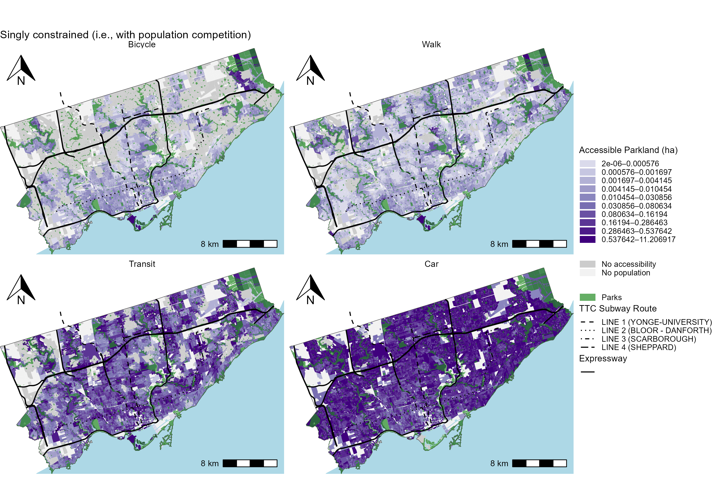

# CHP 5 - Comparing multimodal total-, singly and unconstrained accessibility of Toronto's parklands [NOT DONE]

<!-- Required to number equations in HTML files -->
<script type="text/x-mathjax-config">
MathJax.Hub.Config({
  TeX: { equationNumbers: { autoNumber: "AMS" } }
});
</script>

```{r include=FALSE}
knitr::opts_chunk$set(
  echo = FALSE,
  cache = FALSE,
  warning = FALSE,
  message = FALSE)
```


## Overview
This frames opportunities as hectares of parkland for one type, Large park, as all modes are present in the normative impedance. We will assume everyone walks, and hence the population of walkers is equal to the population at the origin. To keep it simple, just walking as a mode will be analysed, either 1 or 0 binary function at different thresholds. 

First, these assumptions will yield values of $V^0_i$, $V^T_i$ and $V^S_i$ as the accessible parkland along with per capita ratios in discussion with potential parkland service provision. 

Next, $M^0_j$, $M^T_j$ and $M^S_j$ as the accessible population along with per parkland ratios in discussion with potential population served. 


## Accessible parkland (for the population)

Focusing on the accessible number of parks: the following plot demonstrates a disaggregated version of figure above. Each plot demonstrates the number of parks that are accessible, by mode. Again, the embedded assumption is the number of parkland in the city is allocated to each DB based on the travel impedance of that mode's zone relative to all the travel impedance of all modes in the region.

Figure \ref{fig:chp5-mm_parkland_unconc_access_DB_plots} displays the unconstrained accessibility to parkland area, calculated for each mode separately. The scale is in quartiles. As the impedance functions are assumed to be comparable, results are placed on the same scale, but their units are different depending on the mode. For cycling and walking, it can be understood as accessible parkland-ha-within-15-minutes, where as for transit and car it is parkland-ha-$e^{-0.02}$ and parkland-ha-$e^{-0.04}$. Many pockets of no access by bike, more access spatially for walk but lower, medium amount of access by transit and high amount by car (recall: motorized travelers can travel up to 120 minutes, though with dimenishing liklihood).

```{r ,fig.align='center', out.width="6in", fig.cap="\\label{fig:chp5-mm_parkland_unconc_access_DB_plots}Accessibility to parkland area per DB as measured by unconstrained accessibility for multiple modes."}

```

Figure \ref{fig:chp5-mm_parkland_total_conc_access_DB_plots} displays the accessibility to parkland area (in hectares) per DB as measured by the total constrained multimodal accessibility placed on the same scale coloured by quartiles. Again, these values are _proportional_ to the unconstrained measures, but they are explicit in their units: all in accessible parkland area, so explicitly travel impedance functions are taken as comparable as they are all within the $K^{mT}$ balancing factor. 
```{r ,fig.align='center', out.width="6in", fig.cap="\\label{fig:chp5-mm_parkland_total_conc_access_DB_plots}Accessibility to parkland area per DB as measured by total constrained multimodal accessibility."}
knitr::include_graphics("./data/figures/chp5-mm_parkland_total_conc_access_DB_plots.png")
```

Figure \ref{fig:chp5-mm_parkland_singly_conc_access_DB_plots} looks a bit different than the total constrained measure. Bicycle and Walking appear to be more equal. Transit looks more competitive than before, out preforming car mode (and all other modes) in certain pockets of the downtown.  

```{r ,fig.align='center', out.width="6in", fig.cap="\\label{fig:chp5-mm_parkland_singly_conc_access_DB_plots}Accessibility to parkland area per DB as measured by singly constrained multimodal accessibility."}

```

## By neighbourhood

[Summary, constrained aggregated by neighbourhood]

[per capita non-motorized [LT: Bike- unconc. RT: Walk -unconc, LB: Bike- singly. RB: Walk-unconc]] 

[per capita motorized [LT: transit- unconc. RT: car -unconc, LB: transit- singly. RB: car-unconc]] 

[per capita when non-motorized outcompets motorized overall, by total vs. singly - 2 plots]

[Graph that demonstrates per smaller parks vs bigger parks]

[Graphs that discuss how ranks change depending on what measure is used. some summary of the top 5, middle and bottom neighbourhoods]


## Accessible population (to the parkland)

If interested in using totally-constrained accessibility as an indicator of service provision, conceptualing the 'market pontential' variant is useful to yield values of 'number of people that can access parks' for the zonal unit of question. 

The following is the access to people, by mode. Notably, it is not correlated with opportunities, as there is a mis-match in population and parkland in certain neighbourhood (see fig..X)
[4 Toronto DB plots - featuring accessibility to all people by mode]


The following is the access to people, by mode:
[4 Toronto DB plots, summarised by neighbourhood - featuring accessibility to people from ONLY large parks by mode]

[4 Toronto DB plots, summarised by neighbourhood - featuring accessibility to people from ONLY small parks by mode]

[4 Toronto DB plots - featuring accessibility to all people per parkland capita by mode]

[summary table of top 5, middle 5, and bottom 5 neighbourhoods]
