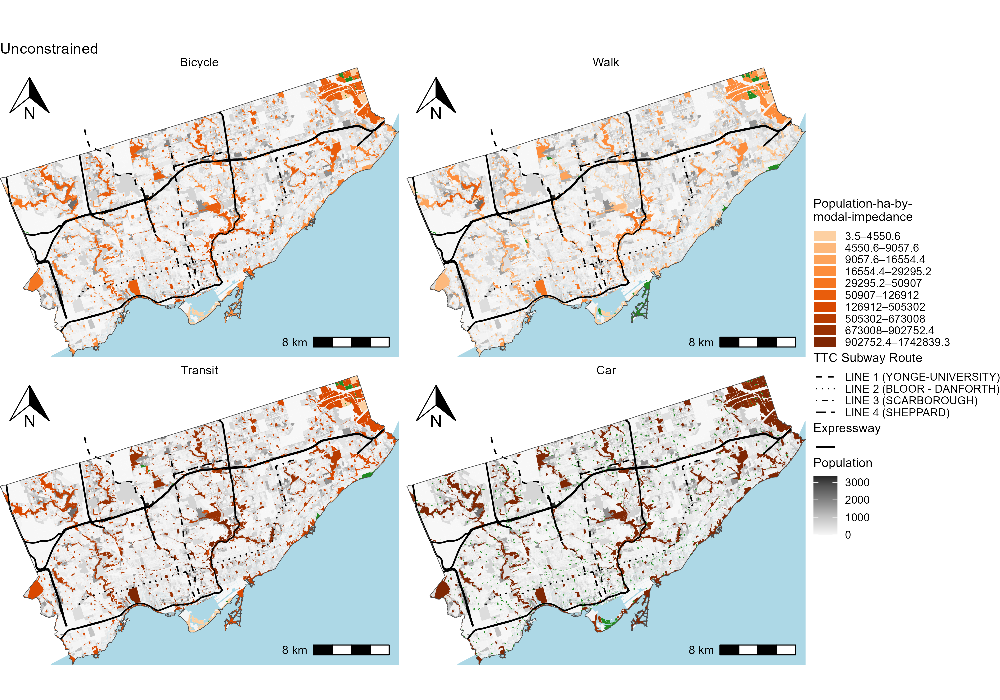
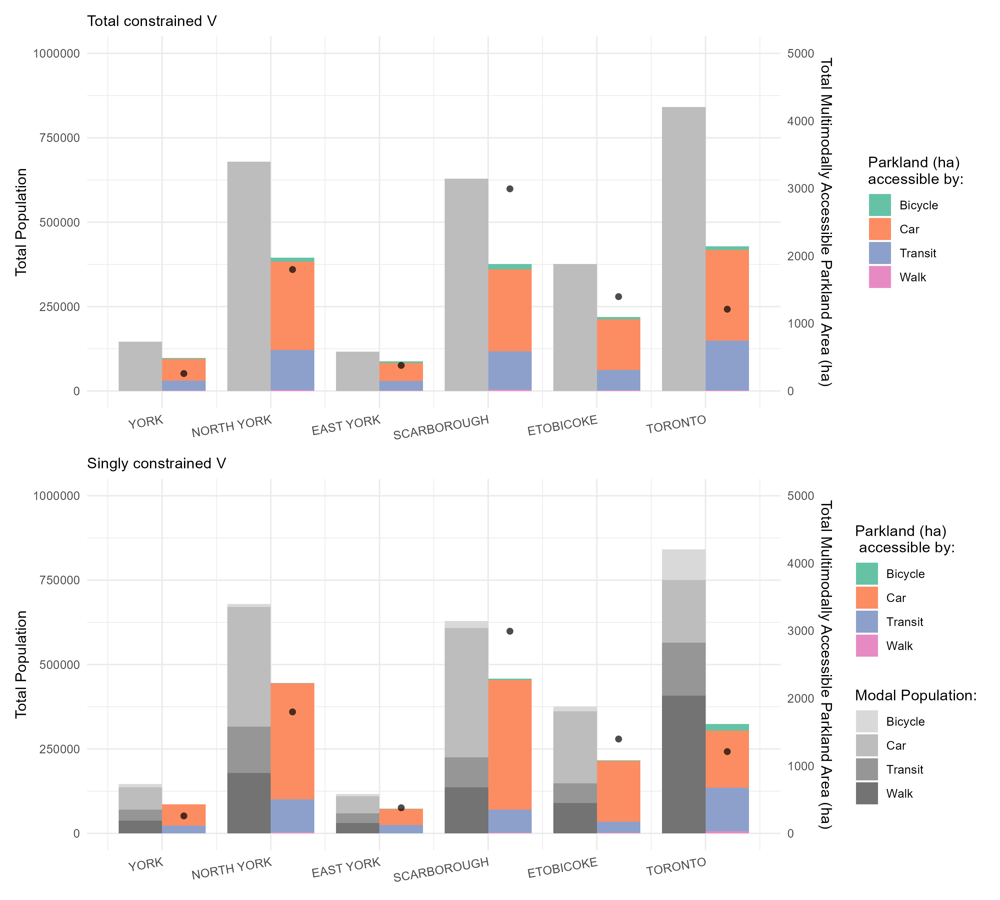
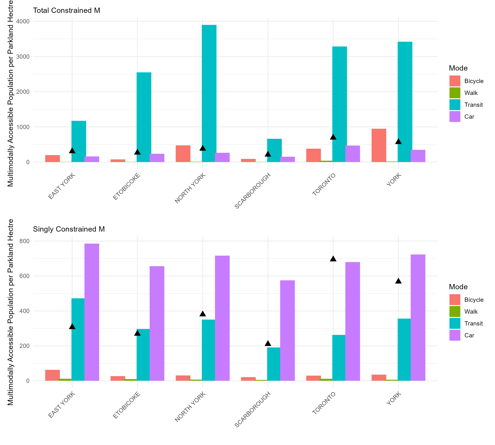

# Multimodal accessibility to parks in Toronto

<!-- Required to number equations in HTML files -->
<script type="text/x-mathjax-config">
MathJax.Hub.Config({
  TeX: { equationNumbers: { autoNumber: "AMS" } }
});
</script>

```{r include=FALSE}
knitr::opts_chunk$set(
  echo = FALSE,
  cache = FALSE,
  warning = FALSE,
  message = FALSE)
```

```{r}
library(dplyr)
library(sf)
library(scales)
load(file="./data/intermediate/access_allmodes_i_m_df.rda")
load(file="./data/intermediate/access_allmodes_j_m_df.rda")
access_allmodes_i_m_df <- access_allmodes_i_m_df |>
  mutate(prop_m = prop*Population,
         vv_tot_i_m = ifelse(V_tot_i_m == 0 | pop_m == 0, 0, V_tot_i_m*10000/pop_m),
         vv_opp_i_m = ifelse(V_opp_i_m == 0 | pop_m == 0, 0, V_opp_i_m*10000/pop_m))

load(file="./data/intermediate/parkland_grouped_wprops.rda") 
parkland_grouped_wprops <- parkland_grouped_wprops |> st_drop_geometry() |>
  rename( prop_walk_atpark = walk_prop, 
        prop_bike_atpark= bike_prop ,
         prop_transit_atpark= transit_prop,
         prop_car_atpark = car_prop)
load(file="./data/intermediate/TO_census_21_DB_wprops.rda")
```

## Overview

This chapter details _multimodal_ accessibility of parkland from the perspective of parkland area and population. Like the unimodal example, origin and destinations are DB and park entrance points, and their masses are modal population per DB _or_ mode-specific parkland area (in hectares) per park. The normative impedance functions for all modes discussed in Chapter 3 are adopted. 

In the first half of the chapter, the focus is on _multimodal accessible parkland area_. The variables of $V^{m0}_i$, $V^{mT}_i$ and $V^{mS}_i$ represent the mode-specific quantities of multimodal accessible parkland area for each DB. The sum of these variables are first detailed which provides an aggregate measure of multimodal accessible parkland area per DB, then the mode-specific values are plotted and discussed. Following this, the accessible parkland per capita ratio is demonstrated and a discussion on multimodal 'potential parkland service provision' is detailed. 

In the more brief second half of the chapter, the focus is on _multimodal accessible population_ and the variables of $M^{m0}_j$, $M^{mT}_j$ and $M^{mS}_j$ represent the mode-specific quantities of multimodal accessible population for each park. The mode-specific values are plotted per park and discussed.

This chapter is concluded by a comparison and discussion of the aggregated multimodal accessible parkland area and multimodal accessible population values for the 6 former municipal boundaries. These values are compared to their tangible counterparts: the amount of population residing in each former municipality (for accessible multimodal parkland area) and the number of actual parkland area in each former municipality (for accessible multimodal population), effectively: ratios of multimodal parkland area potentially provided and ratios of multimodal population potentially served.

## Multimodal accessible parkland (for the population)

First turning to the concept of _multimodal accessible parkland_, the results in this section include those calculated by unconstrained and constrained multimodal measure. Each measure yields different results (i.e., the amount of parkland area that is accessible by a certain mode at a specific zone) depending on the assumptions contained within the accessibility calculation. For the unconstrained measure, the values proportionally reflect the amount of accessible parkland area by mode: as there is no proportionality constant to maintain the resulting values units. For the constrained measures, the values remain a proportion of the regional total and/or the parkland area of each specific park allocated to each origin. Each origin can also be defined by the amount of mode-share present; the use of mode-share as an origin weight is only relevant for the singly constrained accessibility measure, and differences between results will be discussed. 

Beginning with unconstrained accessibility, Figure \ref{fig:chp5-mm_parkland_unconc_access_DB_plots} displays the unconstrained accessibility to parkland area, calculated for each mode separately. The scale is in deciles. DBs with no accessibility are shown in medium grey and DBs with no population are shown in light grey. These lighter grey areas are typically commercial or industrial in land-use, and were dropped before calculating any accessibility measure to better reflect the motivation of this analysis: spatially accessible parkland area from a location _for_ the population. Furthermore, travel impedance functions (and associated travel times) are different depending on the mode. To aid in comparability, multimodal values are placed on the same scale across all four plots, but their units are different depending on the mode. For cycling and walking, it can be understood as accessible parkland-ha-within-15-minutes, whereas for transit and car it is parkland-ha-$e^{-0.02}$ and parkland-ha-$e^{-0.04}$. 

```{r ,fig.align='center', out.width="6in", fig.cap="\\label{fig:chp5-mm_parkland_unconc_access_DB_plots}Accessibility to parkland area per DB as measured by the unconstrained accessibility measure for multiple modes."}
knitr::include_graphics("./data/figures/chp5-mm_parkland_unconc_access_DB_plots.png")
```

In Figure \ref{fig:chp5-mm_parkland_unconc_access_DB_plots}, for non-motorized modes it can be observed that many pockets of the city offers lower levels of accessibility by walking and slightly higher levels by cycling. Highest levels of accessibility are in close proximity to parks. For motorized modes, transit offers moderate levels of accessibility, with highest levels near the subway routes as well as routes (not pictured) with higher frequency transit operation (i.e., higher frequency buses and streetcars). Lower levels of transit accessibility are reflected of where there are lower amounts of parks and transit service. For car mode, accessibility is highest along the east-west expressway north in the city: where car speeds are high and a large amount of parkland area is accessible. Recall: motorized travelers can travel up to 120 minutes, though with diminishing likelihood is assumed as the travel time increased, and motorists do not access smaller parks. Conversely, non-motorized travelers are capped to a maximum 15 minutes of possible travel time.

Another key observation about Figure \ref{fig:chp5-mm_parkland_unconc_access_DB_plots} is that it does not represent truly multimodal accessibility. Each plot evaluates parkland accessibility for a single mode in isolation, without accounting for interactions with other modes. However, the scores could still be compared across modes (as done in the previous paragraph) since they share a common intuitive measurement scale 'parkland-ha-by-modal-impedance', though meaning cannot be gleaned from the values themselves as impedance functions are different across modes making the underlying units not the same.

This issue of inconsistent units is remedied using the multimodal constrained accessibility measures. Figure \ref{fig:chp5-mm_parkland_conc_access_DB_plots_summedmodes} demonstrates the total constrained and singly constrained DB values aggregated at the level of the DB. The values of each DB consist of a share of the mode-specific multimodal accessible parkland area, which can be summed to reflect the multimodal accessible parkland area of a DB as a proportion of the total parkland area in the region that can be reached from DBs with a population (i.e., `r access_allmodes_i_m_df$V_tot_i_m |> sum() |> round(2)` hectres). This form of overall multimodal accessible parkland area amount cannot be intuitively calculated using the unconstrained multimodal accessibility measure.

```{r ,fig.align='center', out.width="6in", fig.cap="\\label{fig:chp5-mm_parkland_conc_access_DB_plots_summedmodes}Overall multimodal accessibility to parkland area per DB."}

```
Both constrained measures in Figure \ref{fig:chp5-mm_parkland_conc_access_DB_plots_summedmodes} consider the mode-specific multimodal accessibility in the region under the same framework. For instance, regarding the total constrained plot, the total parkland area in the region is proportionally allocated to the potential mode-using group at each origin defined only by that mode-using group's associated travel impedance value. Recall, the total constrained measure does not use the modal-shares at each origin, allocation is only based on the relative modal travel impedance and mass of the parkland area.

In the total constrained plot in Figure \ref{fig:chp5-mm_parkland_conc_access_DB_plots_summedmodes}, it can be observed that areas of high multimodal accessibility are in areas where where accessibility by both motorized modes is high: i.e., along subways lines which provide high levels of access by transit but also car accessibility by car as they are under relative higher speed streets. It's notable that areas where car accessibility north in the city along the expressway also provide high multimodal accessibility: though that is because car accessibility is exceptionally high, while all other modes are low (as will be later discussed). 

On the other hand, the singly constrained map in Figure \ref{fig:chp5-mm_parkland_conc_access_DB_plots_summedmodes} presents a different story. This measure accounts for mode-specific population demand, as determined by the modal share of leisure trips made by the DB population. Unlike the total constrained multimodal values, which tends to be more spatially uniform, both the population distribution and the modal split vary significantly across the city. As a result, the singly constrained multimodal accessibility surface is more uneven. It reflects not only the spatial distribution of population but also the differentiated demand and travel impedance associated with each transportation mode. Overall, this plot reveals higher multimodal parkland accessibility in the northern parts of the city compared to the downtown core, particularly around the central near the 'U' of Subway Line 1. This suggests that although the downtown area has a relatively dense parkland network (as seen in the constrained plot), its high population density and greater reliance on shorter-range modes (e.g., walking, cycling, and transit) reduce the relative accessibility of parkland for all.

To explore the differences between modes, the constrained accessibility plots in Figure \ref{fig:chp5-mm_parkland_conc_access_DB_plots_summedmodes} can be decomposed by mode, allowing for an assessment of how much _more_ or _less_ multimodally accessible parkland is available to each potential mode-using population group. These differences arise in part from the way accessibility is shared or limited by the presence of other groups competing for the same parkland supply. A discussion of this mode-specific analysis is presented in the following subsections.

### Mode-specific total constrained multimodal accessibility 

Figure \ref{fig:chp5-mm_parkland_concs_access_DB_plots} displays the mode-specific decomposition of total constrained multimodal accessibility to parkland area (in hectares) at the DB level. All values are displayed on a consistent scale and coloured by decile. Importantly, while these values are proportional to the unconstrained measures, they differ by being expressed in explicit, interpretable units: hectares of multimodally accessible parkland. Travel impedance across modes is made comparable through the use of a common balancing factor, $K^{mT}$, which balances each mode’s unconstrained accessibility flows such that they remain a proportion of the total parkland area in the region. Specifically, the denominator is the total unconstrained accessibility across all modes in the system, while the numerator is the total parkland area reachable in the city (i.e., `r access_allmodes_i_m_df$V_tot_i_m |> sum() |> round(2)` hectares). As a result of this multimodal formulation, every park in the city is accessible by at least one mode unlike in the unimodal case (e.g., walking only), where some parks may fall outside the 15-minute travel threshold.

```{r ,fig.align='center', out.width="6in", fig.cap="\\label{fig:chp5-mm_parkland_concs_access_DB_plots}Multimodal accessibility to parkland area per DB as measured by the total constrained multimodal accessibility measure."}
knitr::include_graphics("./data/figures/chp5-mm_parkland_total_conc_access_DB_plots.png")
```

As the system is constrained, values in the region can be discussed as proportions of the total parkland area in the region. The majority of parkland area (`r ((access_allmodes_i_m_df |> filter(mode == "Car") |> pull(V_tot_i_m) |> sum()) / (access_allmodes_i_m_df |> pull(V_tot_i_m) |> sum())) |> percent()`) is calculated to be multimodally accessible for the car-using population,  while  `r ((access_allmodes_i_m_df |> filter(mode == "Transit") |> pull(V_tot_i_m) |> sum()) / (access_allmodes_i_m_df |> pull(V_tot_i_m) |> sum())) |> percent()`,  `r ((access_allmodes_i_m_df |> filter(mode == "Bicycle") |> pull(V_tot_i_m) |> sum()) / (access_allmodes_i_m_df |> pull(V_tot_i_m) |> sum())) |> percent()` and `r ((access_allmodes_i_m_df |> filter(mode == "Walk") |> pull(V_tot_i_m) |> sum()) / (access_allmodes_i_m_df |> pull(V_tot_i_m) |> sum())) |> percent()` of the remaining parkland is multimodally accessible by transit, cycling and walking populations respectively.

Recall: this allocation works by taking the sum of total parkland area, and allocating it to origins based on the mode's relative travel impedance to reachable parkland area. The proportion of the population using the mode does not enter the equation. Hence, as car and transit are the furthest reaching modes these modes dominate allocation. Furthermore: car populations are assumed to not be able to reach smaller parkland area, but despite this assumption, car still dominates allocation, in part because larger parkland area dominates the amount of total parkland area in the city: `r ((parkland_grouped_wprops |> filter(area_ha <= 3) |> pull(area_ha) |> sum()) / (parkland_grouped_wprops |> pull(area_ha) |> sum())) |> percent()` of the total parkland area is small (i.e., parkettes, small and medium parks) and the remaining  `r ((parkland_grouped_wprops |> filter(area_ha > 3) |> pull(area_ha) |> sum()) / (parkland_grouped_wprops |> pull(area_ha) |> sum())) |> percent()` is large (i.e., large, city and legacy parks).

### Mode-specific singly constrained multimodal accessibility 

The spatial pattern in Figure \ref{fig:chp5-mm_parkland_singly_conc_access_DB_plots} differs significantly from the total constrained measure. One notable distinction is that many DBs in the northern parts of the city report no cycling mode share for leisure trips, despite having population. Hence, under the singly constrained measure, DBs with a cycling mode share of zero are effectively excluded from competing for parkland area by that mode, resulting in zero multimodal accessibility values. These DBs see competition for the multimodal accessible parkland area between the remaining modal population.

```{r ,fig.align='center', out.width="6in", fig.cap="\\label{fig:chp5-mm_parkland_singly_conc_access_DB_plots}Accessibility to parkland area per DB as measured by singly constrained multimodal accessibility."}
knitr::include_graphics("./data/figures/chp5-mm_parkland_singly_conc_access_DB_plots.png")
```

To faciliate comparison, Figure \ref{fig:chp5-mm_parkland_diff_conc_access_DB_plots} visualizes the difference between the singly constrained and total constrained accessibility values for each mode. Areas shaded in orange-red represent locations where the total constrained values are higher, indicating lower accessible parkland availability once competition is taken into account. These orange-to-red areas dominate much of the city, reflecting where competition across multiple modes reduces parkland allocation for a given mode group.

```{r ,fig.align='center', out.width="6in", fig.cap="\\label{fig:chp5-mm_parkland_diff_conc_access_DB_plots}Difference in singly constrained and total constrained multimodally accessible parkland area pe DB for each mode."}

```

In contrast, purple-shaded areas represent DBs where the singly constrained values are higher, indicating greater parkland accessibility when mode-specific demand is explicitly considered. This pattern is especially evident in the downtown core and in areas east of the expressway near the shoreline, particularly for walking, and to a lesser extent for cycling and transit. These are locations with high shares of non-car mode split, and as such, receive a greater allocation of parkland are using the singly constrained measure due to increased demand. Purple areas also emerge along the subway line for transit, and in neighbourhoods with relatively high cycling mode share. Additionally, for active and transit modes, purple zones tend to be present near smaller parks, which are assumed to be inaccessible by car (recall: methodological assumption). In these contexts, walking, cycling, and transit become more competitive than driving, especially in more suburban areas just outside the downtown.

As for the portion of DBs that have lower singly constrained values (shaded orange-red): these appear to be where car multimodal singly constrained values are particualy low (as again, car-mode drives multimodal accessibility). The car-specific multimodal accessibility has the most intensely red DBs, in part because this mode yields the highest accessible parkland area due to its exceptionally low travel impedance. In areas where car mode share is relatively lower (such as near the downtown core and along the subway line where mode-share of non-car modes is higher) this translates into much lower accessibility under the singly constrained measure relative to the total constrained values.

This comparison of multimodal accessibility results highlights the impact that considering local demand has in shaping results. The consideration of multimodal population competition introduces an additional layer of complexity: not only does parkland supply vary across the city, but so does the presence and proportion of different mode-using populations at each DB. The consider of modal population demand in addition to potential travel to parkland supply leads to patterns of accessibility that are more locally sensitive than those produced by the total constrained measure.

### Constrained multimodal accessibility per mode-using capita

As in Chapter 4, it is useful to express accessibility results as parkland area per capita, enabling comparisons to tangible and established benchmarks. For instance, Toronto Parkland Strategy’s illustrative categories: 2 sqm (the space of a hula hoop), 4 sqm (beneath a patio umbrella), 12 sqm (within a bus shelter), and 28 sqm (the canopy of a mid-sized tree). The Strategy also identifies 12 sqm per capita as a threshold indicating parkland need [@toronto_parkland2019]. These categories are used in this section, in addition to an additional category of 50 sqm, the canopy of a large tree, to further distinguish areas that capture a large amount of multimodally accessible parkland area. And as an additional note, values are not aggregated to another zoning system like done in Chapter 4, for the sake of brevity. Results are only discussed at the DB-level. However, aggregating at higher spatial resolutions while maintaining interpretability of units is possible under the multimodal constrained framework, like in the unimodal example.

Beginning first with a comparison of the total and singly constrained values for motorised modes, Figure \ref{fig:chp5-mm_parkland_motorised_per_capita_conc_access_DB_plots} displays the per mode-using capita multimodal accessible parkland for transit and car. 
```{r , fig.align='center', out.width="6in", fig.cap="Total constrained (top) and singly constrained (bottom) multimodal accessibility to parkland area per mode-using capita for motorized modes.\\label{fig:chp5-mm_parkland_motorised_per_capita_conc_access_DB_plots}"}

```
<!-- 
These patterns are reinforced by the LISA cluster map in Figure \ref{fig:chp5-LISA_allmotorized_neigh_plots}, which identifies statistically significant spatial clusters of high-high and low-low spatial association to assist discuss.
```{r ,fig.align='center', out.width="6in", fig.cap="\\label{fig:chp5-LISA_allmotorized_m_plots} Local indicator of spatial association (LISA) clusters of multimodal accessibility to parkland area per mode-using capita for motorized modes."}

```
-->

Referring first to the total constrained values in Figure \ref{fig:chp5-mm_parkland_motorised_per_capita_conc_access_DB_plots}, values are exceptionally high for both modes; median of `r access_allmodes_i_m_df |> filter(mode=="Car") |> pull(vv_tot_i_m) |> median() |> round(2)` and `r access_allmodes_i_m_df |> filter(mode=="Transit") |> pull(vv_tot_i_m) |> median() |> round(2)` sqm per capita for car and transit, with the vast majority of DBs exceeding the 12 sqm threshold. For the car mode, the highest total constrained per capita values occur within the center of the city (i.e., radiating outward from downtown). This reflects the low travel impedance and city-wide reach of the car-based infrastructure: DBs that are centrally located can access a large portion of the city’s parkland quickly and efficiently. This aligns with the logic of the total constrained measure: if a park can be reached, it is allocated a portion of the total parkland area, and faster modes accumulate more portions relative to slower modes, irrespective of _how many mode-users of each type of mode_ there are competing. Transit per capita total constrained multimodal accessibility values also appear relatively high, though its spatial pattern is less spatially distinct than that of car. Despite not matching the car's travel 'efficiency', transit's travel impedance is still relatively low (i.e., far reaching) and connected enough to parkland supply such that the result is substantial accessible parkland area across much of the city. Areas in the city that result in lower transit scores are the result of the travel impedance advantage of other modes and/or lower relative supply of parkland area.

Like the total constrained values, the singly constrained values in Figure \ref{fig:chp5-mm_parkland_motorised_per_capita_conc_access_DB_plots} are also exceptionally high. Car- and transit-using populations have median per capita accessible parkland of `r access_allmodes_i_m_df |> filter(mode=="Car") |> pull(vv_opp_i_m) |> median() |> round(2)` and `r access_allmodes_i_m_df |> filter(mode=="Transit") |> pull(vv_opp_i_m) |> median() |> round(2)` sqm, respectively--both tending to far exceeding the 12 sqm threshold. For the car mode, the highest per capita accessibility is concentrated east of downtown and in the city’s northeast, near the expressways. These areas benefit from both car-specific infrastructure (i.e., expressway reachability at high speeds) and large parkland areas, as well as a higher proportion of car users. For the transit-using population, the highest values appear along major subway corridors (especially Line 2), where both transit service levels and transit mode share are high. This reflects how mode-specific population demand and network coverage together influence per capita access patterns using the singly constrained measure.

What's interesting is how closely the singly constrained per capita values for the motorised modes mirror the raw total constrained patterns for those same modes (bottom row of Figure \ref{fig:chp5-mm_parkland_concs_access_DB_plots}); more so for car than for transit mode.

For transit, the highest values, both raw total constrained and per capita singly constrained, are concentrated along Line 2. This suggests that parkland in these areas along this line is not only highly reachable by transit, but also allocated at a rate that exceeds the effects of population competition. In other words, despite accounting for the number of transit users and their travel impedance, these areas still receive a proportionally high share of parkland. These values are on par with proportions allocated assuming no modal population competition (i.e., total constrained accessibility). However, this proportionality does not extend in the same magnitude to other subway lines or high-frequency transit corridors (i.e., in areas with similarly high levels of total constrained accessibility). In those areas, singly constrained per capita values are not as high as along Line 2, implying that transit users are being out-competed by users of other modes. This highlights the nuance that considering not only the relative mode-specific travel impedance but also the modal competition provides to the results.

For car mode, the similarity between the singly constrained per capita values and the total constrained values is especially striking. Across the city, the two measures are highly correlated (Pearson correlation of `r cor(access_allmodes_i_m_df |> filter(mode=="Car") |> pull(vv_opp_i_m), access_allmodes_i_m_df |> filter(mode=="Car") |> pull(V_tot_i_m)) |> round(2)`). This strong relationship is unique to the car mode; no other mode shows a comparable relationship between per capita and raw accessibility values across either constrained measure.

But why may this be? Again, the singly constrained measure builds on the total constrained formulation by introducing an additional layer of restriction at a more detailed scale: the amount of parkland allocated from each park is constrained and allocation is based on modal population competition. In the case of the car mode, this layer of restriction ends up impacting results only minimally. Why? Because car travel impedance is so exceptionally low, and car-using populations are sufficiently widespread meaning they consistently dominate in demanding larger shares of parkland area from each park. As a result, the car mode not only reaches more parkland than other modes, but also retains a per capita share at nearly equivalent _proportions_ to what it would receive without any population competition--that is, amounts comparable to its total constrained amounts.

Moving onto non-motorised per capita multimodal accessibility: Figure \ref{fig:chp5-mm_parkland_nonmotorised_per_capita_conc_access_DB_plots} visualises the corresponding maps. Overall, both non-motorized modes have much lower of accessible parkland sqm per capita than motorized mode users. The majority of DBs for walkers are below 12 sqm per capita by either measure (median of `r access_allmodes_i_m_df |> filter(mode=="Walk" & vv_tot_i_m != 0) |> pull(vv_tot_i_m) |> median() |> round(2)` and `r access_allmodes_i_m_df |> filter(mode=="Walk" & vv_opp_i_m != 0) |> pull(vv_opp_i_m) |> median() |> round(2)` sqm per capita for total and singly constrained measures respectively). Per capita values for cyclists are higher but more drastically different: DBs are allocated a per capita median rate of `r access_allmodes_i_m_df |> filter(mode=="Bicycle" & vv_opp_i_m != 0) |> pull(vv_opp_i_m) |> median() |> round(2)` for the singly constrained measure while the per capita total constrained rate presents a much more optimistic story with a median of `r access_allmodes_i_m_df |> filter(mode=="Bicycle" & vv_tot_i_m != 0) |> pull(vv_tot_i_m) |> median() |> round(2)` sqm per capita.

```{r ,fig.align='center', out.width="6in", fig.cap="\\label{fig:chp5-mm_parkland_nonmotorised_per_capita_conc_access_DB_plots} Total constrained (top) and singly constrained (bottom) multimodal accessibility to parkland area per mode-using capita for non-motorized modes"}

```

<!--
```{r ,fig.align='center', out.width="6in", fig.cap="\\label{fig:chp5-LISA_allnonmotorized_neigh_plots} Local indicator of spatial association by neighbourhood of motorized constrained accessibility to parkland area per capita for the City of Toronto."}
knitr::include_graphics("./data/figures/chp5-LISA_allnonmotorized_neigh_plots.png")
```
-->

At first glance, the per capita walking plots in
Figure \ref{fig:chp5-mm_parkland_nonmotorised_per_capita_conc_access_DB_plots} appear
quite similar, and in fact show somewhat of a correlation between total and singly constrained values (`r cor(access_allmodes_i_m_df |> filter(mode=="Walk" & vv_opp_i_m != 0) |> pull(vv_opp_i_m), access_allmodes_i_m_df |> filter(mode=="Walk" & vv_tot_i_m != 0) |> pull(vv_tot_i_m)) |> round(2)`), the strongest relationship between per capita rates than for any other mode. However, readers should note that the assumed 15-minute walking range is spatially limited and a binary travel impedance is very dramatic, meaning that even small spatial variations can lead to meaningful differences at a localised scale. High per capita values are concentrated almost exclusively in areas immediately adjacent to parks, whereas in the total constrained plots, pockets of high accessibility also appear a bit farther from park boundaries. This suggests that introducing modal competition eliminates localised walking multimodal accessibility peaks, especially in areas where walking-population is lower.

In contrast to per capita walking values, per capita multimodal accessibility by _cycling_ demonstrates large differences between the two constrained measures in \ref{fig:chp5-mm_parkland_nonmotorised_per_capita_conc_access_DB_plots}. The total constrained cycling plot displays a wider spatial distribution of higher values, particularly on the edges of areas of where cycling mode share is present. These areas are north of downtown and to the north east of downtown, with plentiful parkland area and a cycling population. However, these elevated per capita values are largely eliminated in the singly constrained plot, indicating that modal competition has a stronger dampening effect on the proportion of multimodal accessibility allocated to the cycling population. Due to the consideration of modal competition: many parks reachable by cycling are also reachable by _faster_ motorised modes with similar travel impedance and in larger magnitudes (cycling mode-share is small), resulting in relatively low levels of parkland allocation to cyclists in the singly constrained measure even when adjusted to their per capita proportions.

<!--
### Relationship between unimodal accessibility and multimodal accessibility by walk

It is important to clarify the relationship between the newly introduced multimodal accessibility measure and the unimodal framing presented in Chapter 4. To enable comparison, parkland area per capita is calculated using both the unimodal (walking-only for everyone) and multimodal (walking relative to cycling, car and transit) approaches. While both use the same travel impedance (e.g., 15-minute threshold), the denominators and accessible parkland totals differ: the unimodal measure considers total neighbourhood population and total accessible parkland via walking, whereas the multimodal measure considers only the walking population and the portion of parkland accessible within the full multimodal system. Notably, population is not part of the total constrained measure itself--it only informs the per capita representation. Figure \ref{fig:chp5-WALK_parkland_percapita_comparison_scatter} shows this relationship across neighbourhoods for both total and singly constrained measures, with outlying neighbourhoods labeled.

```{r ,fig.align='center', out.width="6in", fig.cap="\\label{fig:chp5-WALK_parkland_percapita_comparison_scatter}Nieghbourhood-level accessibility to parkland area per capita by walking, comparison between unimodal accessibility and multimodal accessibility ratios. Total constrained (top plot), singly constrained (bottom plot)."}

```
 
Figure \ref{fig:chp5-WALK_parkland_percapita_comparison_scatter} illustrates the relationship between unimodal and multimodal walking measures for both total and singly constrained accessibility. In both cases, the measures show a roughly linear relationship and similar levels of central clustering: 35% of neighbourhoods fall within the interquartile range for the total constrained measure, and 34% for the singly constrained. Key differences between the two plots lie in their scales. Unimodal values range from 0 to 285 sqm/person, while multimodal values range from 0 to 20 sqm/person. This is due to differing calculation assumptions: the unimodal measure assumes _all_ the population accesses parkland via walking alone, while the multimodal measure accounts for the travel impedances of other modes (e.g., cycling, transit and car) as well as walking, which reduces the share of parkland that ends up being attributed walking even after being adjusted by the walking-population of that neighbourhood. Faster modes can "out-access" walking, diluting per-capita parkland area accessible for the walking population.

What is notable is despite these differences, the unimodal and multimodal relationship in maintained in both the total constrained and singly constrained measures. This relationship is maintained as they both measures are still informed by the _same_ spatial distribution of parkland area and the same impedance function (15-minute cutoff). However: the total constrained comparison yields a stronger correlation ($R^2$ = 0.70) than the singly constrained ($R^2$ = 0.49). As discussed, the singly-constrained measure yields results with more variance due to the more restrictive population and opportunity constraints. In both cases, similar outlying neighbourhoods are common across both measures and tend to be those with extreme population levels (i.e., either top or bottom quartile).

In sum, scatterplots in Figure \ref{fig:chp5-WALK_parkland_percapita_comparison_scatter} highlight the value of applying constraints: despite differences in how the unimodal and multimodal measures are calculated, the same underlying walking behaviour is used in both measures so results _should_ be related.
-->

<!-- ### By neighbourhood -->

<!-- As done in the unimodal example, constrained accessibility values can be aggregated to another more meaningful zoning system: the neighbourhood.  Figure \ref{fig:chp5-mm_parkland_total_singly_access_neigh_plots} illustrates both the total constrained and singly constrained values. The total constrained measure can be interpreted as the unconstrained measure anchored to a known quantity: the total amount of parkland in the city that is reachable by at least one mode given travel impedance (`r access_allmodes_i_m_df |> pull(V_tot_i_m) |> sum()` ha out of 8,037.55 ha). The four plots of modal singly constrained measures also sum to the same total parkland area, but incorporate _modal population_ along with zonal allocation of opportunities in a constrained way. All values across both the total and singly constrained measures are presented on a common scale--from 0 to 110 hectares per neighbourhood-- along with the quartiles of each measures dataset. This is done as the units of the measures are the same, i.e., the amount of accessible parkland area per mode for each neighbourhood. And same as in Chapter 4, spatial variation is dampened both by aggregation to the neighbourhood scale (as compared to the DB) and by the varying distance-decay characteristics of each mode.  -->

<!-- Referring to the total constrained values in Figure \ref{fig:chp5-mm_parkland_total_singly_access_neigh_plots} it can be observed that every neighbourhood is populated with a value, unlike at the DB aggregation. This is due to aggregation, as the DBs are summed per neighbourhood to reflect the accessibility score of that neighbourhood. As the measure is constrained: summing each DB within a neighbourhood still preserves the constraint(s) satisfied by the measure. What is interesting though is, with the singly constrained measure, is that due to the large proportion of DBs with 0 cycling mode-share, there are certain neighbourhoods that too are devoid of cycling mode-share hence no _singly constrained_ cycling parkland accessibility is allocated.  -->

<!-- Furthermore in the singly constrained plots of Figure \ref{fig:chp5-mm_parkland_total_singly_access_neigh_plots}, the singly constrained cycling measure often yields higher values than the total constrained version. This occurs because parkland accessibility is not distributed to unpopulated zones, hence concentrating the parkland access in among fewer areas. A similar pattern is seen for walking mode, although at a smaller scale in magnitude to its relatively higher travel impedance. For transit and car modes, both constrained measures produce high values (often in the top quartile), and due to the coarse spatial scale of aggregation, differences between the two are less visually distinct. -->

<!-- ```{r ,fig.align='center', out.width="6in", fig.cap="\\label{fig:chp5-mm_parkland_total_singly_access_neigh_plots}Accessibility to parkland area per neighbourhood summarised per neighbourhood as measured by total constrained multimodal accessibility (top) and singly constrained multimodal accessibility (bottom)."} -->
<!--  -->
<!-- ``` -->

<!-- THE FOLLOWING IS ANOTHER PART -->

<!-- Building on the discussion above, it may also be helpful to explore how multimodal walking accessibility compares to other modes before turning to visualisation of the parkland accessibility per capita. Figure \ref{fig:chp5-allmodes_parkland_percapita_comparison_scatter} contains two scatterplots: neighbourhood level multimodal walk per capita value compared to the other three modes for the total constrained and singly constrained measures. Caution is warranted in interpreting these comparisons. In the total constrained measure, per capita values are derived by normalizing total accessible parkland by the neighbourhood population--yet this population allocation factor is not explicitly part of the accessibility calculation itself. By contrast, the singly constrained measure does incorporate modal population directly into the allocation of parkland accessibility. It also accounts for demand from all modes, which introduces additional variation and reflects competitive access to limited park resources. As such, apparent relationships (or the lack thereof) between modes should be interpreted with these methodological differences in mind. -->

<!-- ```{r ,fig.align='center', out.width="6in", fig.cap="\\label{fig:chp5-allmodes_parkland_percapita_comparison_scatter}Neighbourhood-level accessibility to parkland area per capita, comparison of multimodal values between all modes. Total constrained (top plot), singly constrained (bottom plot)."} -->
<!--  -->
<!-- ``` -->


<!-- For the total constrained measure in Figure \ref{fig:chp5-allmodes_parkland_percapita_comparison_scatter}, other modes (particularly car and transit) tend to exhibit higher parkland per capita values than walking though the hierarchy is somewhat diffuse. There also does not appear to be a pattern in how per capita walking access compares to other modes. However, this changes when considering the singly constrained per capita rates for the different modes where a hiarchary in modal structures becomes more clear as distinct "bands" emerge: across all levels of walking accessibility, car, transit, and cycling consistently register higher per capita values. In other words, at all values of walk - car, transit and cycling consistently score higher values than walk mode _and_ are in consistent ranges based on what they do not have not in common: their impedance function, $i$ to $j$ travel cost, proportion of modal population at an $i$.  -->

<!-- The difference lies in how each measure treats allocation. The total constrained measure averages parkland across the region, assigning all parkland to each zone based on the mode's relative travel impedance without accounting for modal population. In contrast, the singly constrained measure allocates parkland competitively and proportionally, based on the same travel impedance but also the modal share and the enforcement that only the area available at each park is allocated. No under- or over- allocation of park area is allowed, unlike in the total constrained case. The singly constrained allocation is based on the mode share, which when referring to Figure \ref{fig:chp3-mode_split_eachDB_plots} in chapter 3 demonstrates a distinct spatial distribution. Hence, the singly constrained measure also ends up reflecting this distribution, as tied to the distribution of parkland area and associated travel impedance, resulting in multimodal values that are more restricted.  -->

<!-- It’s also important to reiterate that per capita rates in the total constrained measure are externally imposed--they are not part of the calculation (but are imposed for the purpose of comparison and discussion at this point). In contrast, the singly constrained measure inherently considers modal population in its formulation. As a result, their non-normalised accessibility values (i.e., Figure \ref{fig:chp5-mm_parkland_total_singly_access_neigh_plots}), reflect patterns more similar to their per capita values as the 'capita' value is reflected in its internal structure. The singly constrained measure and its per capita ratio will tend to be more comparable in trends than non-normalised total constrained values compared to their per capita values.  -->

<!-- These scatterplots in Figure \ref{fig:chp5-allmodes_parkland_percapita_comparison_scatter} therefore highlight how introducing normalization (e.g., per capita) can create misleading variability--unless the normalizing variable is already accounted for in the measure itself. Overall, under the total constrained measure, travel impedance and the spatial distribution of parks alone drives the allocation of parkland area. As a result, faster modes like car and transit tend to receive greater access, followed by cycling and walking. Per capita values introduce additional variation, as they reflect the underlying mode share of each neighbourhood’s population. However, to fully account for modal population as a form of demand, the singly constrained measure should be used. -->


<!--
### Composition of parkland accessibiltiy? Only use some text, remove otherwise.

Continuing the analysis, one can disaggregate constrained accessibility totals to examine the composition of parkland accessibility by park type for each neighbourhood. While faceted maps (e.g., by mode and park type) could illustrate spatial patterns, Figure \ref{fig:chp5-composition_by_parksize_allmodes_neigh_stacked_total} instead uses stacked bar plots to emphasize the relative contribution of each park type per mode for each neighbourhood assuming the total constrained measure. This visualisation approach highlights the calculated entropy, or diversity, of accessibility across park types at the neighbourhood level. Entropy is calculated based on the Shannon's index $-\frac{\sum x_ilog(x_i)}{log(N)}$, commonly used to calculate the diversity of land-use types in the urban planning context. In this use, we define $x_i$ as the proportion of accessibility from parks of a specific park size class $i$ for a neighbourhood. The $log(x_i)$ captures how un/evenly accessibility is distributed across park size classifications, and the denominator $log(N)$ normalizes the measure based on the number of park size classifications $N$ ensuring values range between 0 (complete concentration in a single category) and 1 (equal accessibility across all park size classification).

```{r ,fig.align='center', out.width="6in", fig.cap="\\label{fig:chp5-composition_by_parksize_allmodes_neigh_stacked_total} Compositional diversity of total constrained accessibility to parkland area by mode summarised per neighbourhood. Neighbourhoods ordered from left to right by decreasing proportion of allocated accessible park-size diversity."}

```

For motorized modes in Figure \ref{fig:chp5-composition_by_parksize_allmodes_neigh_stacked_total}, accessibility is relatively consistent across the city: approximately 70–80% of accessible parkland comes from legacy parks, with the remainder primarily from large and city parks. In contrast, bicycle accessibility is more variable. Neighbourhoods near large parks (often outside the downtown core, as discussed previously) receive a greater share of accessible parkland from larger park size classifications, while those in the downtown core--where smaller parks are more concentrated--show higher proportions from those classifications. Walking accessibility is the most variable, likely due to its tendancy to follow more localised trends as discussed (i.e., driven by its short travel range and diversity of travel network and park-population distribution). Although walking mode yields the lowest overall accessible parkland, keep in mind that Figure \ref{fig:chp5-composition_by_parksize_allmodes_neigh_stacked_total} shows the proportional contribution of each park type per neighbourhood. Notably, neighbourhoods with the highest entropy (greater diversity in accessibility by park size) tend to receive a larger share of their walk-accessible parkland from smaller parks. As previously discussed, much of walk-accessible parkland is concentrated in the downtown core, where these smaller parks (and of various classifications with more similar parkland areas) are more prevalent.

It is important to emphasize that the values shown represent proportions within each neighbourhood, not absolute accessibility levels. Motorised modes continue to dominate in total accessible area, while walking contributes the least. In sum: these compositional patterns are largely shaped by the transport network structure and the mode-specific impedance assumptions embedded in each measure.

Moving onto the singly constrained measure, Figure \ref{fig:chp5-composition_by_parksize_allmodes_neigh_stacked_singly} illustrates the compositional diversity of neighbourhoods’ accessible parkland by mode. Compared to the total constrained measure in Figure \ref{fig:chp5-composition_by_parksize_allmodes_neigh_stacked_total}, the singly constrained version incorporates additional spatial structure--specifically, competition for park space and the enforcement of zonal-level allocation. This ultimately introduces greater variation, especially for non-motorized modes.

```{r ,fig.align='center', out.width="6in", fig.cap="\\label{fig:chp5-composition_by_parksize_allmodes_neigh_stacked_singly} Compositional diversity of singly constrained accessibility to parkland area by mode summarised per neighbourhood. Neighbourhoods ordered from left to right by decreasing proportion of allocated accessible park-size diversity."}
knitr::include_graphics("./data/figures/chp5-composition_by_parksize_allmodes_neigh_stacked_singly.png")
```
Regarding the motorized modes in Figure \ref{fig:chp5-composition_by_parksize_allmodes_neigh_stacked_singly}, the allocation of parkland area to these modal population main relatively stable in terms of their park size composition, with most neighbourhoods continuing to derive the majority of their accessible parkland from legacy parks. 

In contrast, regarding the non-motorized modes in Figure \ref{fig:chp5-composition_by_parksize_allmodes_neigh_stacked_singly}, walk and bicycle modes (non motorised) access a more balanced mix of park types. This shift reflects the fact that, under the singly constrained approach, parkland can no longer be over-allocated based on attractiveness alone--as was the case with the total constrained measure (see Chapter 4 discussion on over/under-allocation). Instead, each park's contribution is capped and allocated according to its actual area. As in the total constrained measure, cycling and walking modes still exhibit similar patterns of accessibility park size composition, but their accessibility composition is now less dominated by legacy parks. Variation across neighbourhoods is shaped both by the spatial reach of each mode (e.g., walking shows more variation than cycling due to its shorter range) and by the binary nature of the impedance function. Unlike motorized modes, which use a continuous decay function allowing access to most parks at varying levels, walking and cycling are constrained by a hard cutoff of 15 minutes, introducing sharper thresholds in park allocation hence more variation in its composition.
-->

## Multimodal accessible population (to the parkland)

The multimodal accessible population variant introduces a new framing for the accessibility analysis. Instead of a focus on how well origins by modal population are preforming from the perspective of _multimodal accessible parkland area_, in this section how efficiently reachable are parks by different modes or the _multimodal accessible population_ is investigated. This can be interpreted as the park's 'market potential' considering multimodal accessibility. 

Recall that this approach uses the same $ij$ travel impedance as before but incorporates mode shares arriving to leisure destinations from the 2022 TTS (Figure \ref{fig:chp3-mode_split_parks_plots}). These modal shares serve to represent the proportion of the population most likely to reach the park by each mode, framing parkland area as mode-specific supply e.g., reflecting the observed mode and hence the likely used soft infrastructure like parking spaces for drivers, bike racks for cyclists, and maybe simply the amount of each mode-using population that visits parks in that TAZ.

Figure \ref{fig:chp5-pop_unconc_access_parks_allmodes_plots} shows the unconstrained accessibility to population by mode, while Figure \ref{fig:chp5-pop_total_access_parks_allmodes_plots} demonstrates the mode-specific multimodal total constrained accessibility measure. While both measures are proportional, the key advantage of the constrained measure is that the total sum of accessible population across all modes and parks equals the total 2021 Toronto CMA population: $2,794,356$. Parks that are inaccessible by a given mode are shown in green.

```{r ,fig.align='center', out.width="6in", fig.cap="\\label{fig:chp5-pop_unconc_access_parks_allmodes_plots} Unconstrained accessible population-by-modal-impedance per park by multiple modes, i.e. market potential of each park by multiple modes."}

```

```{r ,fig.align='center', out.width="6in", fig.cap="\\label{fig:chp5-pop_total_access_parks_allmodes_plots} Total constrained multimodal accessible population by mode per park."}
knitr::include_graphics("./data/figures/chp5-pop_total_access_parks_allmodes_plots.png")
```


Figure \ref{fig:chp5-pop_unconc_access_parks_allmodes_plots} is the accessibility to people by mode calculated using the unconstrained measure and Figure \ref{fig:chp5-pop_total_access_parks_allmodes_plots} is the total constrained version of this measure, or the _multimodal_ accessibility to people by mode. 

Interestingly, unlike in the accessible parkland area results (preceding section's discussion):  transit emerges as the dominant mode in terms of multimodally accessible population. Specifically, `r ((access_allmodes_j_m_df |> filter(mode == "Transit") |> pull(M_tot_j_m) |> sum()) / 2794356) |> percent()` of the total population is accessible from parks by transit, compared to `r ((access_allmodes_j_m_df |> filter(mode == "Car") |> pull(M_tot_j_m) |> sum()) / 2794356) |> percent()`,  `r ((access_allmodes_j_m_df |> filter(mode == "Bicycle") |> pull(M_tot_j_m) |> sum()) / 2794356) |> percent()` by car and  `r ((access_allmodes_j_m_df |> filter(mode == "Walk") |> pull(M_tot_j_m) |> sum()) / 2794356) |> percent()` by walking. This difference is a direct result of how the measure allocates total population: based on the modal travel impedance connecting people and parks, and then aggregated at the level of the park.

Transit, especially higher-order transit, is typically located in dense urban areas, which also contain many (albeit smaller) parks in Toronto's case. This spatial co-location makes transit highly efficient at connecting parks to large numbers of people, when only weighted by travel impedance (i.e., total constrained measure). By contrast, car-dominant populations is more present outside of the downtown area--in lower-density areas with fewer but larger parks. Even though car travel impedance is lower than transit, the co-location of parks in transit-using and population-dense areas appears to outweight this cost advantage.

From the perspective of walking and cycling modes at parks, they appear to capture relatively smaller shares of the multimodally accessible population than motorised modes. This is a similar ranking as in the multimodally accessible parkland area (previous sections) results. However, cycling-parkland-supply captures about two times more multimodally accessible population (`r ((access_allmodes_j_m_df |> filter(mode == "Bicycle") |> pull(M_tot_j_m) |> sum()) / (access_allmodes_j_m_df |> pull(M_tot_j_m) |> sum())) |> percent()`) than the cycling-mode-using-population captures multimodally accessible parkland (`r ((access_allmodes_i_m_df |> filter(mode == "Bicycle") |> pull(V_tot_i_m) |> sum()) / (access_allmodes_i_m_df |> pull(V_tot_i_m) |> sum())) |> percent()`). Why? For reasons similar reasons to transit: parks with more bike-specific park supply are in areas where population is higher-density.

Concerning the singly constrained measure, Figure \ref{fig:chp5-pop_singly_access_parks_allmodes_plots} presents park level multimodally accessible population by mode-specific park supply. These results differ notably from those produced by the total constrained measure.

```{r ,fig.align='center', out.width="6in", fig.cap="\\label{fig:chp5-pop_singly_access_parks_allmodes_plots} Singly constrained multimodal accessible population by mode per park."}
knitr::include_graphics("./data/figures/chp5-pop_singly_access_parks_allmodes_plots.png")
```

Firstly, in Figure \ref{fig:chp5-pop_singly_access_parks_allmodes_plots}, the singly constrained measure allocates the total population from each origin to the mode-specific parkland area supply which is a proportion of the incoming population. The result is the majority of multimodally accessible population (`r ((access_allmodes_j_m_df |> filter(mode == "Car") |> pull(M_pop_j_m) |> sum()) / (access_allmodes_j_m_df |> pull(M_pop_j_m) |> sum())) |> percent()`) being allocated to the car-specific parkland supply. The remaining shares are allocated to transit-specific supply (`r ((access_allmodes_j_m_df |> filter(mode == "Transit") |> pull(M_pop_j_m) |> sum()) / (access_allmodes_j_m_df |> pull(M_pop_j_m) |> sum())) |> percent()`), cyclist-specific supply (`r ((access_allmodes_j_m_df |> filter(mode == "Bicycle") |> pull(M_pop_j_m) |> sum()) / (access_allmodes_j_m_df |> pull(M_pop_j_m) |> sum())) |> percent()`), and pedestrian-specific supply (`r ((access_allmodes_j_m_df |> filter(mode == "Walk") |> pull(M_pop_j_m) |> sum()) / (access_allmodes_j_m_df |> pull(M_pop_j_m) |> sum())) |> percent()`).

The singly constrained values and the total constrained values are different, due to the consideration of mode-specific parkland supply competition. Parks are visited predominately by cars, especially parks that have larger area and hence account for a larger proportion of modal supply that is assumed to be car-specific. Furthermore, larger parks that have this larger amount of car-specific supply are outside the downtown core area, where car-mode share is higher. And again, car mode has the lowest travel impedance. Together, these factors contribute to allocating the vast amount of multimodally accessible population to car-specific supply. 

The difference between total and singly constrained multimodally accessible population is more drastic than in the results of the preceding section. Why may this be? Due in part to the difference in origin and destination zoning systems as well as the impact of demand-side vs. origin-side competition. Parks and DBs are different zoning systems: whereas parks represent themselves and DBs represent a variable aggregation of the population with some uniformly throughout the city. Hence, as the total constrained measures only considers the mass of one zoning system (i.e., only the mass of the DBs in the case of multimodally accessible population), results between the _accessible parkland area_ and _accessible population_ are not directly comparable. Under the singly constrained measure, both zoning systems are considered: the mass of the origins and the destinations, though only one is 'constrained'. In this way, results are more stable. While the amount of 'car-specific parkland supply' and 'car-using population' are not in directly comparable units, the amount of accessibility that is allocated to a specific mode group (whether it is origin-side or destination-side) can be intuitively compared. 

## Conclusions: comparing multimodal accessible parkland and accessible population

This section summarises key patterns in multimodal constrained accessibility across Toronto neighbourhoods, focusing on two perspectives:

- Multimodally accessible parkland area: how total parkland is allocated based on origin-side modal split (representing mode-using population) and travel impedance (i.e., how much parkland area can be accessed from each DB each mode-using population group);
- Multimodally accessible population: how total population is allocated to parks based on destination-side modal split (representing mode-specific parkland supply) and travel impedance (i.e., how many people can access each park by mode-specific parkland supply).

To contextualise the results, the previously discussed values are aggregated at a common scale: by Toronto’s six former municipalities. Parks tend to align with these boundaries, and each area displays distinct spatial and infrastructural characteristics. Recall: Figure \ref{fig:chp3-mode_split_eachDB_plots} displays the boundaries of these former municipalities.

### **How reachable is the parkland area to the population?**

If asking this question, one is interested in evaluating the amount of accessible parkland area from all population-relevant locations across the city. If information about travel to parks by mode is lacking, one could use the _multimodal total constrained opportunities measure_. In this approach, the total parkland area in the region is allocated to each origin zone solely based on travel impedance of each mode relative to all modes in the system. This measure reflects how much accessibility to parkland area a zone has for each type of modal population. The amount of population accessing the parkland area does not enter equation: faster modes can allocated a larger proportion of parkland area of the total, reducing the amount that other mode-users are allocated. The _amount_ of mode-using population at a location does not impact results. In this way, parkland area is treated as an inexhaustible resource.

However, if we do have information about parkland demand by modal group and we view parkland area as exhaustible, then a more refined question can be asked: **How much parkland area from each park is available to each modal-group of the population?**. In this case, the _multimodal singly constrained opportunities measure_ is appropriate. Here, accessibility is allocated competitively, considering both the spatial distribution of modal travel impedance (as in the total constrained measure) as well as the associated modal population (demand). These two dynamics are used to allocate only the parkland area available at each park to the mode-using population group at each origin.

Figure \ref{fig:chp5-mm_vv_T_S_muni_plots} summarises these two constrained measures across former Toronto municipalities, for the parkland area and population data used in this chapter on a per capita basis. Additionally, these plots visualise the amount of actual parkland area per area within the boundaries of each former municipality as well as the 12 sqm parkland area threshold.

```{r ,fig.align='center', out.width="6in", fig.cap="\\label{fig:chp5-mm_vv_T_S_muni_plots} Mutimodally accessible parkland per capita summarised by former municipalities. The diamond point represents the real amount of parkland area per capita in the muncipality and the dashed red line the 12 sqm per capita threshold."}

```
The multimodally accessible parkland per capita is consistently below the 12 sqm threshold for walking populations in all former municipalities. This is due to the high travel impedance of walking (limited to a 15-minute radius). Even in former municipalities with dense and centrally located walking populations, like Toronto, only those directly adjacent to parks see higher levels of access (e.g., as discussed concerning Figure \ref{fig:chp5-mm_parkland_concs_access_DB_plots} and Figure \ref{fig:chp5-mm_parkland_singly_conc_access_DB_plots}). The assumed walking populations fall short in capturing plenty of parkland area, as their travel 'reach' is uncompetitive compared to other modes.

In contrast, motorised modes consistently exceed the 12 sqm per capita threshold and yield the highest levels of multimodal accessible parkland area. This is expected, given their lower travel impedance, which allows populations to access parks well beyond their local boundaries unlike non-motorised modes with higher travel impedances. Notably, under the total constrained measure, transit accessibility often exceeds car multimodal accessibility in more suburban municipalities like Etobicoke and Scarborough. This suggests that, on a per mode-user basis, transit is a more competitive mode for park area accessibility when only relative modal reachability of parks and their amount of parkland area is considered.

However, the total constrained measure does not capture the full picture. When modal population is accounted for within the measure itself (the singly constrained measure), across the city transit-users are allocated lower amounts of accessible parkland area while motorists receive consistently the highest amount. Why? As mentioned, the motorist population is much higher in these suburbs, but also present in high numbers across the city. Even in the most urban Toronto municipality--where transit infrastructure is dense and well connected to parks--the car mode still maintains an edge in per capita parkland accessibility (though the edge is smallest for this municipality), underscoring the impact of considering modal competition in the accessibility results. Indeed, we may see the competitive advantage of the mode's connectivity to the amount of opportunities with the total constrained measure, but in also including the amount of mode-users that use the mode (the singly constrained measure), it is clear that still the car mode is most competitive on a per capita basis at capturing multimodally parkland area.

Cycling values also present a more nuanced story, as their ratios are less stable across neighbourhoods and between the two measures. When modal population competition is not considered, cycling tends to show high per capita multimodal accessibility in municipalities with lower modal bike share i.e., everywhere except York and Toronto. But once population demand is introduced, cycling per capita rates fall below the 12 sqm threshold in all municipalities. The reason, again, is relative modal population competitive: car users, with lower impedance and higher population amounts, capture more shares of the multimodally accessible parkland area. The _amount_ of other mode-users capturing accessible parkland area drive the difference in ratio in the difference between the total and singly constrained ratios. This is interesting, because it suggests that these areas are very well connected to multimodally accessible parkland area by cycling on a per cyclist capita, but when the amount of cyclists is considered in the measure itself, the ratio drops, just like in the case of transit.

<!-- For cycling, like in the case of transit as well, per capita singly constrained measure produces less variability across neighbourhoods than the per capita total constrained measure. This is because it responds directly to mode-specific population distribution. Across all municipalities, active modes (walking and cycling) remain below the threshold, while car access consistently outperforms all others followed by transit, cycling and then by foot. But still, the impact that spatial centrally has on allocation in the singly constrained measure is present: the more densely populated and centrally located municipalities of Toronto and York have much higher per capita accessible parkland area (particularly by motorised modes) than the amount of actual parkland area within their boundaries. -->

Practically, these accessibility scores can be used to identify insights on how to improve multimodal park accessibility for non-car modes. In suburban municipalities that demonstrate high strong cycling connectivity but lower bike mode share, other interventions aside from connectivity can be prioritized such as soft infrastructure (e.g., signage, safety improvements, and promotion of existing routes) to increase cycling mode share. At the same time, reducing car's accessibility through hard infrastructure changes (e.g., restrictions on speed, on routes) or through soft infrastructure (e.g., by limiting park parking) and enhancing transit options (e.g., through dedicated shuttles or targeted routes) can help redirect demand away from driving which shifts mode-split and increases multimodally accessible parkland area for non-car modes. Finally, mode-specific accessibility thresholds should be considered, as a uniform target (e.g., 12 sqm per capita) may not suit all modes. For instance, lower sqm per capita thresholds for active modes and higher ones for transit may better reflect what equitable, mode-sensitive accessibility could look like. Each one of these practical suggestions is a topic that should be further investigated, but the aggregate level scores shed light on these insights.

<!-- Figure \ref{fig:chp5-mm_V_T_S_muni_vs_real_parkland_plots} summarises these two constrained measures across former Toronto municipalities, for the parkland area and population data used in this chapter. Additionally, these plots visualise the amount of actual parkland area within the boundaries of each former municipality. -->
<!--
```{r ,fig.align='center', out.width="6in", fig.cap="\\label{fig:chp5-mm_V_T_S_muni_vs_real_parkland_plots} Mutimodally accessible parkland area summarised by former municipalities and plotted against real parkland area (black dots) and population (grey bars) within the municipality."}

```
-->
<!-- For both the total and singly constrained accessibility measures, York, North York, and Toronto are allocated more accessible parkland area than the actual parkland area physically located within their municipal borders. This suggests that these municipalities benefit from their central location relative to the broader urban region, with substantial access to parkland area allocated from other municipalities. And not only are these former municipalities central to the population: they also contain a plentiful amount of population, especially by modes with low travel impedance (i.e., car and transit). This is an additional insight gleaned from the singly constrained measure which cannot be taken from the total constrained results.  -->

<!-- By contrast, municipalities such as Scarborough and Etobicoke, which contain _more_ actual parkland area within their borders than accessible parkland area, display the opposite trends. Accessible parkland area from these former municipalities' are allocated away to others. Why? It can be observed that while these municipalities contain plenty of parkland area per capita, their parkland area is less accessible (i.e., less reachable by mode-using populations) and contain less amount of population that relatively demands allocation. This finding follows inuititve as well: as Etobioke and Scarborough are the most suburban of the former municipalities (i.e., lowest population density) and are also not centrally located from the perspective of the city of TOronto. -->

<!-- Contrast between the measures highlights the impact of modal population competition. Because the singly constrained measure weights accessibility by the dominant (modal) travel mode of each population segment, a clearer picture emerges of how mode-specific accessibility varies. Scarborough and Etobicoke gain more accessible parkland under this measure due to their high proportions of car users, who face lower travel impedance and can reach more parks by driving. Conversely, in more urban municipalities like Toronto, which have higher rates of active mode usage (e.g., walking and cycling), accessibility declines under the singly constrained measure due to higher impedance values associated with these modes (but the decline is not large enough such that accessible parkland area drops below the amount actually available within the boundaries of the municipality). -->


### **How reachable is the population from parks?**

If evaluating how efficiently the park provides multimodal accessibility to population but the amount of mode-suitable parkland area supply for the parks is unknown: one can choose the _total constrained accessible population measure_. Using this measure, the total population is allocated to each park based only on the modal-group's travel impedance. With this measure, one can understand how much population by modal group is within reach of each park and can be aggregated at different levels to reflect this amount.

However, if one does have information about modal parkland supply and we view population at each origin as exhaustible, then we can ask a more refined question: **How much population from each origin is multimodally accessible to each park?** In this case, the _multimodal singly constrained population measure_ is appropriate. Here, accessible population is allocated competitively, considering both the spatial distribution of modal travel impedance (as in the total constrained measure) as well as the associated mode-specific parkland area (mode-specific supply) to allocate the population available at each DB to the mode-specific parkland supply at each park.

Figure \ref{fig:chp5-mm_vv_T_S_muni_plots} summarises these two constrained measures across the former Toronto municipalities on a per parkland hectre basis. As well, these plots visualise the amount of actual population per hectare of parkland within the boundaries of each former municipality (represented by black trianges). Additionally, note the different ranges in the horizontal scale for the two measures. Though a population per parkland area threshold is not visualised, for reference, the inverse of the 12 sqm parkland area per capita threshold is 833 people per parkland hectare. So, the singly constrained measure represents Toronto-parks with a ratio of ~10 people per walk-specific parkland hectare and 300 people per transit-specific parkland hectare, this means that population is 30 times more reachable to parks by transit than by foot.

```{r ,fig.align='center', out.width="6in", fig.cap="\\label{fig:chp5-mm_vv_T_S_muni_plots} Mutimodally accessible population summarised by former municipalities. The triange point represents the real amount of population per parkland area (person per hectare) in the muncipality."}

```
Across both measures, one consistent pattern emerges: walking accessibility per hectare of walk-specific parkland is low citywide, regardless of whether mode-specific supply is considered within the measure. As mentioned: this is due to the assumed limited 15-minute range of walking which results in only the populations in immediate proximity to a park being allocated the mode-specific supply. Although walking is the second most common mode for park visits (see Figure \ref{fig:chp3-mode_split_parks_plots}) so its assumed walk-specific parkland supply is relatively high, it still cannot overcome its short spatial reach. As a result, only a relatively small amount of walking-population is allocated per walking-accessible hectare relative to the other modes that can be matched to mode-specific supply by DBs much further away. 

Otherwise: modal rates by the total and singly constrained measures are quite different. Focusing on the difference between car and transit values, introducing mode-specific parkland supply into the measure has a dramatic effect on per capita ratios. For transit, the shift is especially noticeable: under the total constrained measure 800 transit-using people per transit-specific parkland hectare and above is the ratio whereas these ratios drops to below 700 across the city when considering the singly constrained measure. This drop is attributed to two related factors: first, car-specific parkland supply is quite high, particularly at the larger parks that make up the majority of the city’s total parkland area. In this way, when considering the singly constrained measure, this large supply demands a large amount of the reachable population. Second, while transit may be more competitive in _reaching_ people from parks under the chosen assumptions (e.g., its travel cost function and how it can access all parks), when mode-specific supply is considered, this cost effect is surpassed by the impact of car's (and other modes')-specific parkland area supply's competitive advantage is attracting population. In other words, even though transit connects well to parks, the relatively lower spatially distributed amounts of transit-specific parkland, shifts much of the 'total constrained' multimodally accessible population from transit to car.

Cycling exhibits a similar pattern as transit, in how its ratio decreases when competitive mode-specific supply is considered. Although the cycling network can connect many people to parks (high total constrained ratios), parks with high multimodally accessible population by bike-specific supply tend to be smaller in size--as car is assumed not to reach them--and are the same parks highly reachable by non-car modes. So when mode-specific supply competition is factored in, population is competed for by this non-car-specific supply, and car-specific supply is especially advantaged as it is plentiful in parks that are not as well connected by all the other modes _as well_ as having the lowest travel imepdance.

The diamond points in Figure \ref{fig:chp5-mm_vv_T_S_muni_plots} represent the static population-to-parkland hectare ratios within each municipality. The accessibility ratios for far-population-reaching modes, like transit under the total constrained measure, often exceed these static ratios--demonstrating transit’s strong potential to connect people from within and beyond the boundaries of the municipality to parks within its boundaries. And as discussed, under the singly constrained measure, transit’s competitive advantage relatively shrinks reflecting a mismatch between the transit network's high levels of connection of people to parkland area and the actual transit-specific park supply (i.e., amount of transit-using visitors to parks weighted by parkland area). Encouraging more people to use transit to reach parks--particularly in place of car trips--would result in more balanced transit and car singly constrained ratios, ratio thresholds that could be formulated into a planning target.

From the opposite perspective, low accessible population per mode-specific hectare ratios may also not be advisable as they signal inefficient mode-specific supply reachability. Just as the 12 sqm per capita threshold is used to assess park equity, a mode-specific population-per-hectare threshold could offer a complementary benchmark to the underlying intuition. These multimodal accessible population thresholds would capture how efficiently parks serve different travel mode populations, and could be calibrated to align with broader goals of promoting wellbeing, social interaction, and community connection, i.e., each hectare of park should aim to be accessible to X amount of people by motorised modes and Y amount of people by active modes. As with the multimodal accessible parkland area thresholds, this is a topic for further investigation.

<!--
If interested in the singly constrained measure of /....

```{r ,fig.align='center', out.width="6in", fig.cap="\\label{fig:chp5-mm_M_T_S_muni_vs_real_parkland_plots} Multimodal total and singly constrained accessible population summarised by former municipalities and plotted against real parkland area and population within the municipality. The black point represents the sum of total poulation."}
knitr::include_graphics("./data/figures/chp5-mm_M_T_S_muni_vs_real_parkland_plots.png")
```


In Toronto, the spatial distribution of parks (though not necessarily the total parkland area) is relatively even. As a result, the accessible population by mode tends to align closely with the actual residential population (as indicated by bars aligning with the black points). Transit offers relatively low travel impedance and is well-connected both to park locations and to areas of population density. Consequently, it yields high levels of accessible population--particularly in municipalities with more well developed transit infrastructure, such as Toronto and York. In contrast, in municipalities where transit service is weaker and car travel has lower impedance, a greater share of the accessible population is captured by the car mode.

However, if population demand _is_ known, the question can be augmented: **how efficiently is the population that demands access within reach of parks?** In this case, the singly constrained population measure should be used (see the second plot in Figure \ref{fig:chp5-mm_M_T_S_muni_vs_real_parkland_plots}). This produces a notably different distribution. Accessible populations no longer resemble the total population of the municipalities, and transit is no longer the dominant mode.

It is important to remember that in both measures, the total population is constrained. However, its allocation depends on both modal travel impedance and the park-side modal split. The park-side modal split is approximately half car-based overall, but it skews strongly toward car use in areas with large amounts of parkland, and car travel also tends to have exceptionally low impedance.

For example, while Toronto has a large population and good proximity to parks, these parks tend to be smaller and are more aligned with non-car modes. Despite this, Toronto’s central location means its population is often allocated to larger, more car-oriented parks located outside the former city boundaries. As a result, Toronto has the lowest accessible population relative to its actual population under this measure. 

In contrast, Scarborough exhibits a much higher accessible population than its actual population. It also has a high number of parks and a large amount of parkland area, making it a highly competitive municipality when evaluated using singly constrained measure. i.e., Population is effectively "pulled" from across the city toward large, car-accessible parks. This dynamic explains the significant variation in accessible population across municipalities, especially since larger parks (being more car-supplied) more competitively exert draw, while smaller parks are not assumed to attract car-based access....
-->